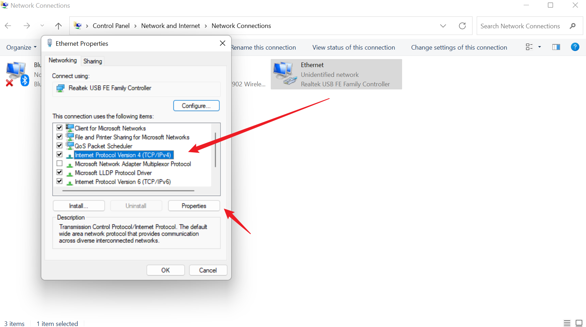

# Preparations Before Using myStudio Pro

Hardware configuration

> Before using myStudio Pro, please make sure the machine is powered on.
>
> The following are the steps on how to start a server program (taking the Windows operating system as an example) :

#### static IP configuration

- First, you need to prepare a functioning network cable. Connect one end of the cable to the network port of the machine base and the other end to the network port of your PC device.

- After the network cable is connected, it is necessary to manually configure the machine's "static IP" for the subsequent "ssh connection". The configuration steps are as follows:
  - Open the Control panel, select `Network and Internet`, and then click `View Network Status and Tasks`.

    
    
  - At this point, enter the "Network and Sharing Center" panel, select "Change Adapter Settings" from the left menu bar, and click to open the "Network Connections" panel.

    

  - Select "Ethernet" and right-click on the "Properties" panel. After it opens successfully, left-click on "Internet Protocol Version 4 (TCP/IPv4)", and finally click the "Properties" button underground

    

  - Go to the Properties panel, click on 'Use the following IP address (S)' with the mouse, and configure the static IP address '192.168.0.x' and the subnet mask '255.255.255.0'.

      

   - Finally, click "Confirm" and close the corresponding configuration panel.

- To verify whether the static IP configuration is successful, press the 'Win+R' key combination to bring up the run window. Then, in the run window, type 'cmd' to open the 'Windows Command Prompt', type 'ping 192.168.0.232' and press the Enter key. If the following content is output, it indicates that the static IP configuration is successful. And the network cable connection is normal.

  

#### start the server program

- You can log in to the machine system via `ssh `connection to perform operations and control. This chapter takes the `MobaXterm` graphical tool as an example for operation.

- Open the application, click on `Session` in the upper left corner to pop up the panel, then select `SSH` to connect and enter the corresponding 'Remote host'. After entering, click Confirm.

- After a successful connection, the panel requires you to enter your "username" and "password", both of which are set to "root" by default, and press Enter to log in to the system.

- The MyCobotPro 450 server program is by default in the following path `/root/MyCobot450/bin` directory. Then use the command `View Current directory Files` to check if there is a corresponding 'executable file'. The name of the executable file is generally `MyCobotPro`.

   ```bash
   ls
   ```

If the server file is executed and the terminal does not report an error message and outputs the following information, the file is successfully run.

```bash
./MyCobotPro
```


### Software configuration

> Before using myStudio Pro, please make sure that a browser, such as modern browsers like Chrome/Edge/Safari, has been installed on your computer.

### myStudio Pro access

> myStudio Pro is a Web application that does not require installation and can be used in a browser via IP.

- In the ssh connection terminal, enter the command `ifconfig` to view, configure and manage network interface parameters, and confirm the `IP`.
  
```bash
ifconfig
```


- Then enter this `IP` into the `URL` address of the browser. Note: the `http` protocol needs to be added. The complete address is as follows;

```bash
http://< Robotic Arm System IP>:< Port Number >
```

- When the browser renders the page, it indicates successful access to myStudio Pro.


[← Previous page](./README.md) | [Next page →](./5.2-install_uninstall.md)