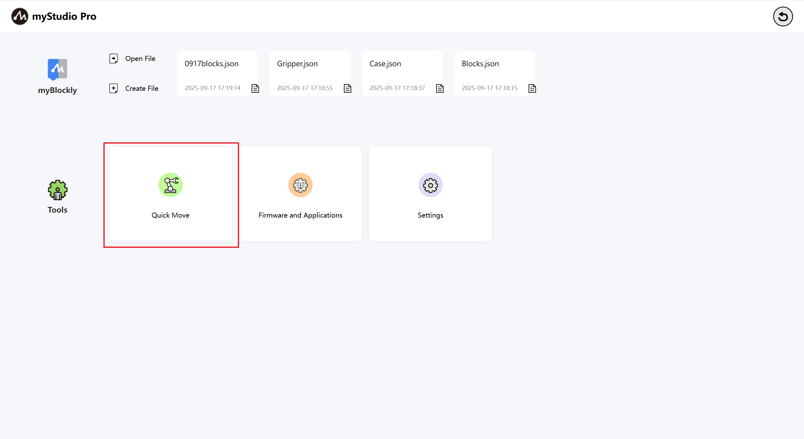
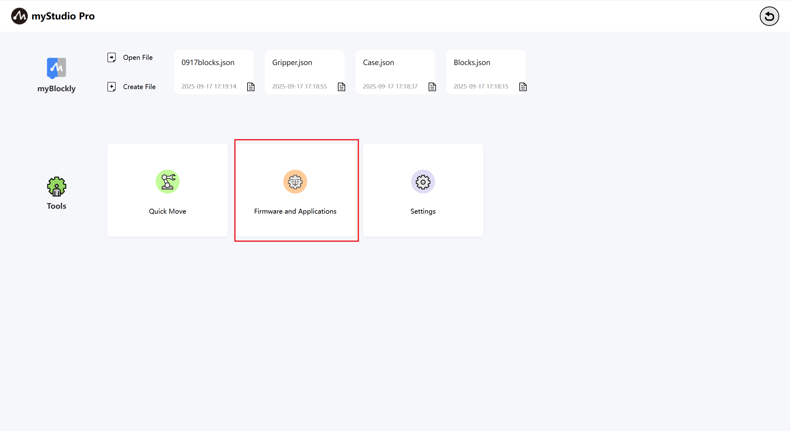
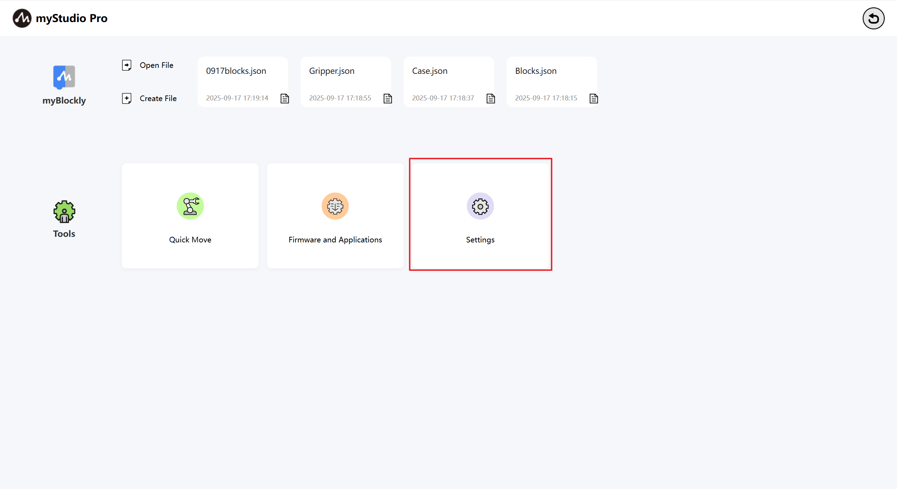

# myStudio Pro Interface Display And Basic Function Usage

Open the software, the main interface is as shown below

The interface is divided into two areas:

1. Return to Zero
2. Function Implementation
3. Information display

> Note: The software will automatically communicate and connect to the robot. If the lower right corner shows "Not connected", please check whether the network connection between the PC and the robot is unobstructed, or try restarting the robot.

### Return To Zero

This button controls all joints of the robot to return to their zero position.

**Note**: This button requires a successful communication connection with the robot. Pressing and holding the left mouse button on this button initiates the robot's home return command，The mechanical arm will slowly move to the zero position.. Pressing and releasing the left mouse button stops the home return command.

After the home return is complete, a pop-up window will appear indicating the completion.

### Soft emergency stop

The function of this button is to control the power failure of the entire robot. When visiting the page, it will detect whether the current robot is powered on. If it is powered on, this button will be in red. If the robot is not powered on, this button will change to green and a pop-up window will appear to indicate that the robot is not powered on. You can click this button to power it on.

#### Power on

When this button is in a green pattern, its function is to power on. After left-clicking this button with the mouse, the robot will start to execute the power-on command. The entire interface of the application will be covered with a layer of transparent light gray shadow. Before the power-on is completed, do not click on other functions within the interface, and a rotating pattern indicating that the application is power-on will be displayed at the center of the application.

After power-on is completed, the icon will turn red and a pop-up window will appear to prompt.

#### Power off

When this button is marked in red, its function is to power off. After left-clicking this button with the mouse, the robot begins to execute the power-off command.

### Functionality

Select the features you want to use here. These features are as follows:

> 1. [Blockly Graphical Programming](./5.1.5-blockly/5.1.5.1-blocklyFirstUse.md)
> 2. Quick Move
> 3. Firmware and Applications
> 4. Settings

### myBlockly
`myBlockly` is a fully visual, modular programming interface, a graphical programming language suitable for beginners to familiarize themselves with programming. Users can develop applications by dragging and dropping puzzle pieces, creating both simple and complex functions. It supports saving and loading graphical code, single-stepping debugging, and executing specific blocks.

> Note: To use myBlockly, you must first connect to a device.

#### myBlockly

This is a clickable button. Clicking it will redirect to the [myBlockly graphical programming interface](./5.1.5-blockly/5.1.5.1-blocklyFirstUse.md)

#### Open File

Here is a clickable button. Clicking it will automatically redirect you to myBlockly and open the file management list, allowing you to perform operations related to JSON files based on the file list.

#### New File

This button has the same function as [**myBlockly**](./5.1.3-interface_description.md#myblockly)".

#### Quickly Load A Previously Saved Blockly File

If you have used myBlockly to program and saved Blockly files, the saved file names and save times will be displayed as shown below. A maximum of four files will be displayed. If more than four files are saved, only the most recent four will be displayed. Left-clicking will open myBlockly and automatically load the selected Blockly file.

### Common Tools

#### Quick Move

Function: Provides quick control of robot I/O, joint angles, and coordinates.

QuickMove [Feature Details](./5.1.6-quickmove/5.1.6.1-quickmovefirstuse.md)

#### Firmware And Applications

Function: Provides updates and upgrades for the robot's embedded firmware, product manuals, official videos, an official GitHub repository, and feedback.

Firmware and Applications [Function Details](./5.1.7-firmware/5.1.7.1-firmware_main.md)

### Settings

Function: Displays and modifies basic application and robot information.

Setting [Function Details](./5.1.8-setting/5.1.8.1-setting_main.md)

### Information display

The underlying part of the application includes the logo of Elephant Robotics Company, the current type of machine, alarm prompts, and the current operating status of the robot.

If the robot reports an error during operation, the application will capture the exception and display it in the error log interface. The meaning in the error log table is as follows:

- number: Error log serial number
- time: The time when the error occurred
- type: The type of error that occurs
- description: Incorrect description information

After the application captures an error, it will first pop up a prompt and provide a solution. If you do not want to handle the error, you can also ignore it. If the same error message is ignored and the connection is not disconnected or the error log interface is not entered to clear it, there will be no pop-up prompt in the application this time. When you disconnect and reconnect the device or enter the error log interface and click the "Clear" button, a pop-up window will appear again to prompt you and save it to the error log table.

### Robot status

Function: Display the current operating status of the robot.

| Color | meaning                                                     |
| ---- | ------------------------------------------------------------ |
| | unconnect |
|     | normal |
|     | running |
|     | error  |

---

[← Previous Chapter](./5.2-install_uninstall.md) | [Next Chapter→](./5.4-Q&A.md)