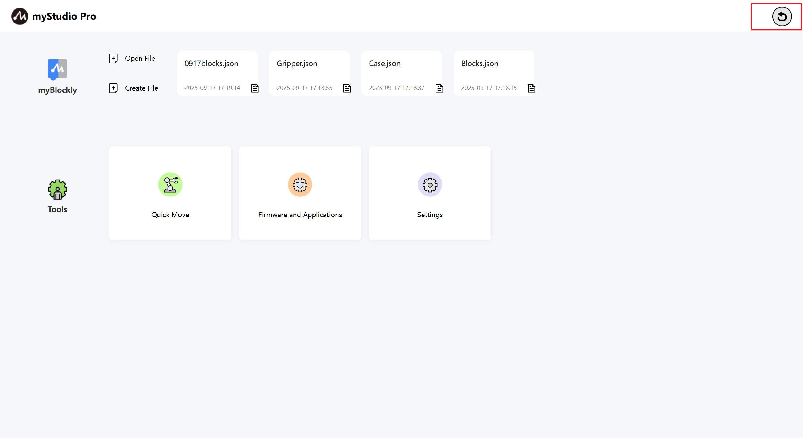

# myStudio Pro Interface Display And Basic Function Usage

Open the software, the main interface is as shown below

The interface is divided into two areas:

1. Return to Zero
2. Function Implementation

### Return To Zero

This button controls all joints of the robot to return to their zero position.

**Note**: This button requires a successful communication connection with the robot. Pressing and holding the left mouse button on this button initiates the robot's home return command. Pressing and releasing the left mouse button stops the home return command.

After the home return is complete, a pop-up window will appear indicating the completion.

### Functionality

Select the features you want to use here. These features are as follows:

> 1. [Blockly Graphical Programming](./5.1.5-blockly/5.1.5.1-blocklyFirstUse.md)
> 2. Quick Move
> 3. Firmware and Applications
> 4. Settings

### myBlockly
`myBlockly` is a fully visual, modular programming interface, a graphical programming language suitable for beginners to familiarize themselves with programming. Users can develop applications by dragging and dropping puzzle pieces, creating both simple and complex functions. It supports saving and loading graphical code, single-stepping debugging, and executing specific blocks.

> Note: To use myBlockly, you must first connect to a device.

This is a clickable button. Clicking it will redirect to the [myBlockly graphical programming interface](./5.1.5-blockly/5.1.5.1-blocklyFirstUse.md)

#### Open File

This is a clickable button that automatically loads Blockly blocks by importing a JSON file.

After clicking the left button of the mouse, a pop-up window will pop up where you can select a file. Select the JSON file saved by blockly to load the file, open myBlockly, and automatically load the corresponding building block in the programming interface.

#### New File

This button has the same function as [**myBlockly**](./5.1.3-interface_description.md#myblockly)".

#### Quickly Load A Previously Saved Blockly File

If you have used myBlockly to program and saved Blockly files, the saved file names and save times will be displayed as shown below. A maximum of four files will be displayed. If more than four files are saved, only the most recent four will be displayed. Left-clicking will open myBlockly and automatically load the selected Blockly file.

### Common Tools

#### Quick Move

Function: Provides quick control of robot I/O, joint angles, and coordinates

QuickMove [Feature Details](./5.1.6-quickmove/5.1.6.1-quickmovefirstuse.md)

#### Firmware And Applications

Function: Provides updates and upgrades for the robot's embedded firmware, product manuals, official videos, an official GitHub repository, and feedback.

Firmware and Applications [Function Details](./5.1.7-firmware/5.1.7.1-firmware_main.md)

### Settings

Function: Displays and modifies basic application and robot information.

Setting [Function Details](./5.1.8-setting/5.1.8.1-setting_main.md)

---

[← Previous Chapter](./5.2-install_uninstall.md) | [Next Chapter→](./5.4-Q&A.md)