## Supported Operating Systems for myStudio Pro:

- Windows

- macOS

- Linux arm64

## Supported Modern Browsers for myStudio Pro:

- Chrome

- Edge

- Safari

- ...

# Preparations Before Using myStudio Pro

### Hardware Configuration

> Before using myStudio Pro, please ensure your machine is powered on.

>
> The following are the steps to start the server program (using Windows as an example):

#### Static IP Configuration

- First, you need a working network cable. Connect one end of the cable to the network port on your machine's dock and the other end to the network port on your PC.

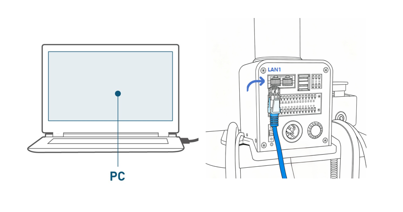

- After connecting the network cable, you need to manually configure a static IP address for your machine for subsequent SSH connections. The configuration steps are as follows:

- Open Control Panel, select `Network and Internet`, and then click `View network status and tasks`.

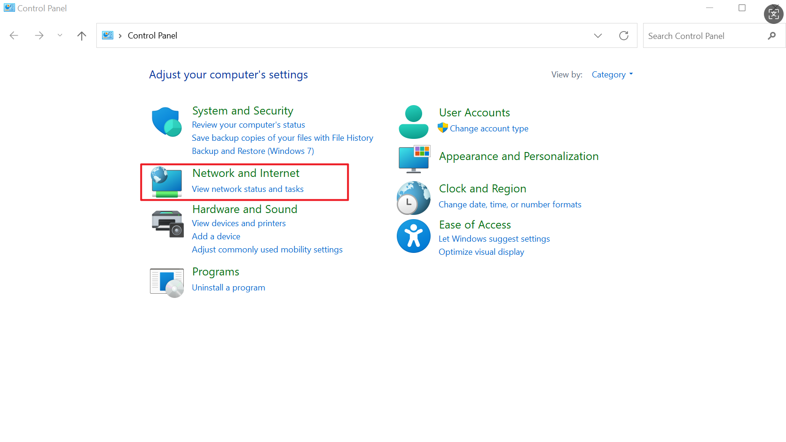

- This will take you to the `Network and Sharing Center` panel. Select `Change adapter settings` in the left-hand menu and then click to open the `Network Connections` panel.

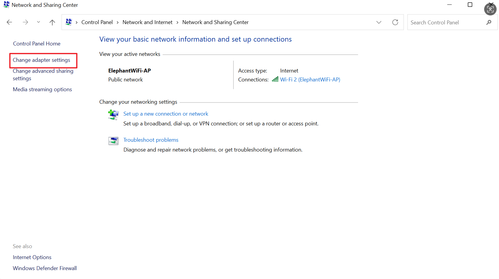

- Select `Ethernet` and right-click to open the `Properties` panel. Then, left-click to select `Internet Protocol Version 4 (TCP/IPv4)`, and finally click the Properties button at the bottom.

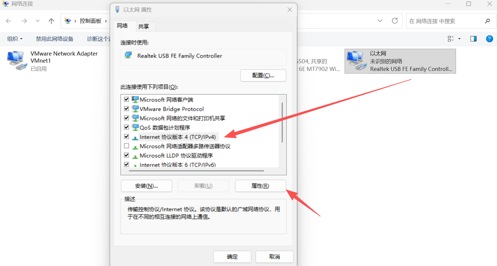

- In the Properties panel, click `Use the following IP address (S)`, configure a static IP address `192.168.0.x`, and a subnet mask `255.255.255.0`.

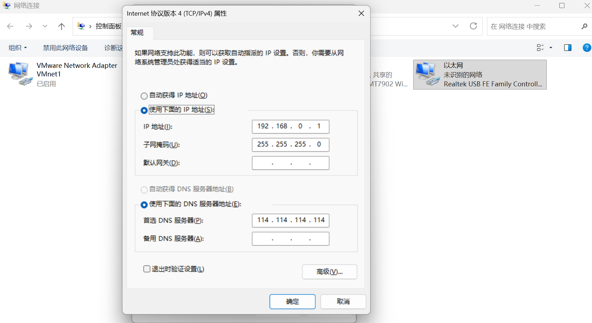

- Finally, click OK to close the corresponding configuration panel.

- To verify successful static IP configuration, press `Win+R` to open the Run window, then type `cmd` to open the Windows Command Prompt. Type `ping 192.168.0.232` and press Enter. If the following output is displayed, the static IP configuration is successful and the network cable connection is normal.

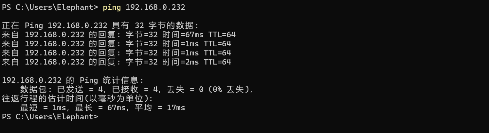

#### Starting the Server Program

- You can log in to the machine system via `ssh` for operation and control. This chapter uses the `MobaXterm` graphical tool as an example.

- Open the application, click the `Session` button in the top left corner to bring up the panel, select `SSH` to connect, enter the corresponding `Remote host`, and click "Confirm".

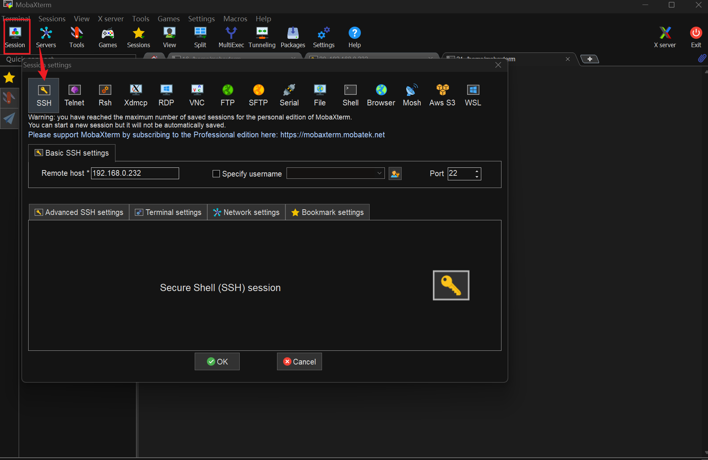

- After a successful connection, the panel will ask you to enter your `username` and `password` (both are `root` by default) and press Enter to log in to the system.

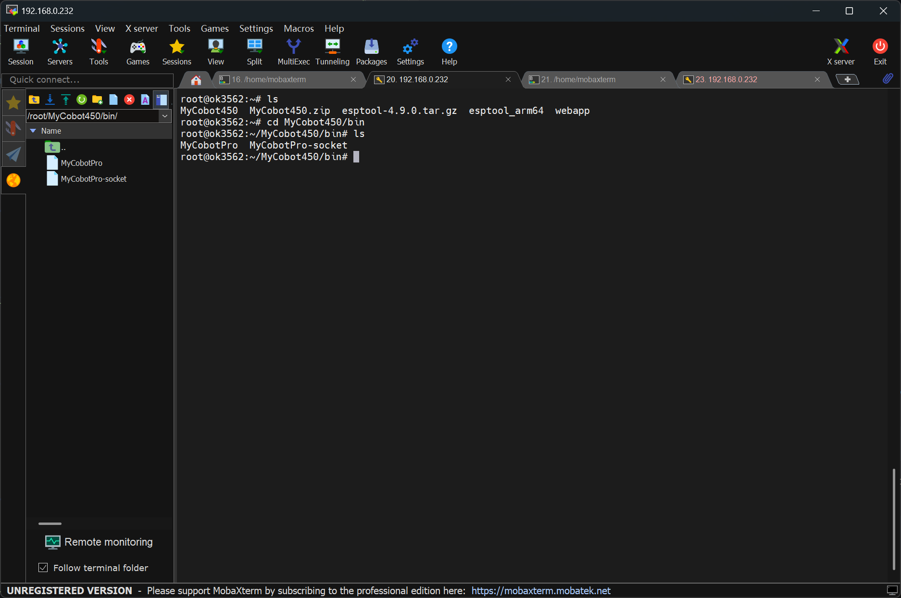

- The MyCobot Pro 450 server program is located by default in the following path: `/root/MyCobot450/bin`. Use the command to view the files in the current directory to check if the corresponding `executable file` exists. The executable file name is usually `MyCobotPro`.


``bash

ls

```
- Executing the server file. If the terminal outputs the following information without any error messages, the file has run successfully.

```bash

./MyCobotPro

```

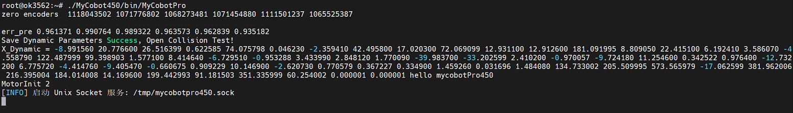

Of course, you can also log in and operate using the `cmd` panel. The specific steps are as follows (taking Windows as an example):

Use `win + r` to open the `cmd` panel and enter the following command.

- Enter `ssh-keygen -R 192.168.0.232`

- Enter `ssh root@192.168.0.232`

Then enter the login password `root`

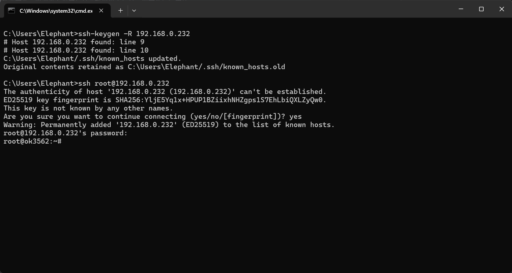

Next, follow the steps above to run the server program.

### Software Configuration

> Before using myStudio Pro, ensure that a browser, such as Chrome / Edge / Safari or other modern browsers, is installed on your computer.

### Accessing myStudio Pro

> myStudio Pro is a web application and does not require installation. It can be used in a browser via IP address.

- In the `ssh` connection terminal, enter `ifconfig` to view, configure, and manage network interface parameters, and confirm the `IP`.

```bash

ifconfig

```
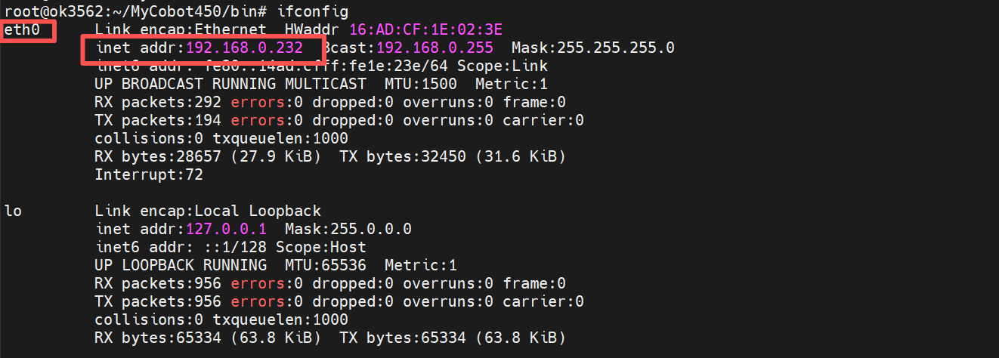

- Then enter the `IP` and port number (default deployment to port 8000) into the browser's `URL` address. Note: the `http` protocol must be included. The complete address is as follows:

```bash
http://<robotic arm system IP>:<port number>

```

- When the browser renders the page, it means that myStudio Pro has been successfully accessed.

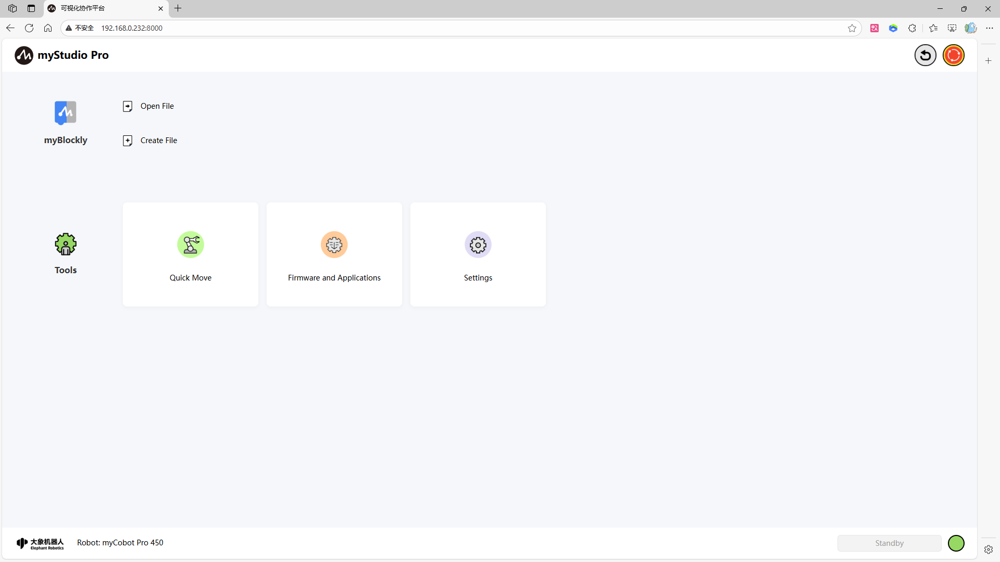

[← Previous Chapter](./README.md) | [Next Chapter →](./5.2-install_uninstall.md)