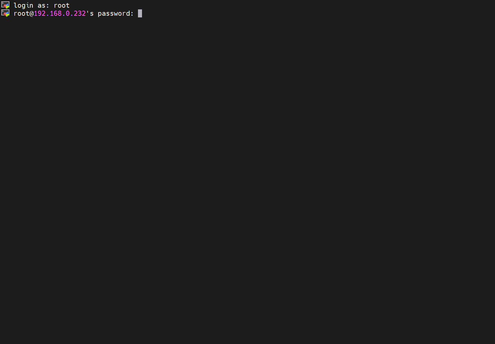
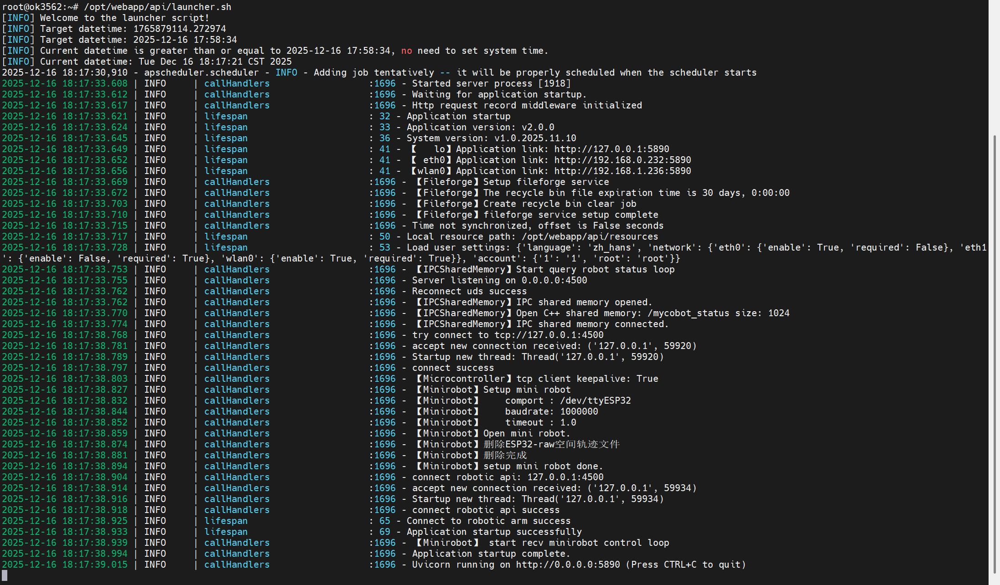
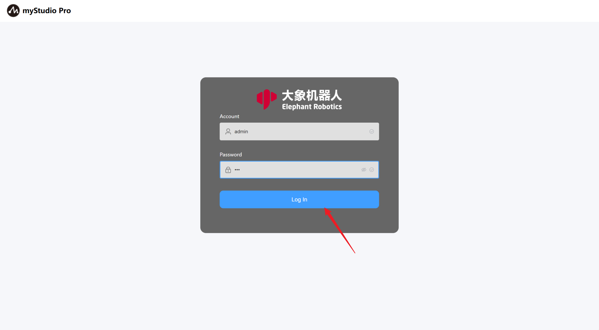
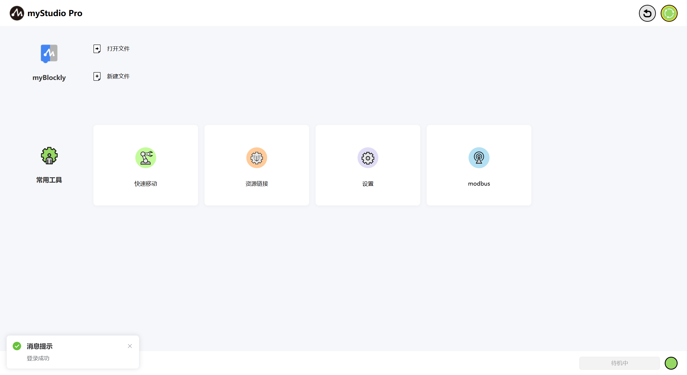

# First Use

## Supported Operating Systems for myStudio Pro:

- Windows

- macOS

- Linux arm64

## Supported Modern Browsers for myStudio Pro:

- Chrome

- Edge

- Safari

- ...

## Preparations Before Using myStudio Pro

### Hardware Configuration

> Before using myStudio Pro, please ensure your machine is powered on.

>
> The following are the steps to start the server program (using Windows as an example):

### Static IP Configuration

- First, you need a working network cable. Connect one end of the cable to the network port on your computer's dock, and the other end to the network port on your PC.

    

- After connecting the network cable, you need to manually configure the machine's `static IP` for subsequent `SSH connection`. The configuration steps are as follows:

- Open Control Panel, select `Network and Internet`, and then click `View network status and tasks`.

    

- Now you are in the `Network and Sharing Center` panel. Select `Change adapter settings` in the left menu bar and click to open the `Network Connections` panel.

    

- Select `Ethernet` and right-click to open the `Properties` panel. Then, left-click to select `Internet Protocol Version 4 (TCP/IPv4)`, and finally click the Properties button at the bottom.

    

- In the Properties panel, click `Use the following IP address (S)`, configure a static IP address `192.168.0.x`, and a subnet mask `255.255.255.0`.

    

- Finally, click OK to close the corresponding configuration panel.

- To verify successful static IP configuration, press `Win+R` to open the Run window, then type `cmd` to open the Windows Command Prompt. Type `ping 192.168.0.232` and press Enter. If the following output is displayed, the static IP configuration is successful and the network cable connection is normal.

    

### Starting the Server Program

> Note: The system has already configured to enable automatic startup. The following steps are for manual startup instructions. - You can log in to the machine system via SSH to operate and control it. This chapter uses the MobaXterm graphical tool as an example.

- Open the application, click "Session" in the upper left corner to bring up the panel, select "SSH" connection, enter the corresponding "Remote host," and click "Confirm."

    

- After a successful connection, the panel will ask you to enter your "username" and "password" (both are "root" by default) and press Enter to log in to the system.

    

- The MyCobot Pro 450 server program is located by default in the following path: `/root/MyCobot450/bin`. Then, use the command to view the files in the current directory to check if the corresponding executable file exists. The executable file name is usually `MyCobotPro`.


    

    ```bash
    ls
    ```
- Executing the server file, if the terminal does not report any error messages and outputs the following information, then the file has run successfully.

    ```bash
    ./MyCobotPro
    ```

    

- Executing the robot control service script. If the terminal outputs the following information without errors, the file has run successfully.

    ```bash
    /opt/webapp/api/launcher.sh
    ```

    

Of course, you can also log in and operate using the `cmd` panel. The specific steps are as follows (taking Windows as an example):

Use `win + r` to open the `cmd` panel and enter the following command.

- Enter `ssh-keygen -R 192.168.0.232`

- Enter `ssh root@192.168.0.232`

Then enter the login password `root`


Next, follow the steps above to run the server program. By default, the server file and robot control services start automatically on boot.

### Software Configuration

> Before using myStudio Pro, please ensure that a browser, such as Chrome / Edge / Safari or other modern browsers, is installed on your computer.

### Accessing myStudio Pro

> myStudio Pro is a web application that does not require installation and can be used in a browser via IP address.

- In the SSH terminal, type `ifconfig` to view, configure, and manage network interface parameters, and confirm the `IP`.

    ```bash

    ifconfig

    ```

    

- Then enter the `IP` and port number (default deployment to port 8000) into the browser's `URL` address. Note: You need to include the `http` protocol. The complete address is as follows:

    ```bash

    http://<robotic arm system IP>:<port number>

    ```
- > Note: If you are using the LAN1 network port to access myStudio Pro, the system will automatically log in. After logging in, you will automatically enter the main page.

- > When you are using the LAN2 or WLAN network port to access myStudio Pro, you need to log in first. The default username and password are `admin` and `123` respectively. When the browser loads the login page, enter the default password and click the `login` button to log in.

- > [How to change the default login account?](./5.3.5-setting.md#8-Account Settings)

    

- When the browser renders the page, it means that myStudio Pro has been successfully accessed.

    

[← Previous Chapter](./README.md) | [Next Chapter →](./5.3.2-myBlockly.md)