# Quick Move

*Before Starting*

> *1. Ensure the machine is powered on*

> *2. Ensure the machine connection and communication are normal*

> *3. Ensure the machine is in zero position*

> *4. The machine server is running*

## 1 Interface Introduction

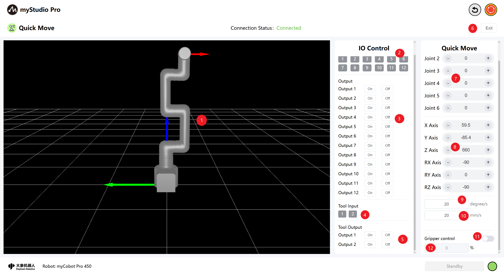

| Number | **Description** |
| ---- | ------------------------------------------------------------ |
| 1 | myCobot Pro 450 3D Simulation Model (Coordinate system: Red arrow: X, Green arrow: Y, Blue arrow: Z) |
| 2 | Bottom IO pins 1-12, Input, belongs to the safety module detection item |
| 3 | Bottom IO pins 1-12, Output, the output can be set by clicking the switch button |
| 4 | End-effector I/O pins 1 and 2, inputs |
| 5 | End-effector I/O pins 1 and 2, outputs, can be used to control the F100 force control gripper |
| 6 | Exit the quick movement interface |
| 7 | Angle control: By clicking the `+` `-` buttons, the joint angle of the robotic arm is controlled. The value represents the current joint angle information of the robotic arm. The value can also be directly modified for joint control. |
| 8 | Coordinate control: By clicking the `+` `-` buttons, the coordinate control of the robotic arm is performed. The value represents the current coordinate posture information of the robotic arm. The value can also be directly modified for coordinate control. |
| 9 | Set the movement step size of the mechanical arm joints to the default value of 20 degrees per second. |
| 10 | Set the movement step size of the mechanical arm's coordinates. The default value is 20 millimeters per second. |
| 11  | Gripper control switch, which can turn on/off the gripper control mode. The default state is off.                  |
| 12  | Gripper angle value input box, through which the angle can be issued. |

## 2 Angle Control
In the angle control area, by clicking the `+` The `-` button controls the joint angles of the robotic arm. The value represents the current joint angle information of the robotic arm, and you can also directly modify the value to control the joints, Enter the position within the limit range and then click `Enter` to start the control.

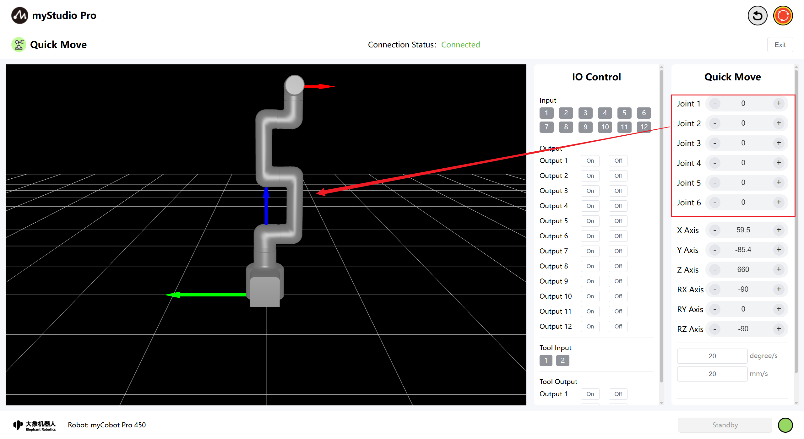

## 3 Coordinate Control 

Before using coordinate control, joint 3 needs to be moved to an angle of approximately -90 degrees.

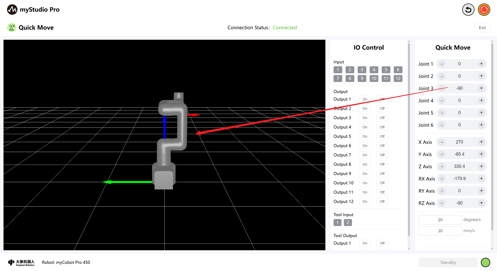

In the coordinate control area, click the `+` and `-` buttons to control the coordinates of the robotic arm. The value represents the current coordinate posture information of the robotic arm, and you can also directly modify the value to control the coordinates, Enter the position within the limit range and then click 'Enter' to start the control.

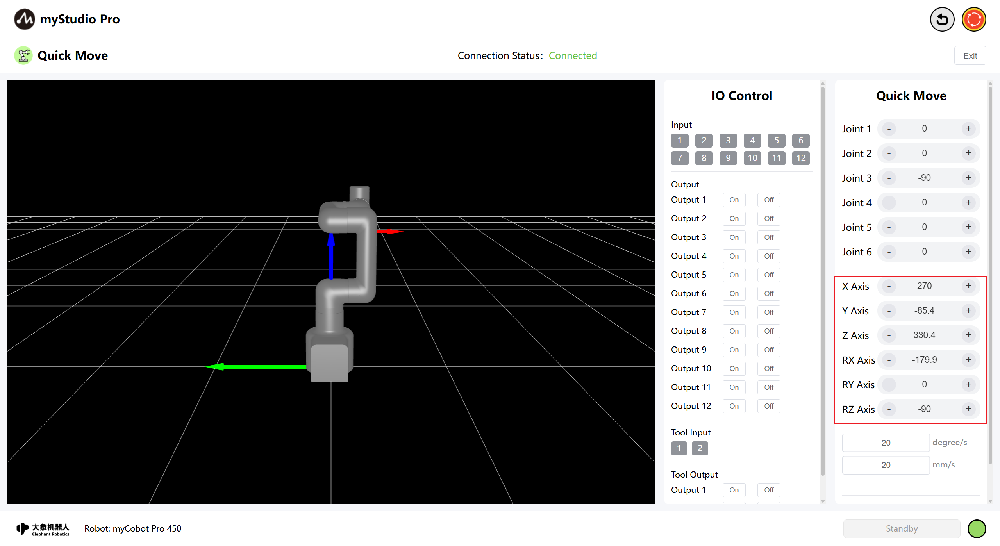

## 4 Continuous Movement

By long-pressing the `+` and `-` buttons in the corresponding areas, you can control the robot to move continuously at a specified angle/coordinate.

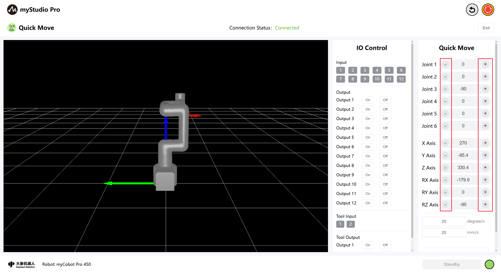

Note: When the long-press operation continues to the point where it reaches the joint limit, it will automatically stop.

Note: When controlling the coordinates, the robotic arm must first be moved to the coordinate control posture.

## 5 IO Control

### 5.1 Bottom IO

Set the bottom IO pin numbers 1-12 for output; users can customize the control actuators. For example, you can customize the control of the gripper and suction pump.

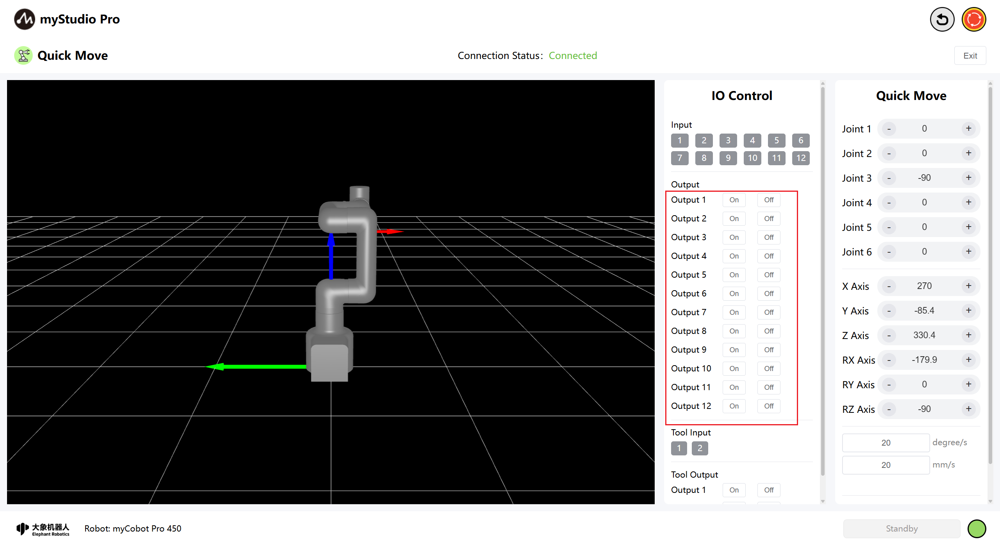

Click the `On` and `Off` buttons to configure.

### 5.2 End-of-Line I/O

Setting the end-of-line I/O pin numbers 1-2 allows you to control the F100 force ontrolled gripper. The prerequisite is that the standard F100 force control gripper must be properly connected for normal control to be achieved.

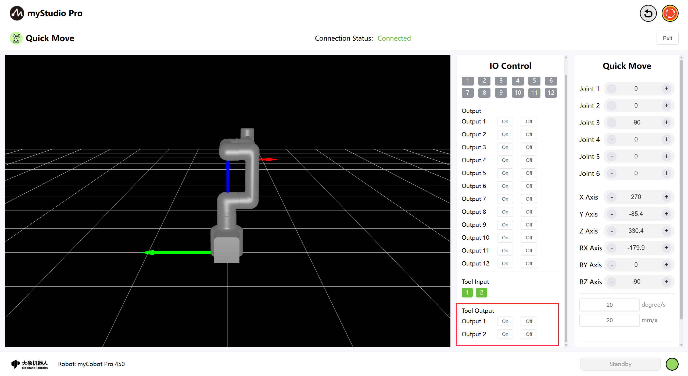

Turn on the F100 force-controlled gripper by clicking the `Off` and `On` buttons.

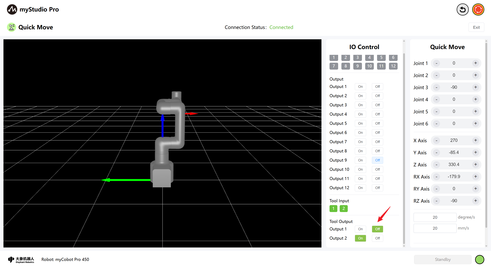

Disable the F100 force Control Gripper  by clicking the `On` and `Off` buttons.

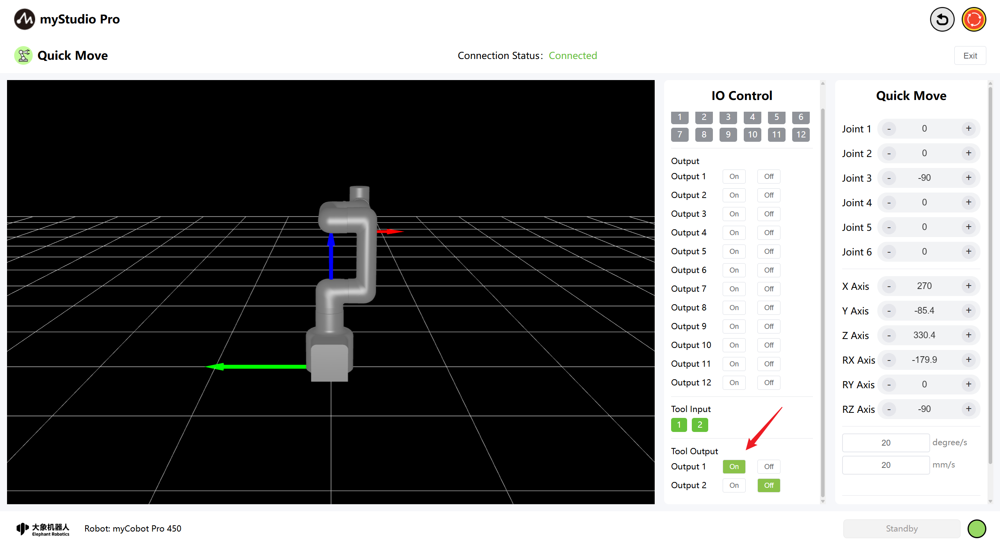

## 6 Gripper Control

> Attention:
> 
> 1.Before using this function, please ensure that the robotic arm is connected to the standard F100 force control gripper.
> 
> 2.Verify whether the current control protocol of the F100 Force Control Gripper is Modbus and whether Modbus control has been enabled. This function can be used normally only when both conditions are met.

The default state of the gripper is `closed`.

> 1.The input box for controlling the gripper angle is available
> 
> 2.The end of the 3D simulation model robotic arm does not have a gripper attached.

Clicking the switch button will conduct a connection check for the end gripper of the robotic arm. If no gripper is detected, a message will be displayed on the page as follows.

**This message indicates that in addition to the aforementioned point 2, point 3 also causes this issue. Please ensure that the connection and gripper configuration are correct!**

If there are no issues and the grippers still cannot be opened or controlled, please contact the after-sales service.

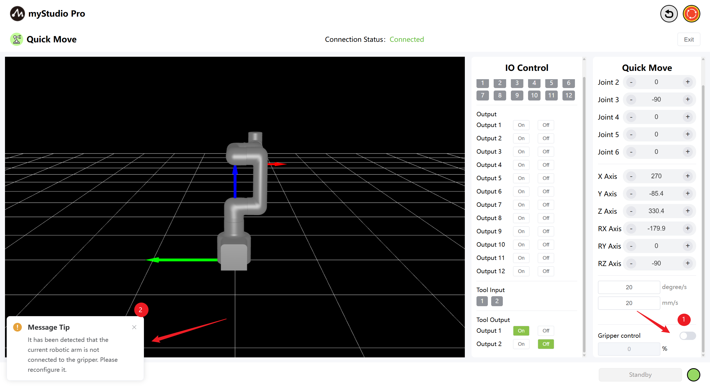

When the gripper button is activated successfully, the input box can be edited (within the range of 0-100%), and the 3D simulation model will render the gripper, while simultaneously displaying the actual control angle of the gripper in real time.

> 1.The input box for controlling the gripper angle is available
>
> 2.3D simulation model of the mechanical arm's end-effector with rendered gripper

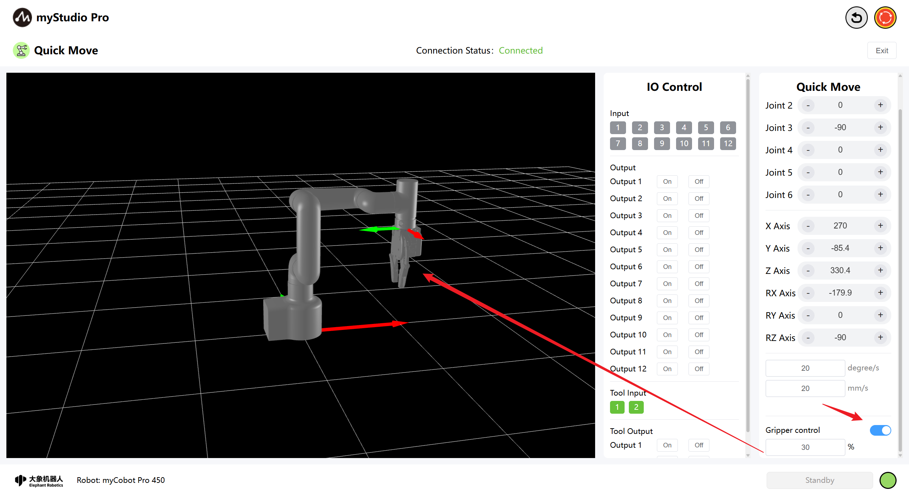

At this point, you can use the gripper to input the angle you want to control into the input box. After entering the value, click on an empty area or press the Enter key. This will send the command. Once the command is successfully sent, there will be a corresponding message prompt on the page. Meanwhile, the gripper will move to the commanded angle, and the end of the 3D model gripper will perform a simulation movement.

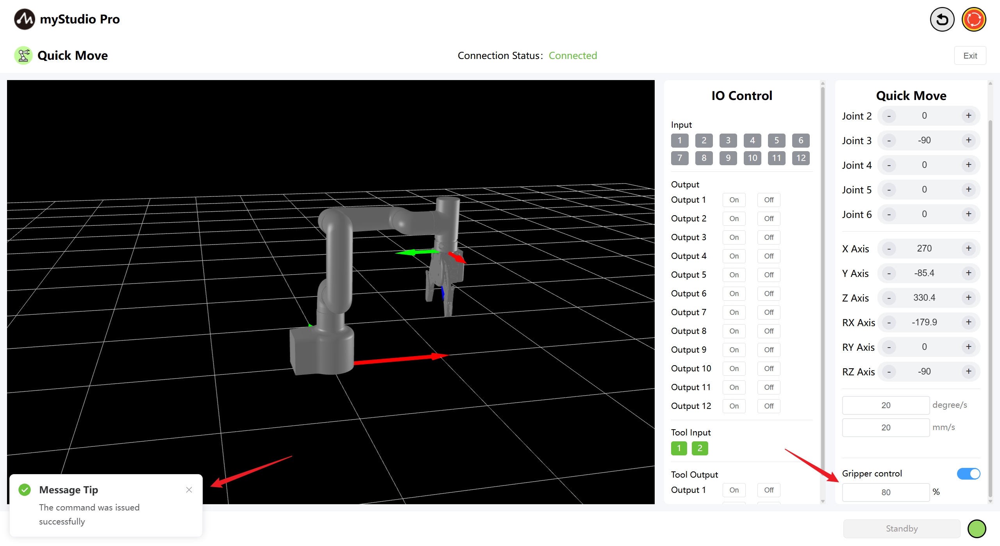

Following the above operation steps, you can control the F100 force control gripper. When you manually close the control button or leave the rapid movement page and re-enter, the page status will be reset and restored to the default (closed) state.

[← Previous Chapter](./5.3.2-myBlockly.md) | [Next Chapter →](./5.3.4-resource.md)