# What is myStudio Pro?

**myStudio Pro** is a robot programming and control software integrating multiple functions, providing users with one-stop solutions such as visual programming interaction, quick movement control, drag teaching, robot status query and configuration. The software mainly integrates four functional modules: `myBlockly`, `Quick Move`, `Firmware and Applications`, and `Settings`, covering the entire process requirements from programming to debugging, from learning to deployment.

The **`myBlockly`** module draws on Scratch, a children's programming language developed by the Massachusetts Institute of Technology, in terms of functionality and design concept, and uses a graphical building block assembly method for programming. Users can gradually build a complete code logic by intuitively dragging and dropping module combinations. The entire process is simple to operate and easy to understand, making it especially suitable for programming beginners and teaching scenarios.

From the perspective of user experience, **myBlockly** is a low-threshold visual code generation tool that makes programming as easy and intuitive as building with blocks. From the perspective of developers, this module is essentially a text editor capable of dynamically generating structured code. The code generated by users through drag-and-drop interactions will eventually be transformed into a sequence of instructions that can be executed on robots. This design and interaction method not only reduce the difficulty of use but also ensure the professionalism and executability of the program.

**Quick Move**

The module focuses on the rapid positioning and real-time control of the robotic arm. The rapid movement function can quickly move the robotic arm to the designated position. The read and write states of the end and bottom IO can be set. In addition, the module provides a dedicated operation area, supporting step-by-step or continuous motion control of joints or coordinates, achieving high-precision position adjustment and flexible motion debugging.

**Resource Links**

This module provides users with convenient resource navigation, centrally displaying frequently used external links, including technical documents and official contact information. Users can quickly access relevant support materials without manual searching, improving usage and maintenance efficiency.

**Settings**

This module covers basic configuration options for the software and robot system. Users can perform operations such as language switching, joint motion limit settings, system update detection, and software driver updates here.

**Modbus**

This module provides users with convenient MODBUS protocol access control. Through the MODBUS protocol, interactive control of the device can be achieved. When enabled, the device can preview the register address function table or perform interactive operations through this module.

## myStudio Pro Interface Display and Basic Function Usage

Open the software. The main interface is shown in the image below.

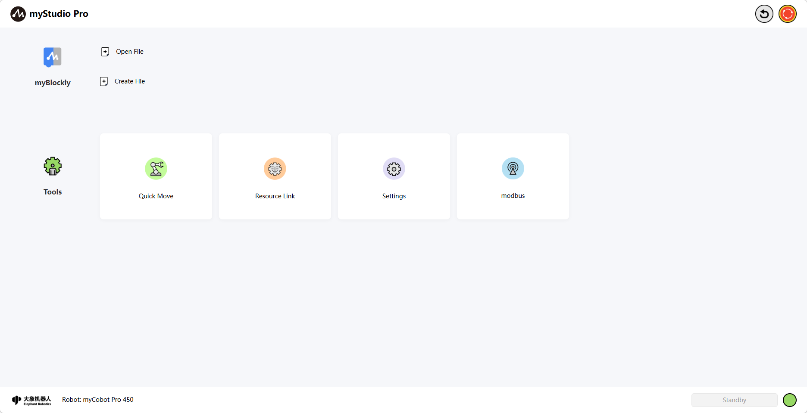

Interface Function Introduction: The interface is divided into three areas:

1. Return to Zero and Power On/Off

2. Function Implementation

3. Information Display

> Note: The software will automatically connect to the robot. If the bottom right corner displays "Not Connected," please check if the network connection between your PC and the robot is stable, or try restarting the robot.

## Return to Zero

This button's function is to control all joints of the robot to return to the zero position.

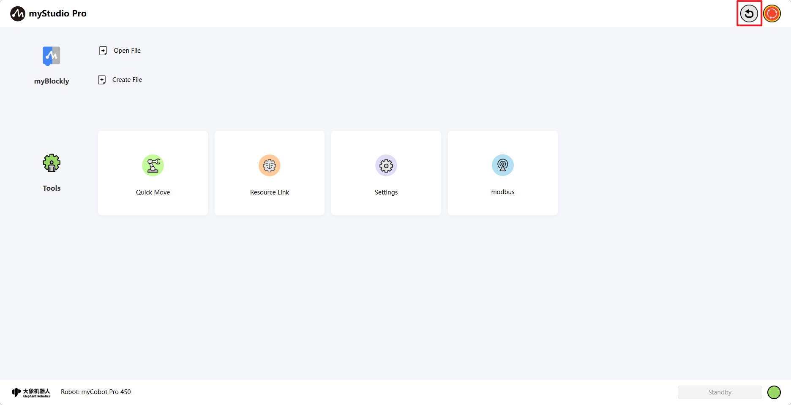

**Note**: This button function requires a successful communication connection with the robot. After pressing and holding the left mouse button, the robot will begin executing the zero-return command. The robotic arm will slowly move to the zero position. Releasing the mouse button will stop the zero-return command.

A pop-up window will indicate that zeroing is complete.

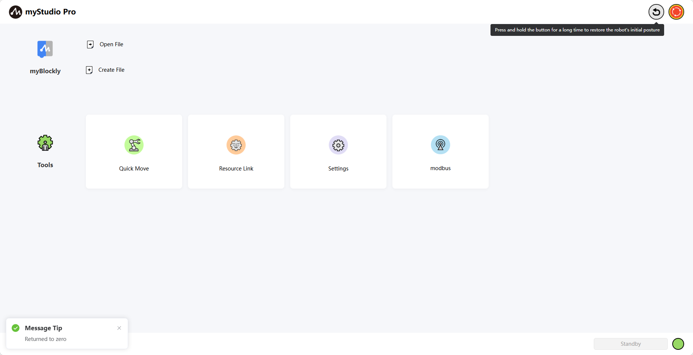

## Soft Emergency Stop

This button function: Controls the robot to shut down. When accessing the page, the system checks if the robot is powered on. If it is, this button is red; if it is not powered on, the button turns green and a pop-up message will indicate that the robot is not powered on. You can click this button to power it on.

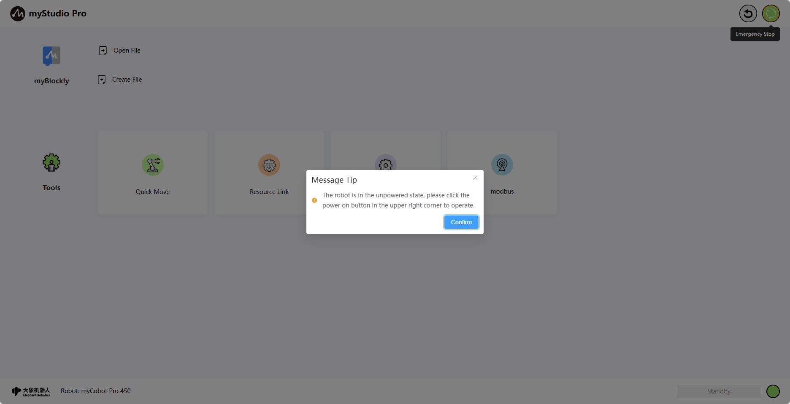

## Power On

When this button is green, its function is to power on. After left-clicking this button, the robot begins executing the power-on command. The entire application interface will be covered by a transparent light gray shadow. Before the power-on process is complete, you cannot click any other functions on the interface, and a spinning circle indicating that the robot is powering on will appear in the center of the application.

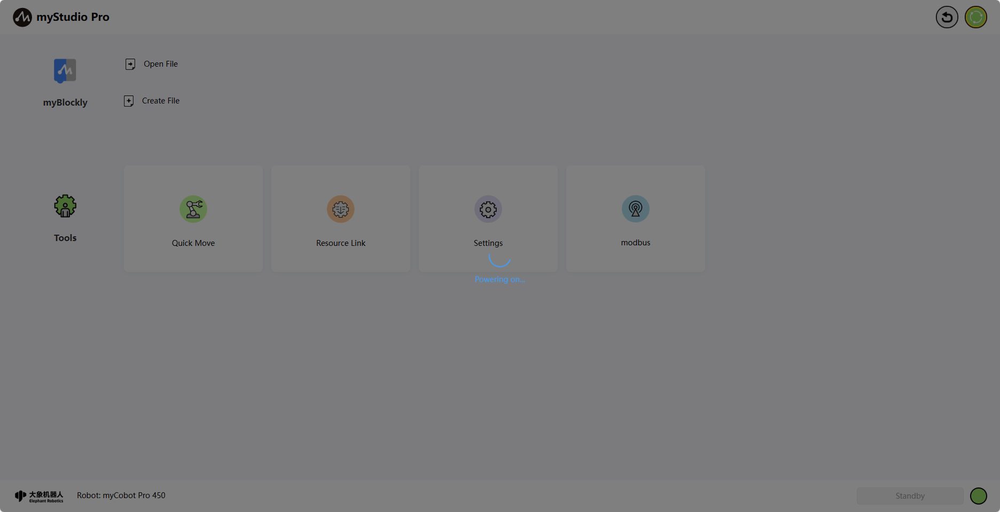

After power-on is complete, the icon will turn red and a pop-up notification will appear.

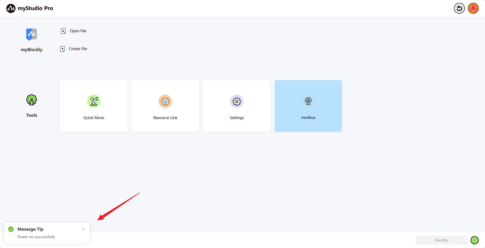

## Power Off

When this button is red, its function is to power off. Left-clicking this button will cause the robot to execute the power-off command.

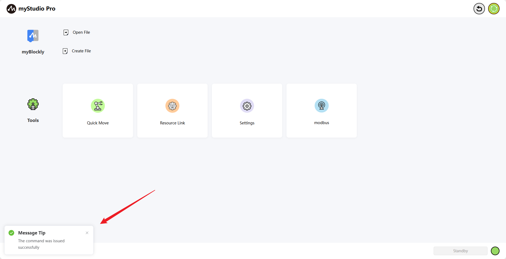

After power-off, the icon will turn green and a pop-up notification will appear.

## Function Implementation

Here you can select the functions you want to use. The functions include:

> 1. [myBlockly Graphical Programming](./5.3.2-myBlockly.md)
> 2. Quick Move
> 3. Resource Links
> 4. Settings
> 5. Modbus

## myBlockly

`myBlockly` is a fully visual modular programming interface, belonging to the graphical programming language, suitable for beginners to learn programming. Users can develop applications by dragging and dropping puzzle pieces, creating simple and complex functions. It supports saving, loading, single-step debugging, and executing specified individual blocks in the graphical code.

Note: A device connection is required to use myBlockly.

#### myBlockly

This is a clickable button. Left-clicking it will navigate to the [myBlockly graphical programming interface](./5.3.2-myBlockly.md)

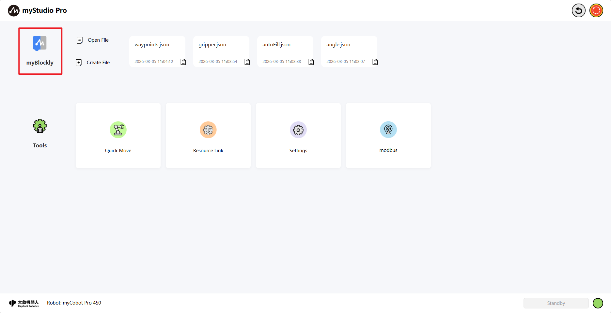

#### Open File

This is a clickable button.

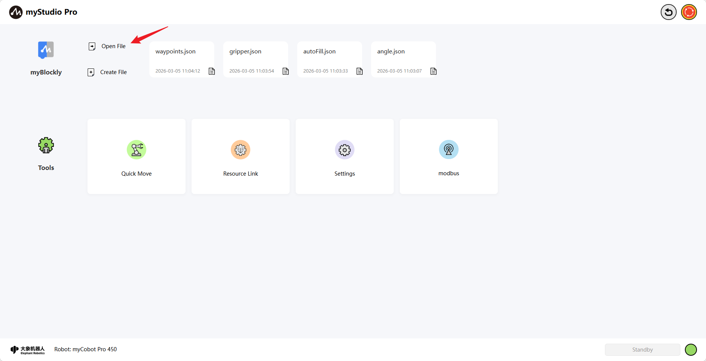

Clicking this will automatically navigate to myBlockly and open the file management list, allowing you to perform JSON file-related operations based on the file list. 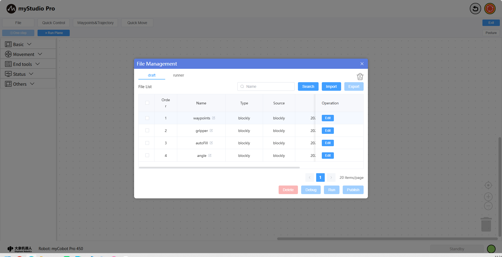

#### Create a New File

This button functions the same as [**myBlockly**](./README.md#myblockly).

**Quickly Load Saved Blockly Files**

When you have used myBlockly programming and saved Blockly files, the saved file names and save times will be displayed in the location shown in the image below. A maximum of 4 files can be displayed; if more than 4 are displayed, only the 4 most recently saved files will be shown. Left-clicking will open myBlockly and automatically load the selected Blockly file.

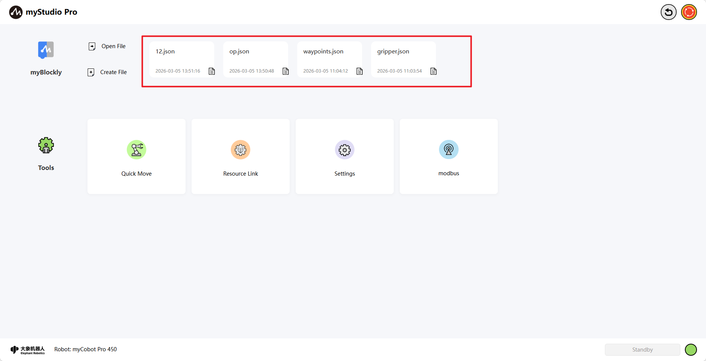

## Common Tools

#### [Quick Move](./5.3.3-quickmove.md)

Function: Provides quick control of robot IO and quick control of joint angles and coordinates

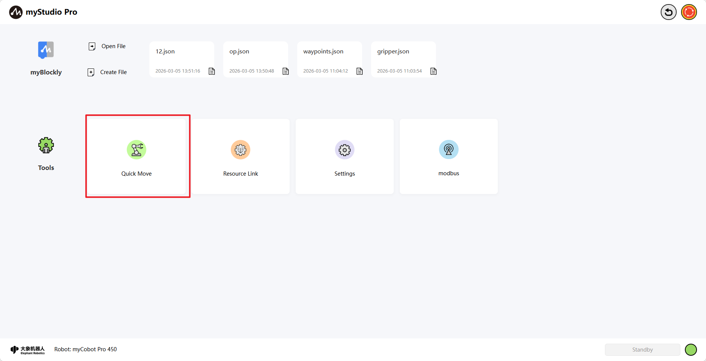

<!-- Quick Move [Detailed Function Introduction](./5.3.3-quickmove.md) -->

#### [Resource Link](./5.3.4-resource.md)

Features: Provides robot product user manuals, official videos, an official GitHub repository, an official online store, and a feedback function.

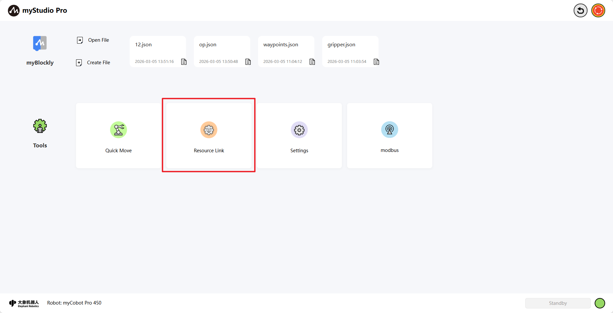

#### [Settings](./5.3.5-setting.md)

Features: Integrates the following core functions: real-time monitoring of robot status and information, one-click check for application version updates, personalized settings (language/motion parameters), and quick configuration of network connection and login account, helping you efficiently manage your robot system.

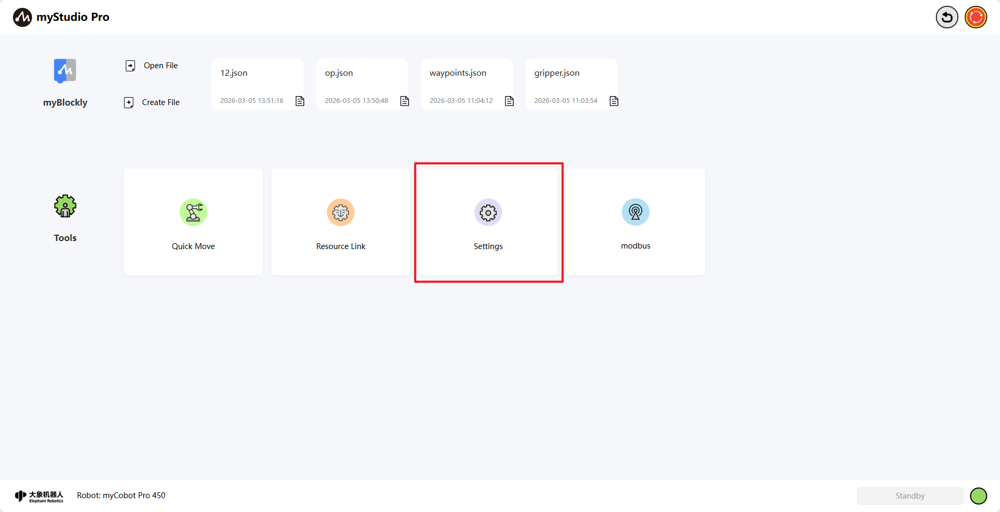

#### [modbus](./5.3.6-modbus.md)

Function: Enables interactive control of the device via the MODBUS protocol. After enabling the device, this module allows previewing the register address function table or performing interactive operations.

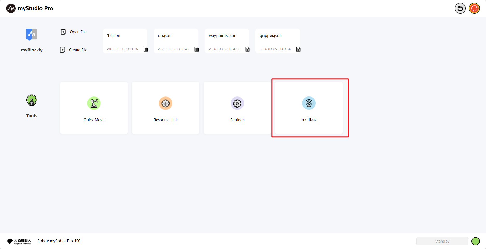

## Information Display

The underlying part of the application, including the Elephant Robotics logo, the current machine type, alarm prompts, and the current robot's operating status.

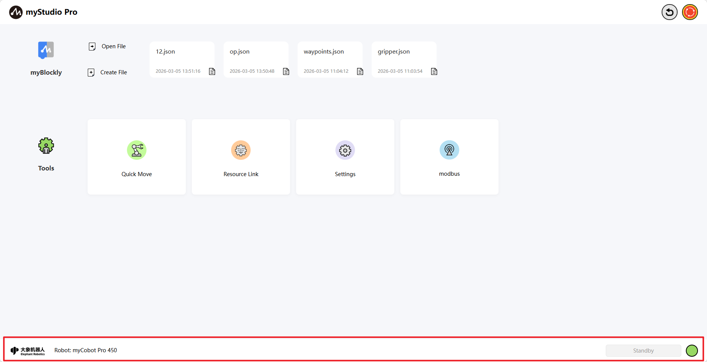

## Alarm Notification

Function: Displays robot error messages, and left-clicking opens the error log window.

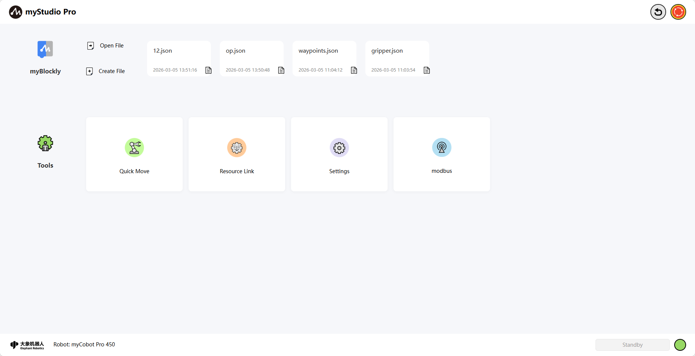

Left-click to open the error log window.

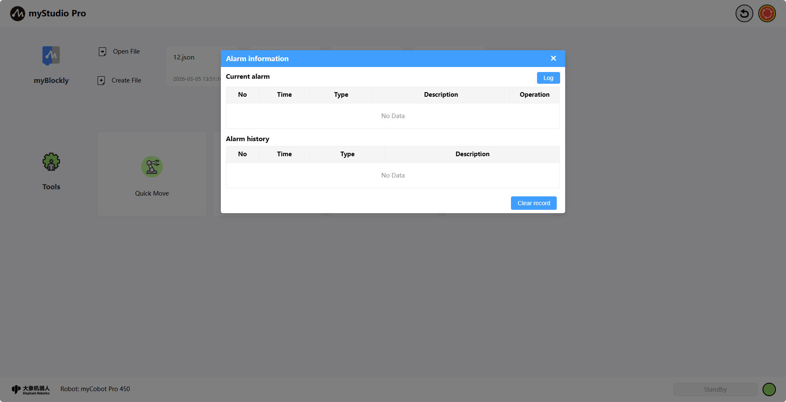

If the robot encounters an error during operation, the application will capture the exception and display it in the error log interface. The meanings in the error log table are as follows:

- number: Error log number

- time: Time when the error occurred

- type: Type of error encountered

- description: Error description

After the application captures an error, it will first display a pop-up prompt and provide a solution. If you do not want to handle the error, you can ignore it. When you disconnect and reconnect the device or enter the error log interface, clicking the "Clear" button will re-enable the pop-up prompt and save it to the error log table.

For example, capturing a joint 1 over-limit error:

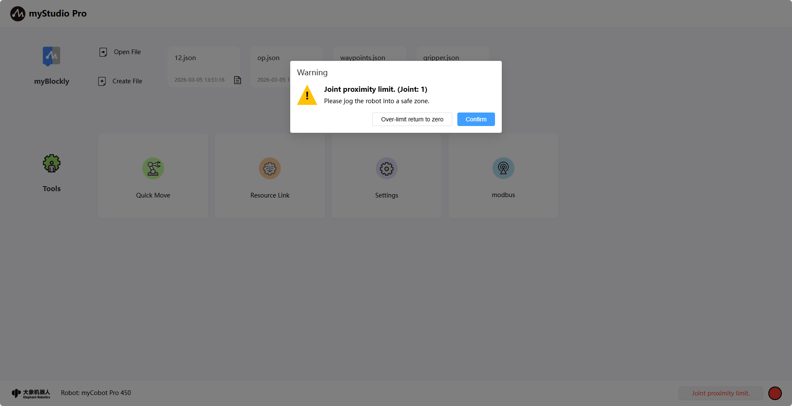

1. When an abnormality is detected in the robotic arm, a specific warning pop-up window will appear. The pop-up consists of four parts: 
    1. The specific content of the current abnormality error; 
    2. The solution to the current abnormality error. If the current abnormality can be resolved or recovered, it will be displayed; otherwise, no content will be displayed; 
    3. A 'Repair' button for the current abnormality error that can be cleared or recovered. Triggering this button will automatically repair the abnormality; otherwise, no button will be displayed; 
    4. A confirmation button for the current abnormality. If you do not want to handle the error, you can use this button to ignore the current abnormality.

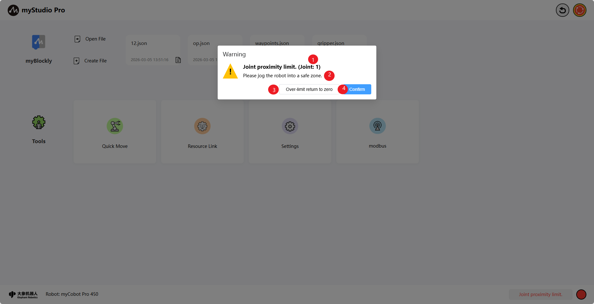 2. Repaired anomalies will be displayed in the historical alarm table of the anomaly list, and currently existing anomalies will be displayed in the current alarm table. The anomaly's existence time will be automatically recorded.

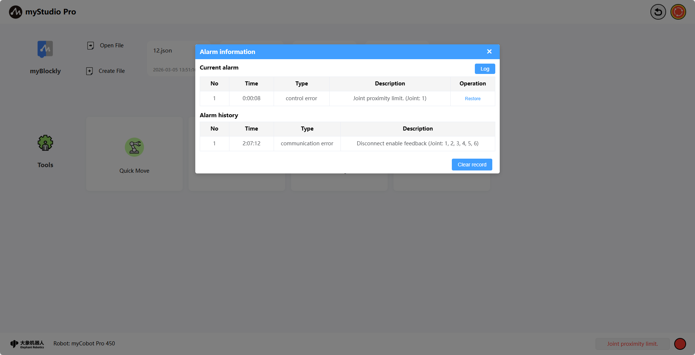

3. If an anomaly is repairable, click the Repair button 

    (1) to perform the anomaly repair operation. Clicking the Clear Records button

    (2) will clear the resolved historical alarm records.

    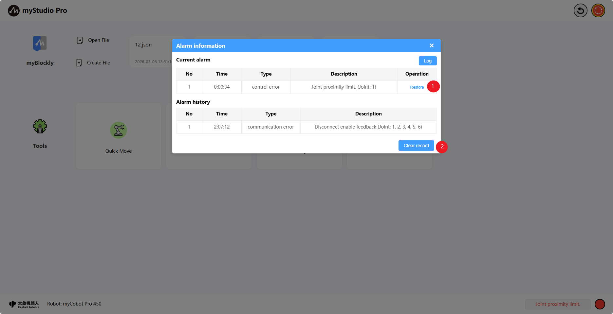

## Robot status

Function: Display the current operating status of the robot

| Color | meaning                                                     |
| ---- | ------------------------------------------------------------ |
|  |  not connected |
|  | standby  |
|  |  operation |
|  |  error |

---

[← [Previous Chapter](../5.1-SystemInstructions.md) | [Next Chapter →](./5.3.1-myStudioFirstUse.md)