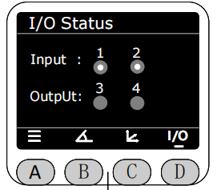
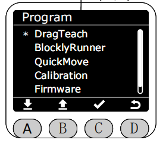

# **First use**

After the robotic arm is powered on, MiniRobot will first display its logo, followed by the main interface, which by default displays the joint information and static IP information of the robotic arm.

Switch between displaying different robotic arm information using the buttons at the bottom of the screen. Pressing the C key displays the current coordinates and static IP information of the robotic arm.

Pressing the D key displays the current input/output status of the M8 interface at the end. No dots indicate a low level, while white dots indicate a high level.

Press the A key to enter the menu interface. Use the icons at the bottom of the screen to select specific functions，**Please note that if there is no operation on this screen within 30 seconds, it will automatically redirect back to the main screen.**

[← 上一章]() |[下一页 →](./5.4.2-dragteach.md)