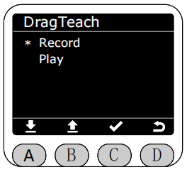
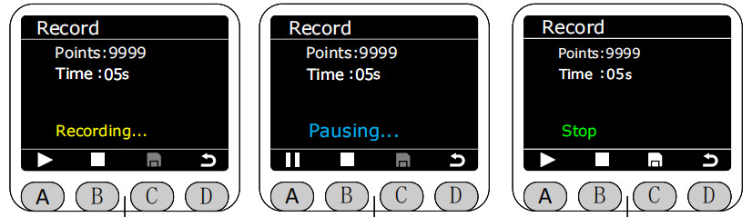
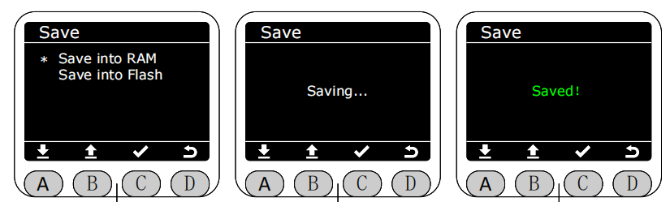
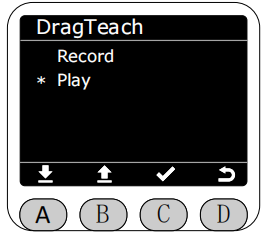
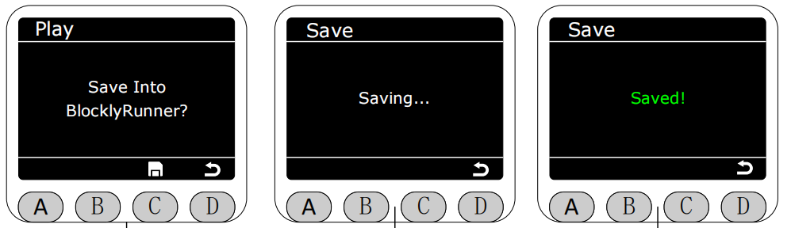

# **DragTeach**

In the Program interface, select the asterisk (*) to enable drag_teach function, and press the C key to enter drag-and-drop teaching mode.

#### ***Before proceeding, it should be noted that the production folder in the web application contains the published track files, while the test folder contains the unpublished track files.*** 

Select the Record function, press the C key to enter the recording interface. It is in a stopped state by default; you can exit the interface directly at this point. Press the A key to start recording. During recording, the end light strip will be solid yellow. Saving is not allowed during recording or pausing.

**The longest recording time is 120 seconds.** You can pause recording during the process by pressing the A key, and the end light strip will be solid blue.

Press the B button to stop recording. At this time, the end light strip will be solid green. After stopping recording, you can press the C button to save.

The recording method can be selected to save in RAM or Flash. If saved in RAM, the recorded track file will be lost after the machine restarts.

***If saved in Flash, the recorded track file will not be lost after the machine restarts. At the same time, the track file saved in Flash will be synchronously uploaded to the test folder on the web, named tpr-1.***

***Each file saved to Flash is an overwrite save, meaning only the most recently recorded track file saved to Flash is retained. The same applies to the web version.***

If the recording time exceeds the maximum duration limit or if you exit without saving, a warning screen will pop up. At this time, the end light strip will flash red for 1 second.

After saving the track file, you can select the Play function in the DragTeach interface to play the most recently saved track file.

The playback path can be selected to play from RAM or Flash.

Entering the playback interface, press the A key to start playback. At this time, the end light strip will flash yellow for 1 second. Pressing the A key again while playing will pause playback. At this time, the light strip will be solid blue. Pressing the B key will stop playback.

***The default playback mode for the track is infinite loop.***,After playback stops, you can choose whether to upload the track file to BlocklyRunner. If you choose to upload, the track file will be saved in the production folder on the web interface，***Files stored in RAM cannot be uploaded to the production folder on the web platform; they can only be played in the drag-and-drop teaching interface. Files stored in Flash can be uploaded to the production folder on the web platform.***

A warning will be displayed if no files are available for playback in either of the two playback paths. If a file is available in one path but not the other, a corresponding warning will also be displayed when clicking on it. At this time, the red light on the end LED strip will flash for 1 second.

[← 上一页](./5.4.1-home.md) |[下一页 →](./5.4.3-blocklyrunner.md)
