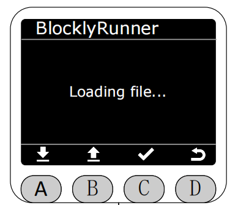
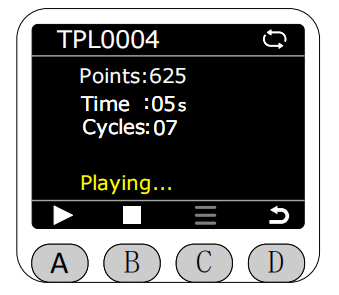
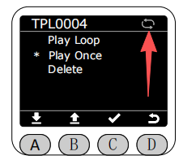
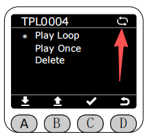
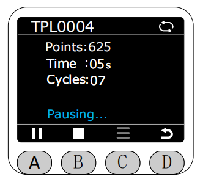
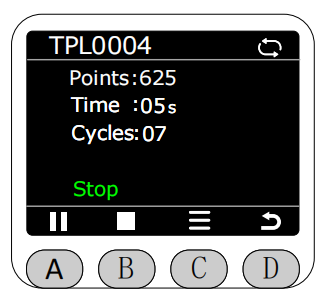

# BlocklyRunner

In the Program interface, select the BlocklyRunner function by the asterisk ( * ).

After entering the BlocklyRunner function, it will first check if there are any published track files in the myStudio Pro production folder.

If no published track files are found, an error message will be displayed. At this time, the red light on the end strip will flash for 1 second.

If a published track file exists, it will be displayed in the BlocklyRunner interface. You can select to play a published track file.

After selecting a published track file, its status will be checked first.

If the file is normal, press the A key to start playback. 

**During playback, the current loop status of the track file will be displayed in the upper right corner of the screen. Gray indicates single loop playback, white indicates infinite loop playback, and the default is infinite loop playback.**

**Before the track file starts or stops executing, you can press the C key to access the menu options to delete the track file, perform single playback, or loop playback.** After deletion, the corresponding track file in the myStudio Pro production folder will also be deleted.

If you select single playback, playback will automatically stop after the track file finishes playing.

If you select loop playback, it will automatically restart after the track file finishes playing.

Pressing the A button again while playing will pause playback.

Pressing the B button will stop playback.

[← Previous Chapter](./5.4.1-dragteach.md) |[Next Page →](./5.4.4-quickmove.md)