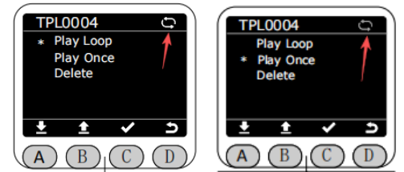
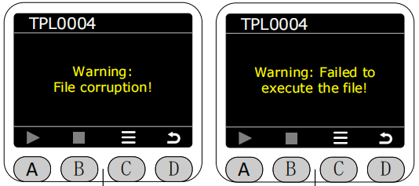

# ***BlocklyRunner***

In the Program interface, select the asterisk (*) to enable BlocklyRunner function, and press the C key to enter BlocklyRunner function.

After entering the BlocklyRunner function, it will first check if there are any published track files in the production folder on the web interface.
 

If available, the published track file will be displayed in the BlocklyRunner interface, and you can choose to play the published track file.

After selecting a published track file, the status of the track file will be checked first.

 

If the file is working correctly, press the A button to start playback. Press the A button again while the file is playing to pause playback. Press the B button to stop playback.

***During playback, the current playback loop status of the track file will be displayed in the upper right corner of the screen. Gray indicates single loop playback, and white indicates infinite loop playback. The default is infinite loop playback. Before the track file has started or stopped executing, you can press the C key to access the menu options to delete the track file, perform single playback, or loop playback.***After the deletion operation is performed, the corresponding trajectory file in the production folder on the web client will also be deleted simultaneously.

If there is no published track file or the track file is corrupted, a corresponding error message will be displayed.

[← 上一页](./5.4.1-dragteach.md) |[下一页 →](./5.4.4-quickmove.md)