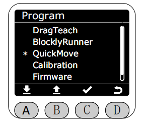
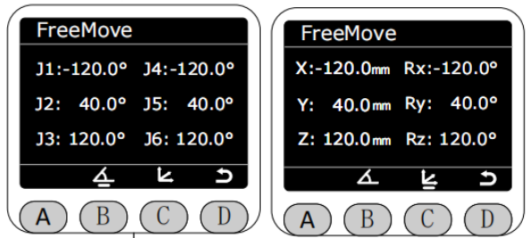
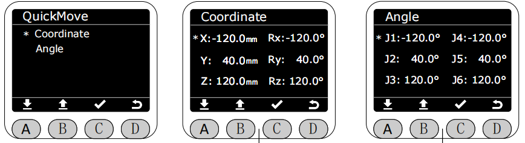
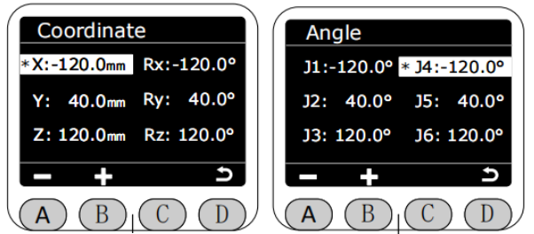

# QuickMove

In the Program interface, select the QuickMove function by marking the asterisk (*), and press the C key to enter QuickMove mode.

Once in QuickMove mode, you can choose between free movement or joint inching.

In FreeMove mode, the robot arm's angle data is displayed in real-time by default. Press and hold the buttons on both sides of the end effector to freely drag the robot arm. **At this time, all motor brakes will be released; please be careful.** Pressing the C key will display the current coordinate data of the robot arm in real-time.

In JogMove mode, the robot arm's angle data is displayed in real time. You can choose between jog angle or jog coordinate mode.

Select the joint you want to jog to control the robot arm's joint movement; the selected joint will be highlighted. In single-point jog motion, the step angle is 0.1°. Holding down the jog button will rotate the joint at a speed of 10, automatically stopping when it reaches near its limit.

[← Previous Chapter](./5.4.3-blocklyrunner.md) |[Next Page →](./5.4.5-calibration.md)