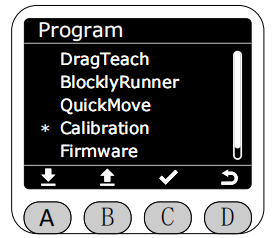
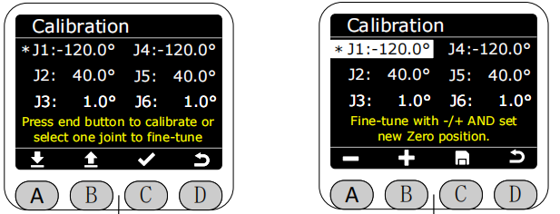

# ***Calibration***

In the Program interface, select the Calibration function by clicking the asterisk, and press the C key to enter the Calibration function.

After entering the Calibration function, you can select the joints you want to calibrate by clicking on them. Once selected, you can use the A and B keys to rotate the joints to the desired zero position. After reaching the desired position, press the C key to save the calibration. The corresponding joint angle data in the screen will directly become 0°.

[← 上一页](./5.4.4-quickmove.md) |[下一页 →](./5.4.6-firmware.md)
