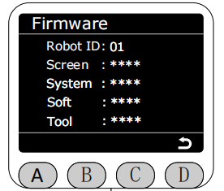

# ***Firmware***

In the Program interface, select the Firmware function by clicking the asterisk, and press the C key to enter the Firmware function.

After entering the Firmware function, all version information of the current robotic arm will be displayed.
RobotID corresponds to the unique identifier of the robotic arm, used to distinguish between different robotic arms.
Screen corresponds to the version of the minirobot.
System corresponds to the system version.
Soft corresponds to the Web+ backend+ motion control version (e.g., 1.0.1 + 1.0.2 + 1.0.3 = 1.101.102.103).
Tool corresponds to the end effector version.

[← 上一页](./5.4.4-quickmove.md) |[下一页 →](./5.4.6-firmware.md)
