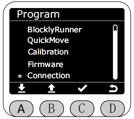
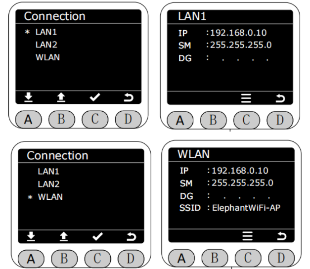

# ***Connection***

In the Program interface, select the Connection function by clicking the asterisk, and press the C key to enter the Connection function.

After entering the Connection function, you can select the corresponding network interface to display the configuration information of the current robotic arm network interface.

[← 上一页](./5.4.6-firmware.md) |[下一页 →](../5.5-blockly)
