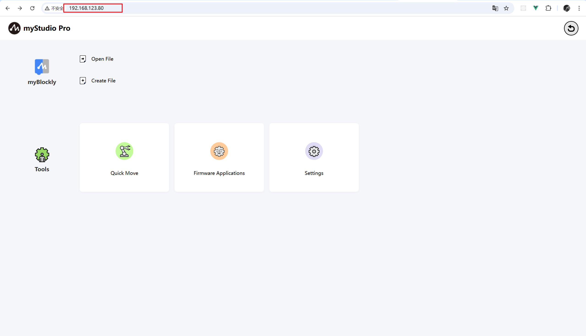
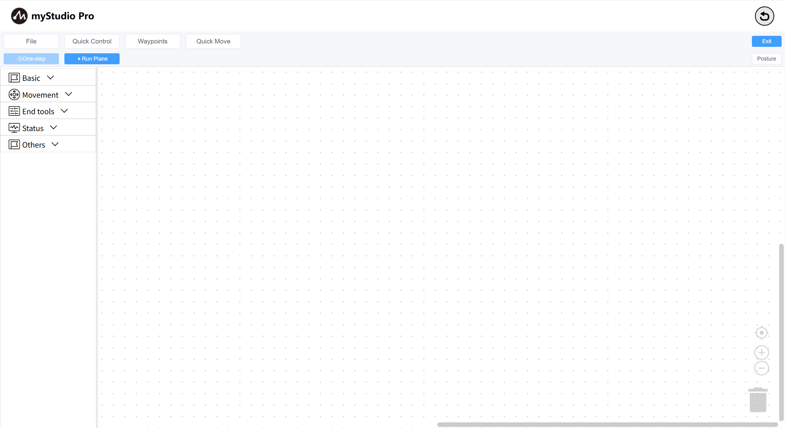

# First Time Use

myStudio software has been configured in the machine system. You can use a PC to open a browser and access it through `ip`. After the homepage is loaded, the system will automatically establish a connection with the machine.

You can access the Blockly programming page by clicking the Blockly icon or the New Document button.
> Of course, you can also load a saved workspace by clicking the Open File button (for information on saving a workspace, click here).  
> Accessing the Blockly programming page by clicking the Blockly icon or the New Document button is equivalent to creating a new workspace.

The `blockly` homepage is shown below:

---

[← Previous Chapter](../5.4-Q&A.md) | [Next Chapter→](./5.5.2-interfaceDescription.md)