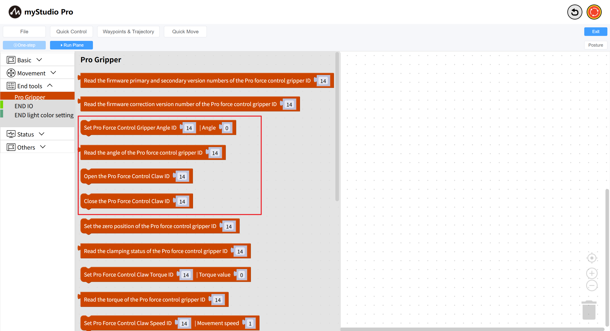
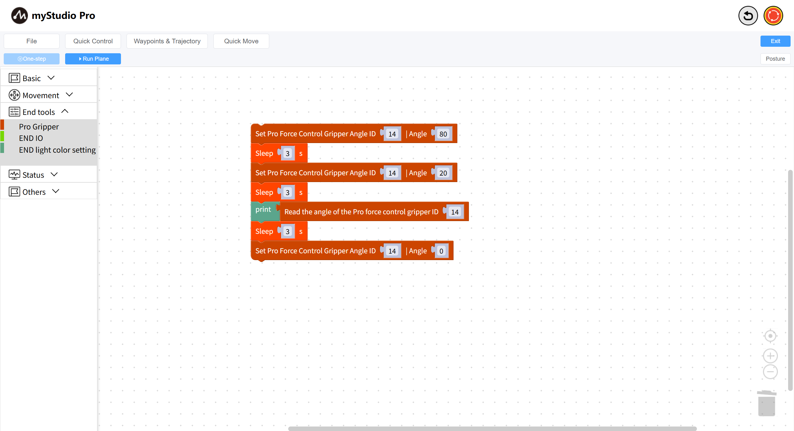

# Using the Gripper

*Before You Begin*

> *1. Ensure the machine is powered on*
>
> *2. Ensure the machine is properly connected*
>
> *3. Enable the server*

This chapter describes how to use `Blockly` to control the Pro Force Gripper connected to a robotic arm.

### API display

We will use the following blocks.

1: `Set Pro Force Control Gripper Angle`: Sets the gripper to a specific state (open or closed) at a specified angle.

Parameter Description:

This block has two adjustable parameters:

- Gripper ID parameter: Default is 14
- Gripper Angle parameter: Indicates the desired angle, with a range of 0 to 100.

2: `Read Pro Force Control Gripper Angle`: Reads the current gripper angle.

This block has one adjustable parameter:

- Gripper ID parameter: Default is 14

### Small Example

The graphic code is as follows:

Code execution results:
- Controls the Pro force-controlled gripper to a value of `80` degrees
- Waits for 3 seconds
- Controls the Pro force-controlled gripper to a value of `20` degrees
- Waits for 3 seconds
- Reads the current angle of the Pro force-controlled gripper
- Waits for 3 seconds
- Controls the Pro force-controlled gripper to a value of `0 `degrees
**Note**:

If you are unable to control the gripper from the example above, please ensure that your Pro Force Control Gripper is using the `Modbus` protocol.

After completing this configuration, run the example code again.

---

[← Previous Chapter](./5.5.9-waypoint.md) | [Next Chapter→](./5.5.11-dragTeach.md)