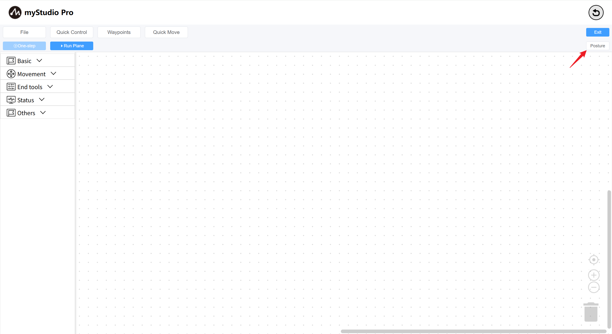
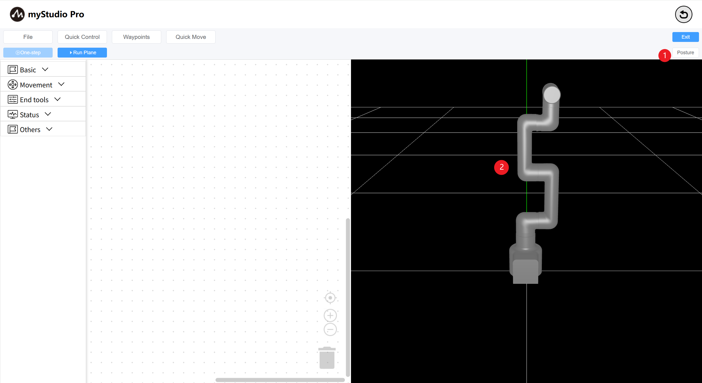
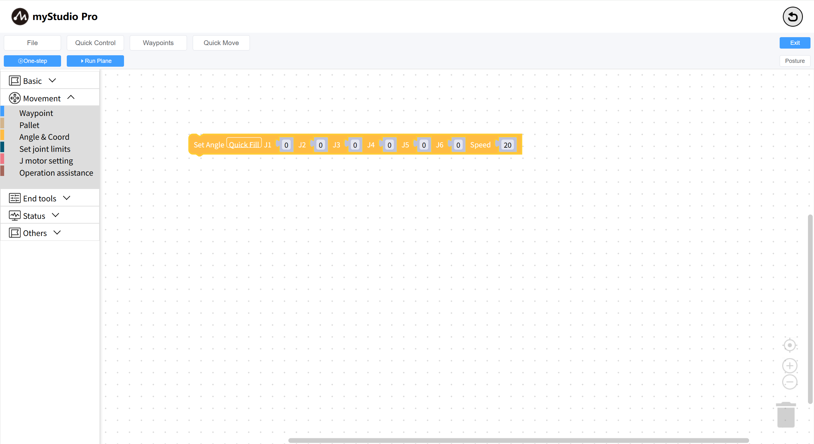
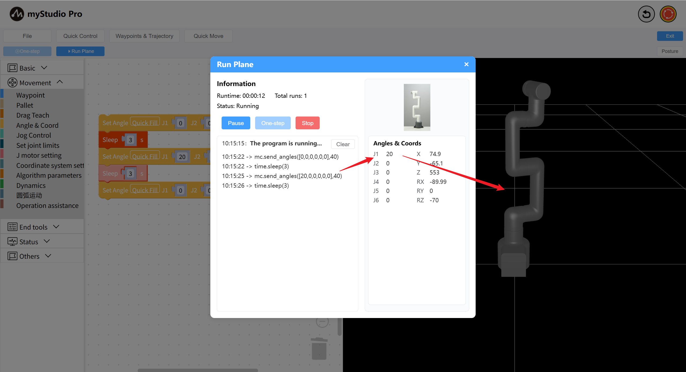
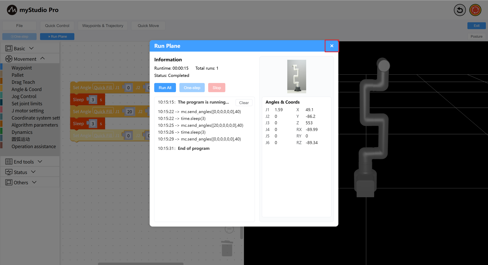
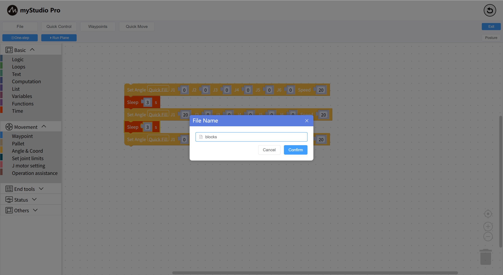
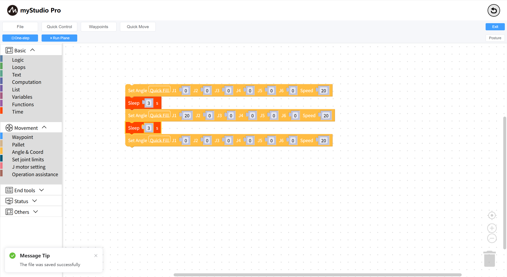
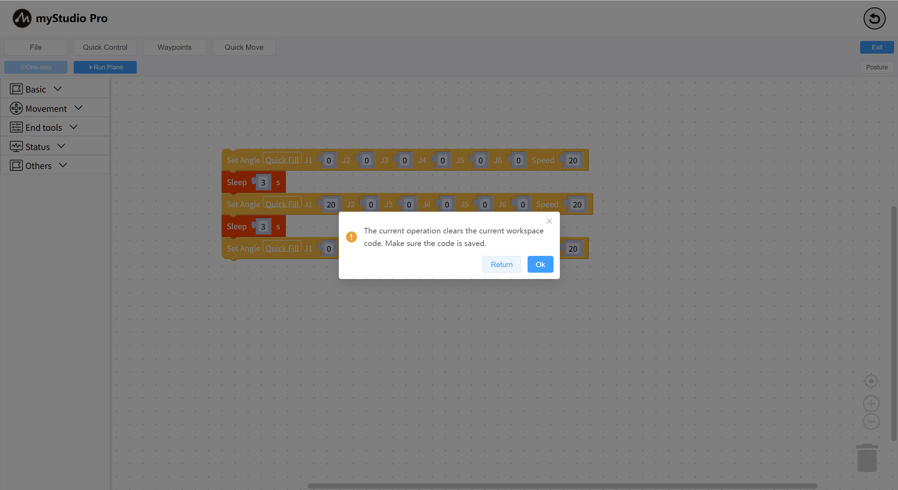

# Small Case

*Before You Begin*

> *1. Ensure the robot is powered on*
> 
> *2. Ensure the robot server is running*
> 
> *3. Ensure the robot is at zero position*

Let's write a small example to introduce the basics of 'Blockly'.

**Example Description:** Control a robotic arm to return to zero, then move a joint to a 20-degree position, and then return to zero.

**Step 1:** First, click the Pose button to open the Pose view, where you can see the current pose of the simulated robotic arm.

- 1: Toggle the Posture Panel: Click to display it if it's hidden, or to hide it if it's hidden.
- 2: The robotic arm simulation model simulates movement in real time based on the current real-world angle.

**Step 2:** Start programming

Open the toolbox's first-level category `Motion Control`, select the second-level category `Angle & Coordinate`, and drag the `Set Full Angle` block to the workspace.

This block is used to control the movement of each joint of the robotic arm to a given angle, and the default movement speed is 20.

Open the toolbox's first-level category `Basic Programming`, select the second-level category `Time`, drag the `Sleep` block to the workspace, and set the sleep time to 3 seconds.

The 3-second sleep time means the program waits for 3 seconds before continuing. Why does it wait for 3 seconds? Because the team needs to ensure that the robot arm completes the first command action before executing subsequent actions.

Copy the `Set Full Angle` block and change the `Joint 1` angle to 20 degrees:

- Click and select the `Set Full Angle` block in the workspace;
- Press Ctrl + C on your keyboard to copy the `Set Full Angle` block;
- Press Ctrl + V on your keyboard to paste the `Set Full Angle` block;
- Change the `Joint 1` value of the new block to 20 degrees;
- Drag this block to connect it to the `Sleep` block;

Similar to the above operation, copy the `Sleep` block and set the sleep time to `3` seconds;

Duplicate the first `Set Full Angle` block in the workspace again;

The complete code is as follows:

> This code means:
>
> - Control the robot arm to return to zero position 
> - Wait 3 seconds (for the machine to return to zero position) 
> - Move one joint (J1) to the 20-degree position 
> - Wait 3 seconds 
> - Control the robot arm to return to zero position 

Finally, click the `Run Panel` button. After the panel opens, click the `Run` button to start executing the code.

After the code is finished running, click the panel `X` to close the panel.

**Step 3:** Save and load files (or save and load workspaces)

`blockly` supports saving and loading of workspaces.

Click the `File` button, a drop-down menu will appear. Click the `Save` button, a file naming modal window will be displayed, enter a name and click OK to save. The saved result will be displayed as a message prompt in the lower left corner.

**Step 4:** Create a new workspace (this will clear all code in the workspace)

Click the `File` button. A drop-down menu will appear. Click the `New Workspace` button. A prompt will appear. Click the `Confirm` button.

New workspace completed

**Step 5:** Load the workspace file we saved previously.

Click the `File` button to display a drop-down menu. Click the `Open File` button in this menu to display a list of saved files. Select the workspace file you want to load and click the `Open` button to load it. Click the `Delete` button to delete the file.

Loading completed

---

[← Previous Chapter](./5.5.2-interfaceDescription.md) | [Next Chapter→](./5.5.4-autofill.md)

