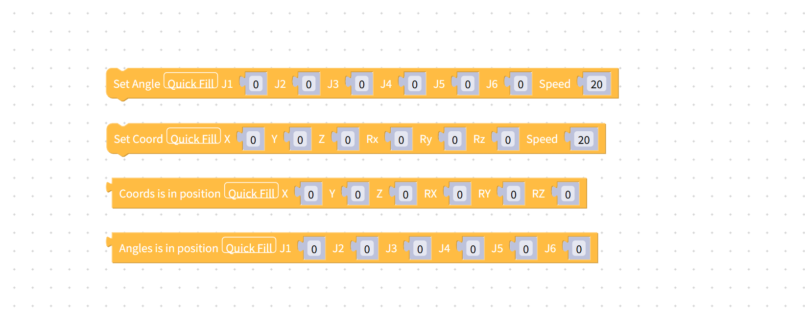
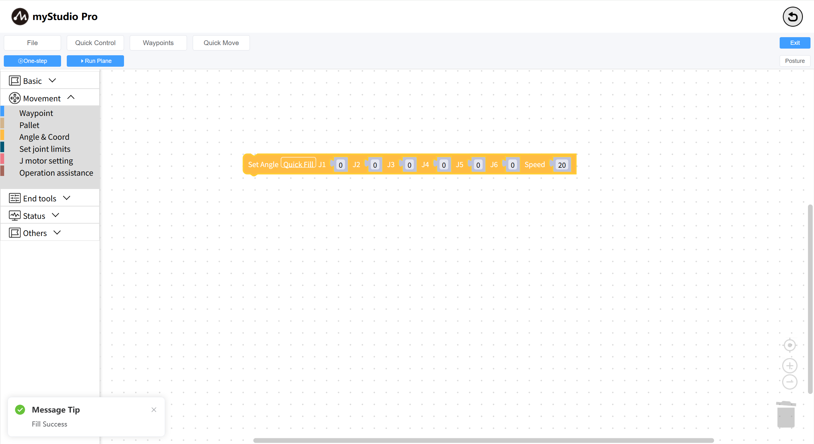

# Quickly Fill Data

*Before You Begin*

> *1. Ensure the robot is powered on*
> 
> *2. Ensure the robot server is running*
> 
> *3. Ensure the robot is at zero position*

This chapter introduces the Quick Fill feature in building blocks.

When a building block has too many data items, filling them in one by one becomes cumbersome. Therefore, we can use the Quick Fill feature for blocks with too many data items.

Currently, the following building blocks support Quick Fill:

### How to Use Quick Fill

Using the `Set Full Angle` block as an example, first select the block, then click the `Quick Fill` button within the block.

When the following prompt box appears on the page, the entry is successful.

---

[← Previous Chapter](./5.5.3-littleCase.md) | [Next Chapter→](./5.5.5-quickMove.md)

