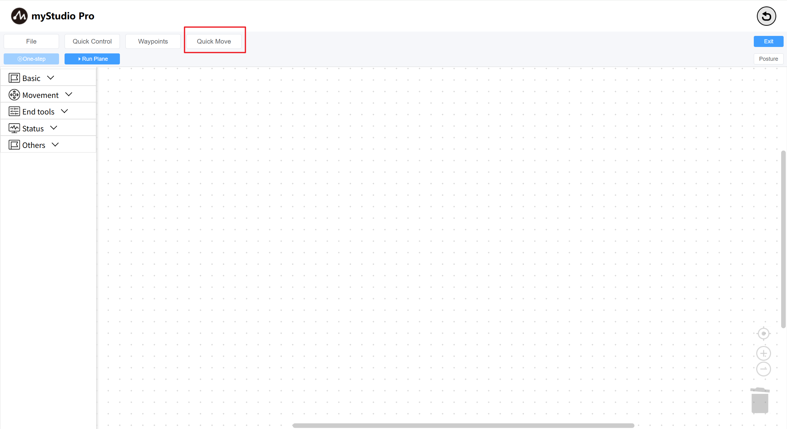
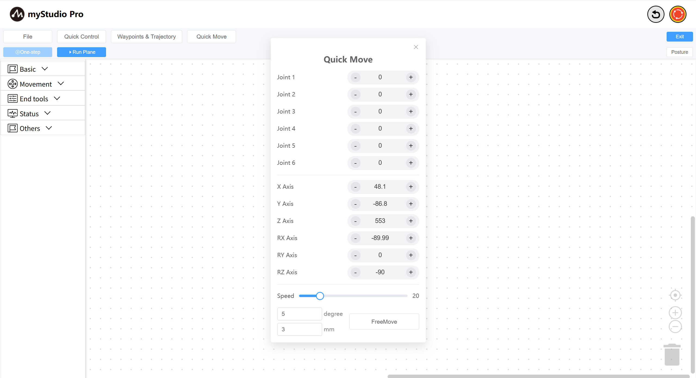
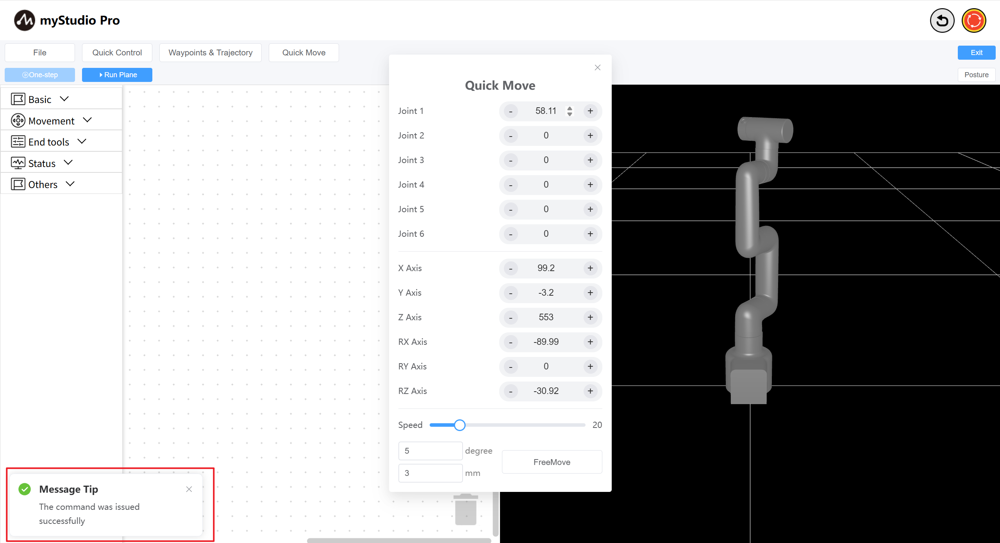
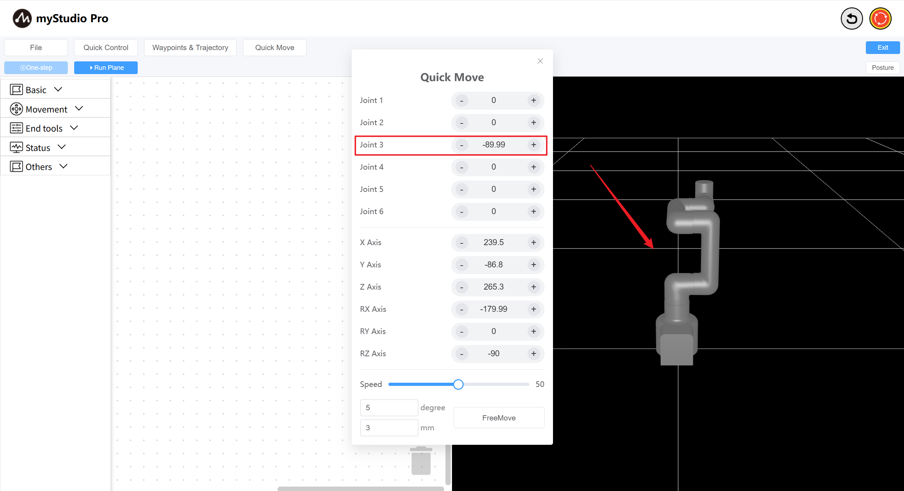

# Quick Move

*Before You Begin*

> *1. Ensure the robot is powered on*
> 
> *2. Ensure the robot server is running*
> 
> *3. Ensure the robot is at zero position*

What is **Quick Move**? Simply put, it allows you to quickly control robot movement with mouse clicks, without programming.

> Note: There are two **Quick Move** control panels in myStudio, and their functions are similar.

**Step 1: Click the Quick Move** button to open the **Quick Move** panel and wait for the robot data to be returned.

If all data is zero, please check that the robotic arm is connected and functioning properly.

**Step 2:** Try clicking the `-` / `+` buttons to control different joints of the robotic arm. Supports single-point, long-press continuous movement, and direct modification of angles and coordinates by pressing Enter for control.

**Step 3:** Control the coordinates.

First, move Joint 3 to approximately `-90 degrees`, as shown below.

Then, click the  `-` / `+`  buttons for different coordinate axes to control the coordinates.

For other functions, please refer to [Quick Move](../5.6-quickmove/5.6.1-quickmovefirstuse.md)

---

[← Previous Chapter](./5.5.4-autofill.md) | [Next Chapter→](./5.5.6-useCoords.md)