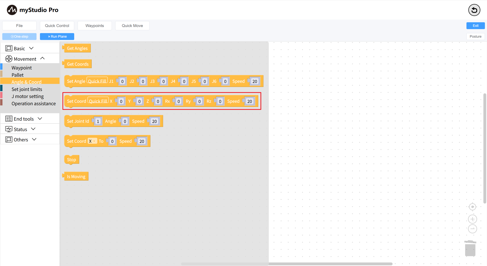

# Learning to Use Coordinate Control

*Before You Begin*

> *1. Ensure the robot is powered on*
> 
> *2. Ensure the robot server is running*
> 
> *3. Ensure the robot is at zero position*

This chapter describes how to use coordinates to control the robotic arm.

### Mainly covered APIs:

**Set Coordinates**

- **Prototype**: `send_coords(values,speed)`

- **Interface Description**: Set multiple coordinates for the robotic arm

- Parameters:

- values: [X, Y, Z, RX, RY, RZ]

- speed: Speed, range: 1-100

### Small Case

#### Before using coordinate movement for the first time, some steps are required:

- Return the robotic arm to its zero position. For details, refer to [Controlling the Robotic Arm to Return to Zero](./5.1.5.3-littleCase.md)

- Set the initial pose for the robotic arm's coordinate movement (J3 of the robot must be parallel to the ground)

- As shown in the code below:

Open the `Run Panel` and run the code.

#### Coordinate Movement

Drag a `Set Coordinates` block onto the workspace and click the `Quick Fill` button to fill in the data. Change the `Z` axis data to `300`.

The complete code is as follows:

Execute the code and observe the robot arm moving up and down.

---

[← Previous Chapter](./5.5.5-quickMove.md) | [Next Chapter→](./5.5.7-singleStep.md)