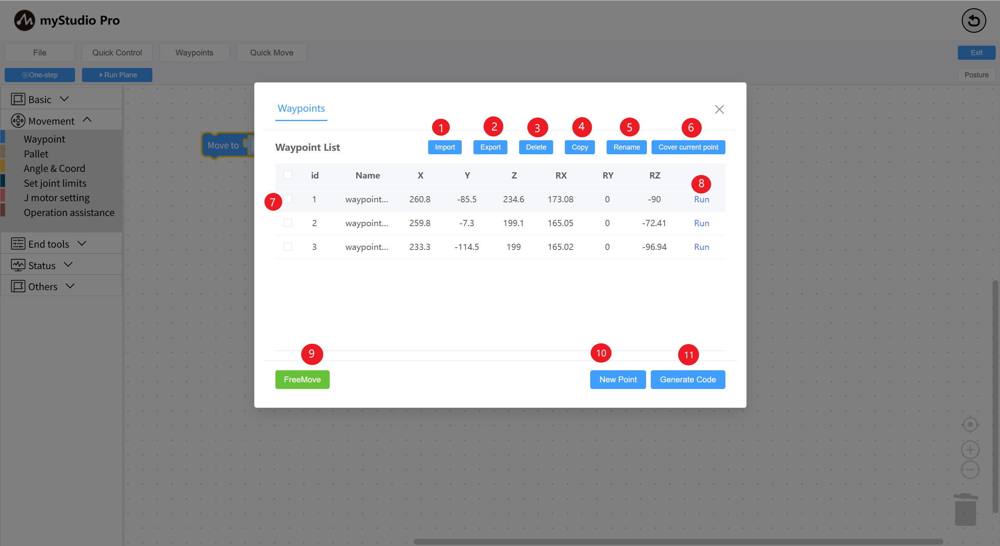
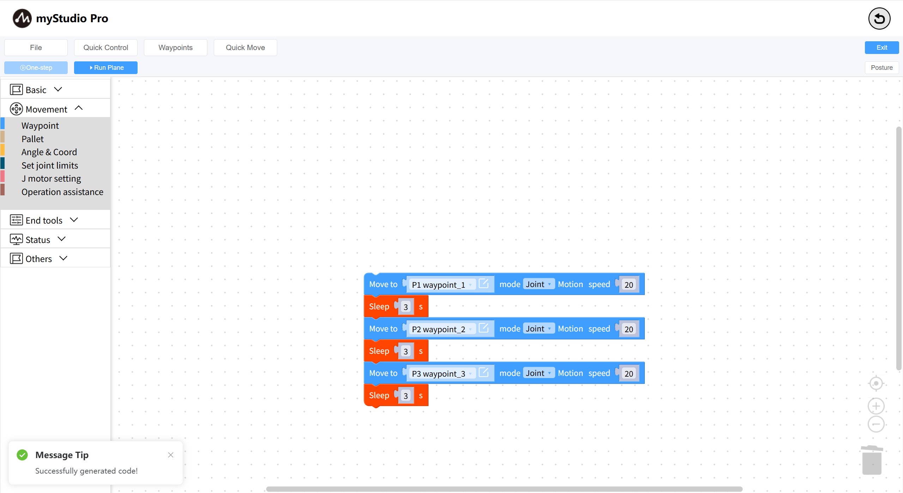
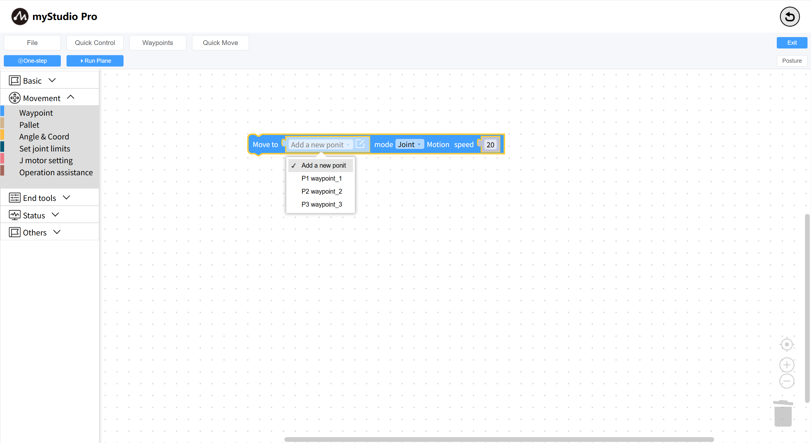
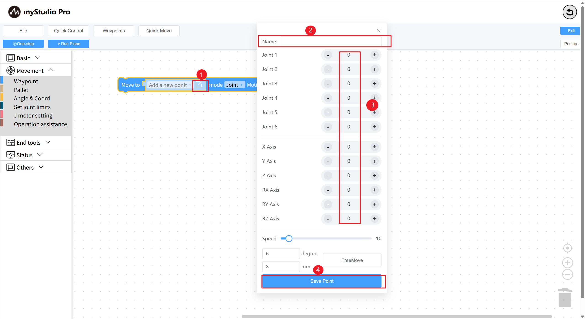

# Waypoints

*Before You Begin*

> *1. Ensure the robot is powered on*
>
> *2. Ensure the robot is properly connected*
>
> *3. The server is enabled*

This chapter describes how to use the waypoint function to control the robotic arm.

Function Description: By `entering multiple waypoint data (robot arm joints and coordinates)`, you can quickly control the robot arm to reach each waypoint. Open the waypoint list page, enable free movement, relax the robot arm, manually adjust the robot arm posture, and click Add Point to add a waypoint data.

| Serial Number | Description |
| ---- | ------------------------------------------------------------ |
| 1 | Click the "Import" button to import a previously saved JSON file containing waypoint information. |
| 2 | Click the "Export" button to export all waypoint information into a single JSON file. |
| 3 | Click the "Delete" button to delete all selected waypoints in the current waypoint list. |
| 4 | Click the "Copy" button to copy the coordinate information of all selected waypoints. |
| 5 | Click the "Rename" button to rename all selected waypoints.
| 6 | Click the "Overwrite Current Point" button to quickly overwrite the coordinates of all selected waypoints with the current robot arm coordinates. |
| 7 | Check the "List Data" column. Functions 3-6 rely on this function. |
| 8 | Click the "Run" button, and the robot arm will move to the currently recorded waypoint. |
| 9 | Click the "Free Move" button, and a second confirmation window will pop up. Clicking "Confirm" will turn the button yellow. The robot arm will relax, and you can adjust its posture. |
| 10 | Click the "Add Point" button to enter the current robot arm coordinates.
| 11 | Clicking the "Generate Code" button will quickly generate waypoint blocks into the Blockly program coding area. |

Select a waypoint block in `blockly` and add it to the program coding area. Alternatively, use the `Generate Code` button in the waypoint list to attach the generated waypoint block to the last block in the workspace.

The waypoint block associates the data in the waypoint list. Select any waypoint in the waypoint list to associate.

Add point information to the waypoint block. Select the new point and click the edit icon to open the new waypoint pop-up window. The custom waypoint name will be set by default. Use the + or - keys to adjust the waypoint information. Click the Save Waypoint button to add the waypoint data.

> In addition, the waypoint building block can modify the movement mode. Joint movement mode: movement is based on the joint information of the current waypoint. Linear movement mode: movement is based on the coordinate information of the current waypoint.
| No. | Description |
| ---- | ------------------------------------------------------------ |
| 1 | Select a waypoint. Click the edit icon to open the waypoint editing dialog. |
| 2 | Enter the waypoint name. |
| 3 | Display the robot's joint and coordinate data. Use the left (-) and right (+) buttons to adjust the waypoint data. |
| 4 | Click Save Waypoint to add or modify waypoint data.                    |

---

[← Previous Chapter](./5.5.8-program.md) | [Next Chapter→](./5.5.10-gripperUse.md)
