# Settings
### 1 Interface Introduction

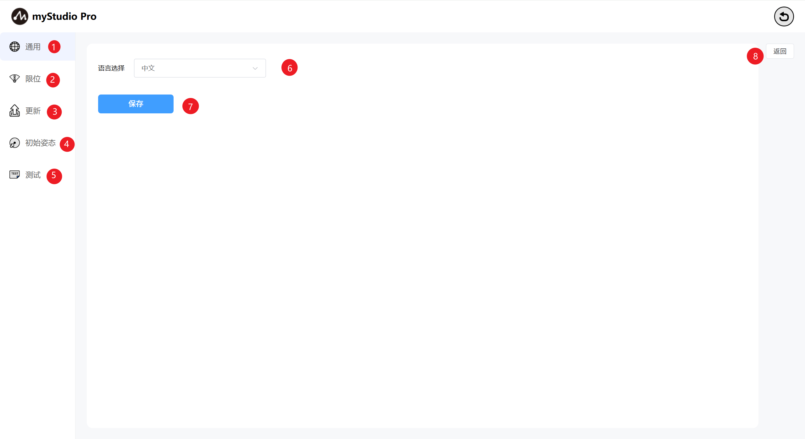

| Serial Number | Function Description |
| ---- | -------------------------- |
| 1 | General Settings Module, mainly for language settings |
| 2 | Limit Settings Module |
| 3 | Check Update Module |
| 4 | Initial Posture Module |
| 5 | Test Module |
| 6 | Language Selection Module |
| 7 | Save Settings Button |
| 8 | Exit Settings |

### 2 General Settings

Clicking the `General` icon will take you to the language settings page. You can choose between `Chinese` and `English`.

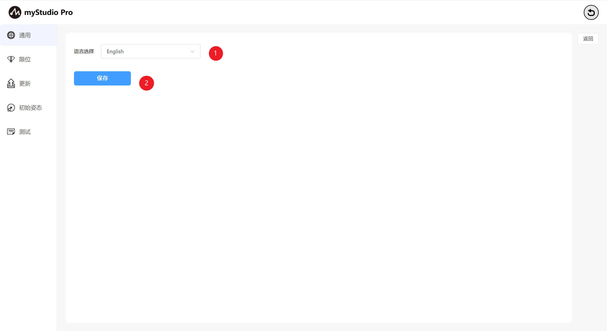

After selecting the corresponding language, click the `Save` button. A second confirmation prompt window will appear. Click Confirm to successfully set the language.

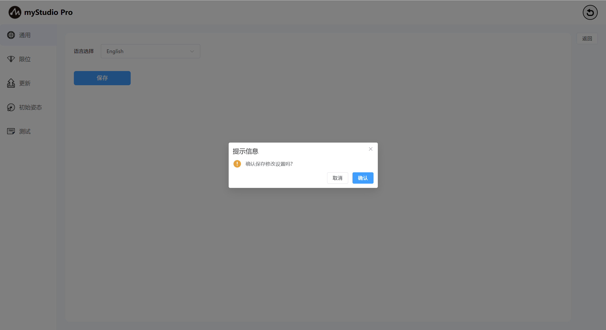

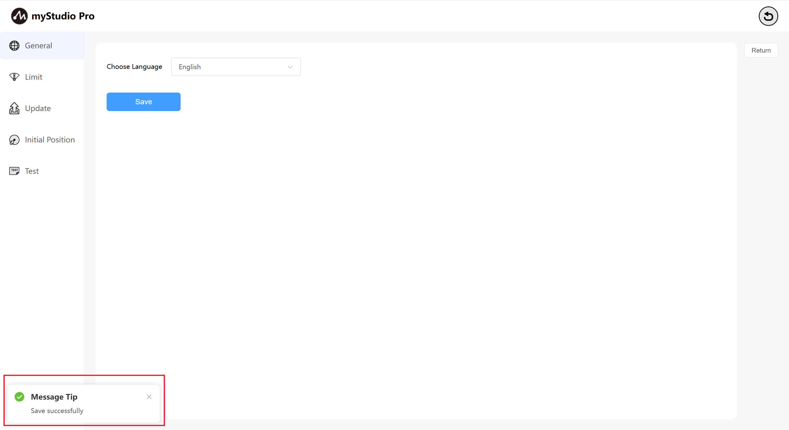

## 3 Limit Settings

> Note: Limit parameter modification only supports the minimum and maximum joint angles. Other parameters cannot be modified.

Click the `Limit` icon button to enter the joint limit settings page. The `Limit Settings` interface displays the parameters related to the current robot arm's joint limits and coordinate limits by default.

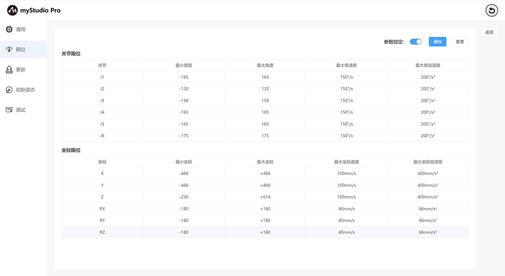

The `Parameter Lock` button is in the locked state by default, and the button color is blue, indicating that the limit parameters cannot be modified.

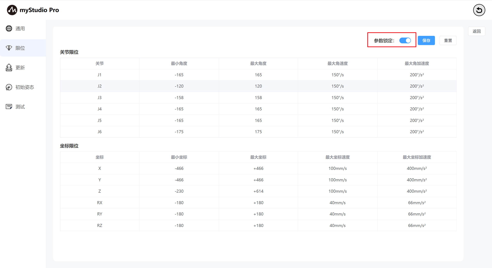

When the parameters are locked, click the `Parameter Lock` button and the button will turn gray, indicating that the parameters are unlocked, which means that the limit parameters can be modified (only the minimum and maximum angle values ​​can be modified).

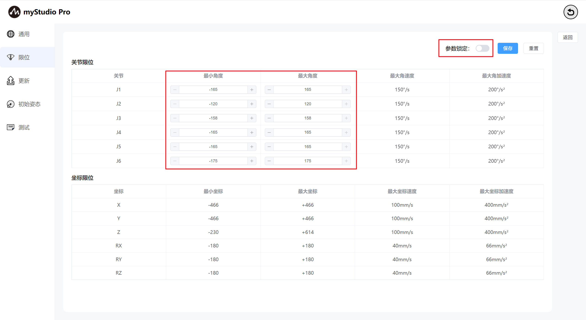

Click the `Save` button and define a file name according to the prompts in the pop-up window to save the parameters of the current limit page to a local file (json file) and set the joint limits of the robot arm.

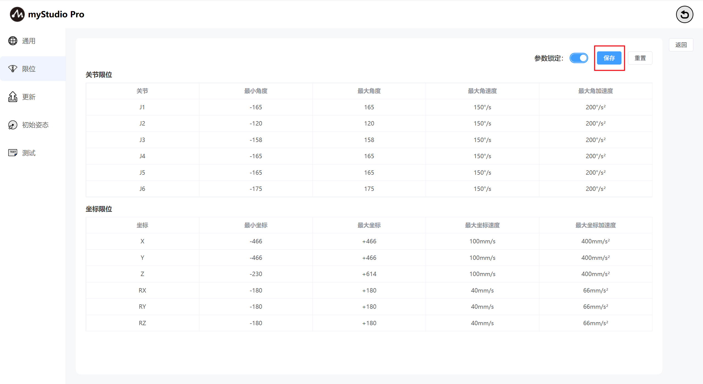

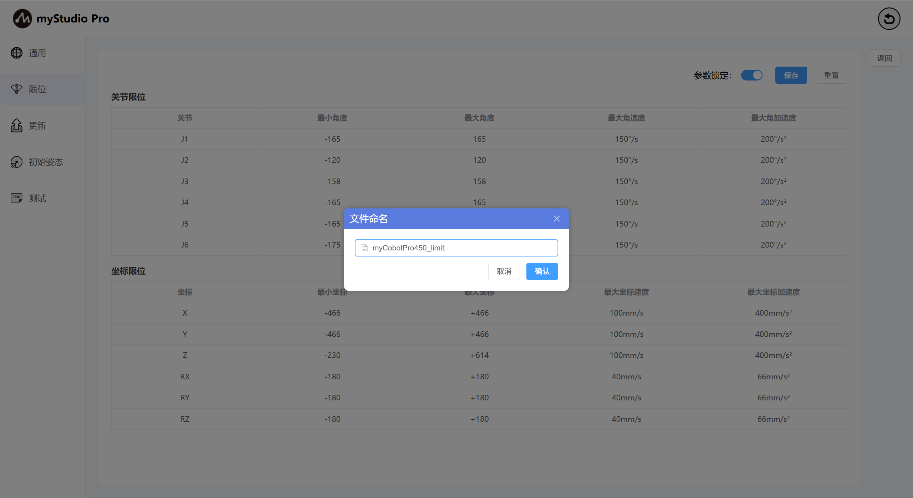

## 4 Check for Updates

Clicking the `Update` icon will take you to the Check Update Status page.

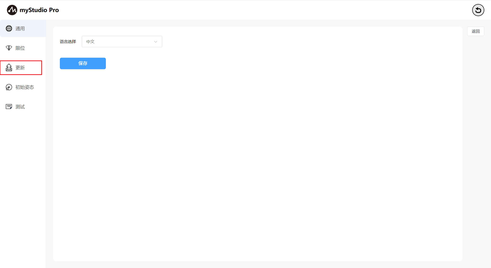

The Update page primarily checks the Atom firmware version status of the robotic arm.

If the robotic arm's Atom firmware is not the latest version, a prompt will appear indicating that a firmware update is required.

## 5 Initial Posture

Click the `Initial Posture` icon to enter the Initial Posture page.

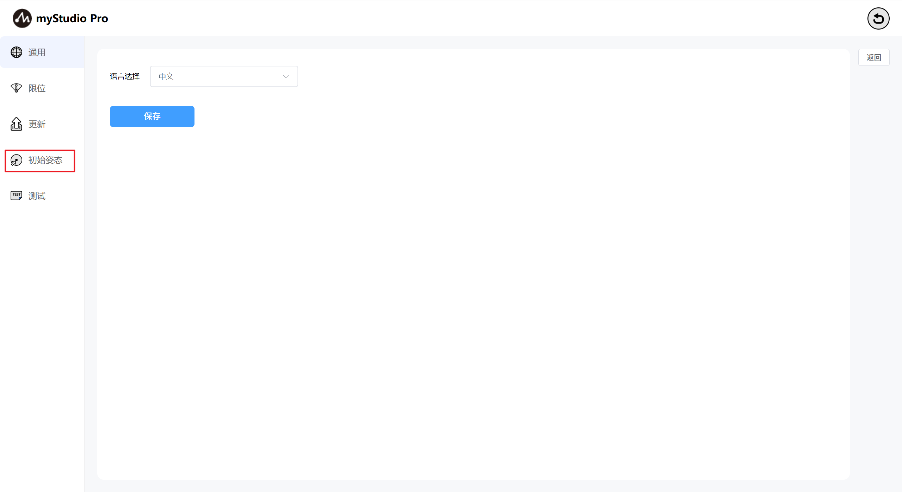

Initial Pose Page: Displays the robot arm's initial pose model, joint angle information, and coordinate pose information.

## 6 Testing

Click the `Test` button to enter the test page.

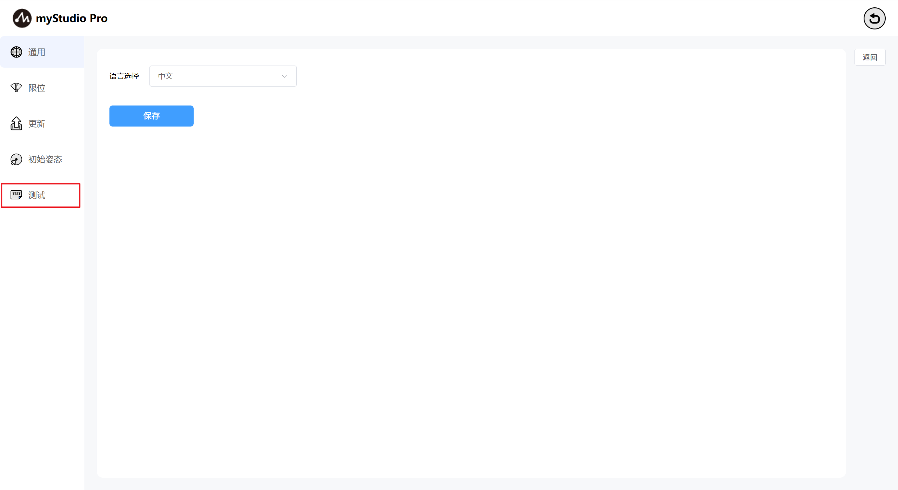

`Test` page: mainly tests the communication connection, firmware, servo and other status of the robot arm.

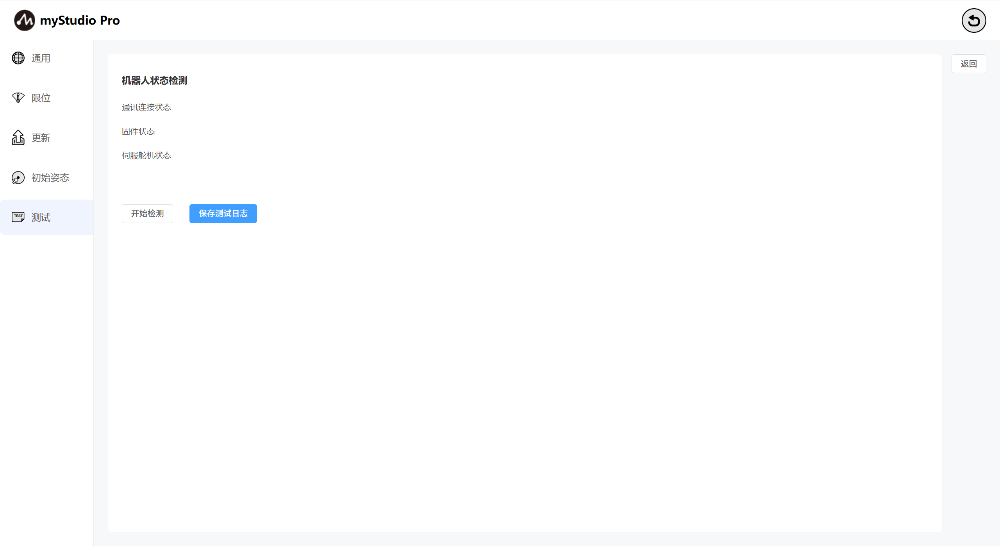

Click the `Start Detection` button to start the test.

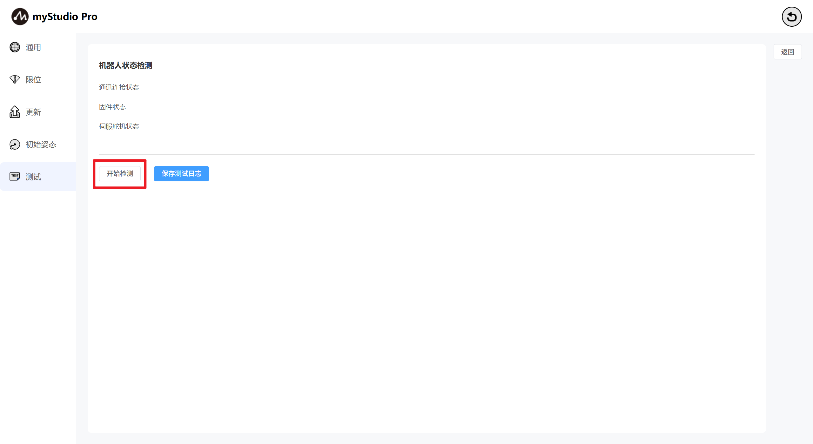

After the test is completed, click the `Save Test Log` button and follow the pop-up window to save the test results to a local log file.

---

[← Previous Chapter](../5.7-firmware/5.7.1-firmware_main.md) | [Next Chapter→](../../6.developmentGuide/README.md)