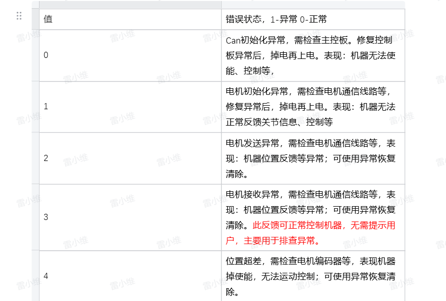

# Checking and Handling Robot Arm Exceptions

When the robot arm fails to execute a motion command, you can query the corresponding exception information in the Python terminal, for example.

## Reading Robot Status

### Status Feedback Analysis

Under normal circumstances, this interface returns all 0s. Reading the robot status is as follows:

```python
from pymycobot import Pro450Client
# The default IP address is "192.168.0.232" and the default port number is 4500
pro450 = Pro450Client('192.168.0.232', 4500)

if pro450.is_power_on() !=1:
    pro450.power_on()  # Power on

pro450.get_robot_status() # Reading Robot Status

```

Return:

```bash
[0, 0, 0, 0, 0, 0, 0, 0, 0, 0, 0, 0, 0, 0, 0, 0, 0, 0, 0, 0]
```

Indicates the robot is not moving, no joints are exceeding limits, no joint hardware errors, and no joint software errors.

A complete explanation of each value is as follows:

`[Reserved, Whether Moving, Whether J1 Exceeds Limits, Whether J2 Exceeds Limits, Whether J3 Exceeds Limits, Whether J4 Exceeds Limits, Whether J5 Exceeds Limits, Whether J6 Exceeds Limits, Whether J1 Motor Hardware Error, Whether J2 Motor Hardware Error, Whether J3 Motor Hardware Error, Whether J4 Motor Hardware Error, Whether J5 Motor Hardware Error, Whether J6 Motor Hardware Error, Whether J1 Software Communication Error, Whether J2 Software Communication Error, Whether J3 Software Communication Error, Whether J4 Software Communication Error, Whether J5 Software Communication Error, Whether J6 Software Communication Error]`

The following example is as follows:

```bash
[0, 1, 0, 0, 0, 0, 0, 0, 0, 0, 0, 3, 0, 0, 0, 0, 0, 0, 0, 0, 0]
```

This indicates that the robot reported an error during movement, with J4 reporting a control error.

```bash
[0, 0, 0, 1, 0, 0, 0, 0, 0, 0, 0, 0, 0, 0, 0, 0, 0, 0, 0]
```

This indicates that robot J2 exceeded the limit.

```bash
[0, 0, 0, 0, 0, 0, 0, 0, 0, 0, 0, 0, 0, 0, 0, 0, 0, 0, 3, 0]
```

Indicates that the robot's J5 line is abnormal - receiving an error

### Exception resolution

#### Joint out of limit

When a joint exceeds the limit, use one of the following solutions:

- Execute the over-limit return to zero interface:

```bash
pro450.over_limit_return_zero() #The robot will return to the origin at a slower speed
```

- Execute joint relaxation and manually move the joint to within the limit

```bash
pro450.set_motor_enable(254, 0)
```

#### Joint Hardware Error

Most hardware errors can be recovered using exception recovery.

```bash
pro450.servo_restore(joint_id)
```

If this problem persists after using exception recovery or restarting the robot, please contact our engineers. Detailed information about the hardware errors for each joint is shown in Figure 1:


#### Joint Software Errors

Software error feedback mainly includes: circuit abnormalities, CAN module abnormalities, encoder abnormalities, and enable failure. If the enable failure occurs, use `pro450.set_motor_enable(254, 1)` to enable motion again. For other abnormalities, please contact our engineers. Detailed joint software error information is shown in Figures 2 and 3:




#### The robot is in motion and cannot move.

The robot is in motion and does not respond when you send a motion point. Please stop the robot by executing `pro450.stop()` and `pro450.resume()`. If the robot still cannot move, please contact our engineers. <br/>

---

[← Previous Chapter](./6_gripper.md) | [Next Chapter→](../6.2-ROS1/README.md)