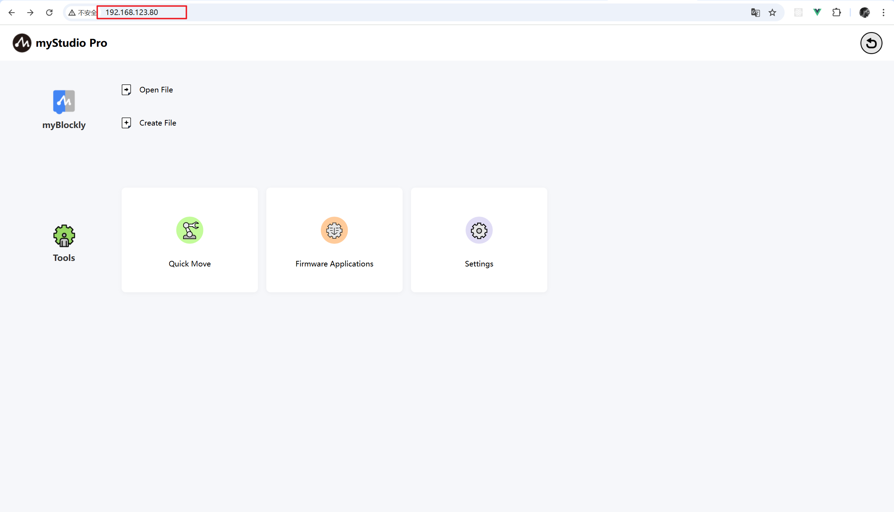
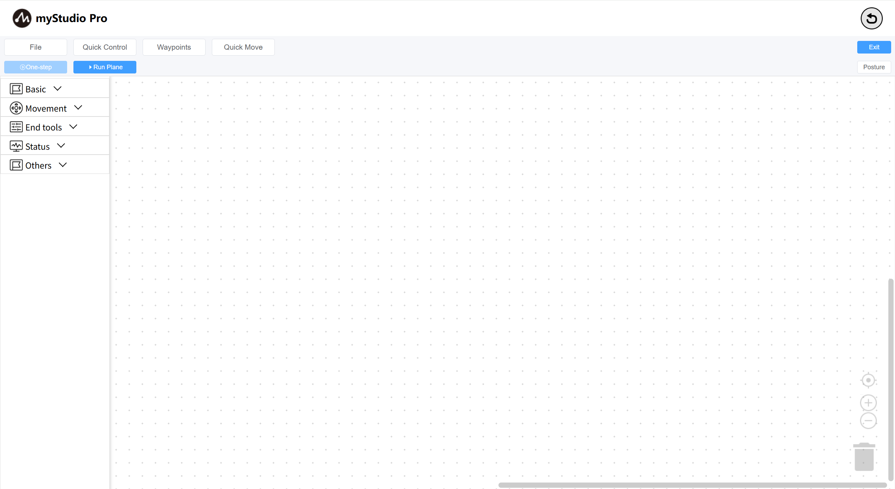

# First time using

The myStudio software has been configured into the machine system. You can open a browser on your PC and access it via `ip`. Once the home page is loaded, the system will automatically establish a connection with the machine.

You can click the blockly icon or the "New Document" button to enter the blockly programming page.

> Of course, you can also load the workspace you have saved by clicking the Open File button (for information on how to save the workspace, please click here). 
> The operation of entering the blockly programming page by clicking the blockly icon and the New Document button here is equivalent to adding a workspace.

The home page of `blockly` is shown as follows:

[← Previous page]() | [Next page →](./6.5.5.2-interfaceDescripton.md)