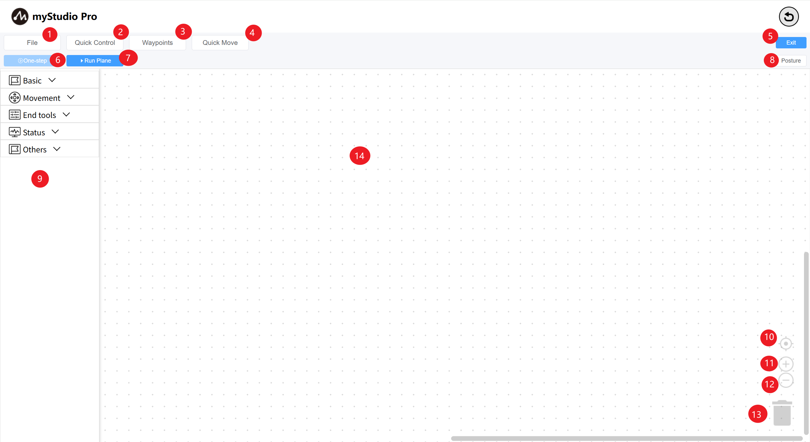

# blockly Main Interface Introduction

| Serial number |  Function introdution                   |
| ---- | ------------------------------------------------------------ |
| 1    | File: You can load, save, and create a new workspace;               |
| 2    | Quick power-on: The robotic arm releases/grips the joint tightly;  |
| 3    | Waypoint: Quickly create and run teaching points; |
| 4    | Quick Move: used to quickly control the movement of the robotic arm;                           |
| 5    | Exit: exit blockly main interface;                                    |
| 6    | One-step: Select a building block, you can click this button to execute only the currently selected building block; |
| 7    | Run panel: Open the run panel, where you can run and debug the workspace code;   |
| 8    | Posture: Open the attitude page and you can see the current angle and coordinate information;      |
| 9    | Toolbox: Provides built building blocks for users to use;           |
| 10   | Workspace calibration: After clicking, the workspace will return to the origin;           |
| 11   | Zoom in: enlarge the workspace;                            |
| 12   | Zoom out: Reduce the workspace;                            |
| 13   | Trashcan: The building blocks in the workspace can be dragged here to be deleted, and deleted building blocks can also be taken out from here; |
| 14   | Workspace: You can drag the building blocks in the toolbox here for programming; |

[← Previous page](./6.5.5.1-blocklyFirstUse.md) | [Next page →]()