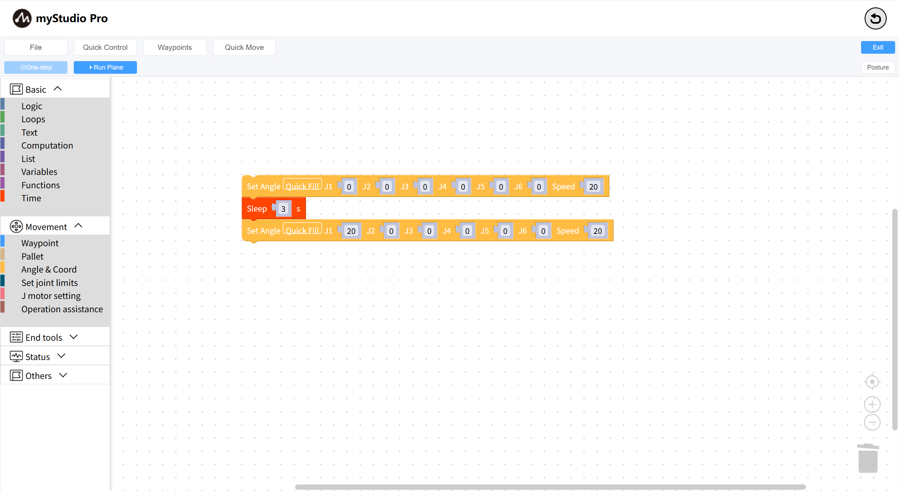

# Little Case

Let's write a small case to introduce the basic usage of `blockly` through this case

**Case Description** : Control the robotic arm to return to zero, then control one joint to move to a 20-degree position, and then return to zero.

- 1: Switch the posture panel: When the posture panel is hidden, click Show; otherwise, click Collapse.
- 2: Mechanical arm simulation model, which can simulate movement in real time based on the current real Angle.

**Step 2:** Start programming

Open the first-level category motion control in the toolbox, select the second-level category Angle & Coord, and drag the set full Angle building block to the working area.

This building block is used to control the movement of each joint of the robotic arm to a given Angle, with a default movement speed of 20.

Open the first-level classification `Basic` programming in the toolbox, select the second-level classification time, drag the sleep block to the workspace, and set the sleep time to 3 seconds.

Copy and `set the full-angle` building block and modify the Angle of joint 1 to 20:
- Click the mouse to select `set the full-angle` building block in the workspace.
- Press and hold Ctrl + C on the keyboard to copy and `set the full-angle `building blocks.
- Press and hold Ctrl + V on the keyboard to paste `set the full-angle` building block.
- Modify the `Joint 1` of the new building block to 20.
- Drag this building block to connect it with the `sleep` building block;

The operation is similar to the above. Copy the sleep block and set the sleep time to `3` seconds.
Copy the first setting `set the full-angle`block in the workspace again;
The complete code is as follows:

> The meaning of this code is:
> - Control the robotic arm to return to zero
> - Wait for 3 seconds (wait for the machine to return to zero and complete)
> - Move Joint 1 (J1) to a position of 20 degrees
> - Wait for 3 seconds
> - Control the robotic arm to return to zero

Finally, click `the Run Panel` button. After opening the panel, click the `Run All` button to start executing the code.

The code has completed running. Click Panel X to close the panel.

**Step 3:** Save and load the file (or save the load workspace)

`blockly` supports saving and loading the workspace.

Click the `File` button, and a drop-down menu will appear. Click the `Save` button within it, and a file naming modal window will be displayed. Enter your own name and click "Confirm" to save. The save result will be shown in the form of a message prompt at the lower left corner.

**Step 4:** Create a new workspace operation (This operation will clear all the code in the workspace)

Click the `File` button, a drop-down menu will appear. Click the `Create` button within it, and a prompt will show up. Click the "Confirm" button.

The new workspace has been completed.

**Step 5:** Load the workspace operation, loading the workspace file we saved earlier.

Click the `File` button, and a drop-down menu will appear. After clicking the `Open` button in the menu, a list of saved files will be displayed. Select the workspace file you need to load and click the `Open` button to load it. Click the `Delete` button to delete the file.

Loading completed.

