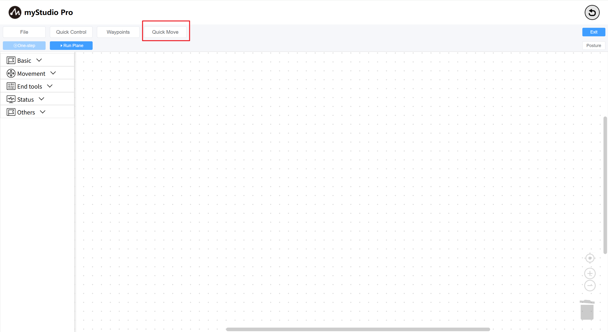

# Quick Move

What is `Quick Move`? In simple terms, it means that without programming, the robot can be quickly controlled to move simply by clicking the mouse.

> Note: There are two quick-move control panels in myStudio, and their functions are not much different

**Step 1:** Click the Quick Move button to open the Quick Move panel and wait for the robot data to return.

If all the data is zero, please check whether the robotic arm has been connected and whether it is functioning properly.

**Step 2:** Try clicking the `-` / `+`'buttons to control different joints of the robotic arm.

**Step 3:** Control coordinates.

First, `joint 3` needs to be moved to around `-90 degrees`, as shown in the following figure.

Then you can click the `-` / `+`buttons on different coordinate axes to control the coordinates.

For other functions, please refer to [Quick Move]()

[← Previous page](./6.5.5.4-autofill.md) | [Next page →](./6.5.5.6-useCoords.md)