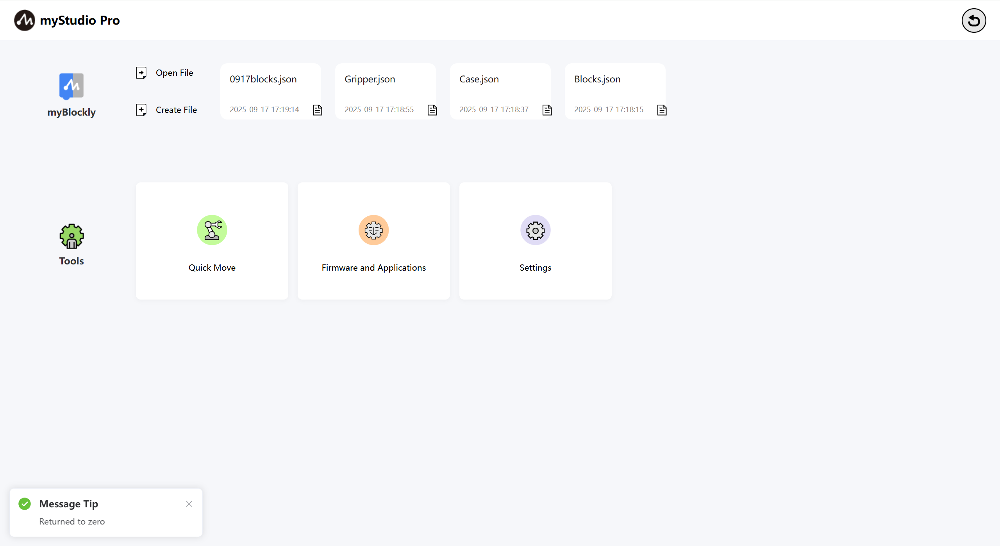
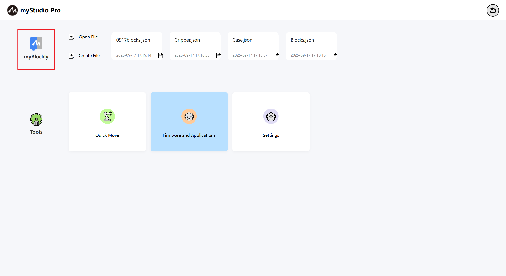
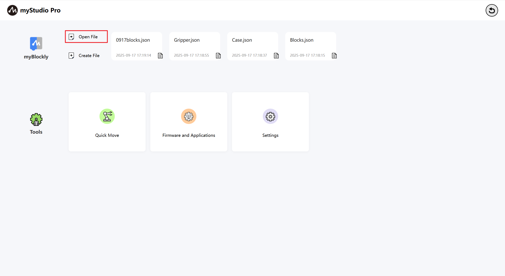
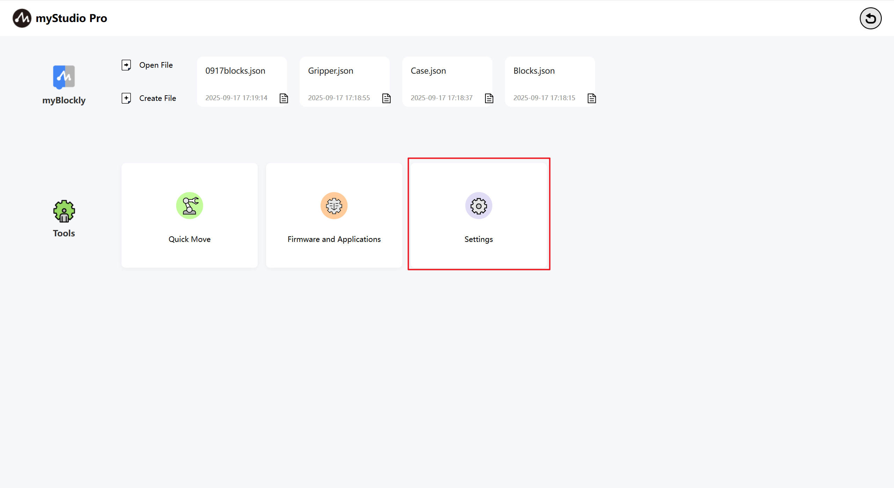

# myStudio interface display and basic function usage

Open the software. The main interface is as shown in the following figure

Interface function introduction: The interface is divided into two areas:

> 1. Return to zero
>
> 2. Function realization

### Return to zero

The function of this button is to control all the joints of the robot to return to the zero position.

Note: The function of this button takes effect only if the communication of the robot has been successfully connected. After long pressing and clicking this button with the left mouse button, the robot starts to execute the return-to-zero command. When the mouse button is released after long pressing, the return-to-zero command stops executing.

After the zeroing process is completed, a pop-up window will appear to prompt that the zeroing is done.

### Function realization

Here you can choose the functions you want to use. The functions include the following:

> 1. [blockly Graphical Programming](./6.5.5-blockly/6.5.5.1-blocklyFirstUse.md)
> 2. Quick Move
> 3. Firmware and Applications
> 4. Settings

### myBlockly

myBlockly is a fully visual modular programming interface, belonging to a graphical programming language, suitable for beginners to get familiar with programming. Users can develop applications by dragging and dropping puzzles to create both simple and complex functions. Supports functions such as saving, loading, single-step debugging and execution of graphical code, and executing specified individual building blocks.

> Note: To use myBlockly, you must first connect the device for communication.

Here is a clickable button. After clicking it with the left mouse button, it will jump to [myBlockly Graphical Programming Interface](./5.1.1-blockly/5.1.1.1-blocklyFirstUse.md).

#### Open File

Here is a clickable button that can automatically load blockly blocks by importing a JSON file.

After left-clicking the mouse button, a pop-up window will appear where you can select files. By choosing the JSON file saved through blockly, you can load the file. Open myBlockly and the corresponding building blocks will be automatically loaded in the programming interface.

#### Create File

This button has the same function as [**myBlockly**](./6.5.3-interface_description.md#myblockly).

#### Quickly load the historically saved blockly Json

When you have used myBlockly programming and have already saved blockly files, the names of the saved files and their saving times will be displayed at the position shown in the following figure. The maximum number of displayed files is 4. If it exceeds 4, only the latest 4 saved files will be shown.Left-click the mouse button to open myBlockly and automatically load the selected blockly file.

### Common tools

#### Quick Move

Function: Provide quick control of robot IO as well as quick control of joint angles and coordinates

Quick Move [Detailed Function Introduction](./6.5.6-quickmove/6.5.6.1-quickmoveFirstUse.md)

### Firmware And Applications

Functions: Provide updates and upgrades for the embedded firmware of robots, product user manuals, official videos, official GitHub online stores, and feedback functions.

Firmware And Applications [Detailed Function Introduction](./6.5.7-firmware/6.5.7.1-firmwareFirstUse.md)

### Settings

Function: Display and modification of basic information of applications and robots

Settings [Detailed Function Introduction](./6.5.8-setting/6.5.8.1-settingFirstUse.md)

[← 上一章](./6.5.2-install_uninstall.md) | [下一章 →](./6.5.4-Q&A.md)