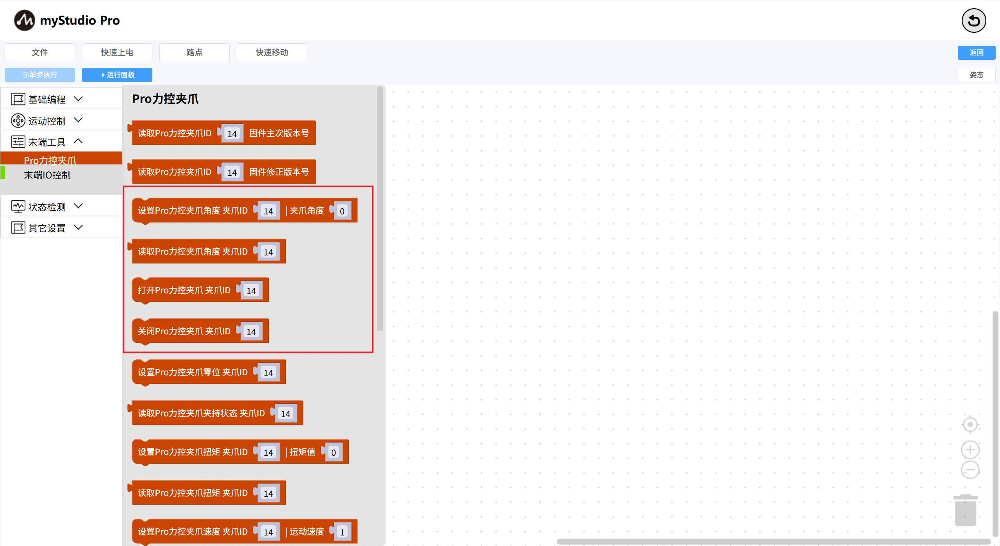
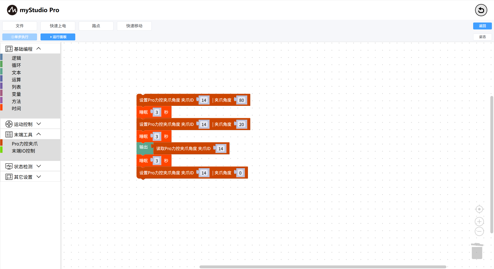

# Usage of Gripper

*Before starting*

> *1. Make sure the robotic arm is powered on*
>
> *2. Ensure that the robotic arm is properly connected*
>
> *3. the robotic arm server has been enabled*

This chapter introduces how to use `blockly` to control the `Pro Gripper` connected to the robotic arm.

### API display

We will use the following building blocks

1: `Set the Pro force Control gripper Angle` : Make the gripper enter the specified state (open or closed) at the specified Angle

Parameter introduction:

This building block has two adjustable parameters:

- Gripper ID parameter: Default 14

- Gripper Angle parameter: Indicates the Angle to be set, with a value range of 0 to 100

2: `Read the angle of Pro force Control gripper` : Read the current gripper Angle value

This building block has an adjustable parameter:

- Gripper ID parameter: Default 14

### Little Case

The graphic code is as follows:

- Execution effect of the code:
  - Control the Pro force control gripper to reach the position with a value of `80`
- Wait for 3 seconds
  - Control the Pro force control gripper to reach the position with a value of `20`
- Wait for 3 seconds
  - Read the Angle value of the current Pro force control gripper
- Wait for 3 seconds
  - Control the Pro force control gripper to reach the position with a value of `0`

**Note:**

If you are unable to control the gripper from the above examples, please ensure that the communication method of your Pro force control gripper is controlled by the `modbus` protocol.

After the Settings are completed, run the small case code again.

[← 上一页](./6.5.5.9-waypoint.md) | [下一页 →](../6.5.6-quickmove/6.5.6.1-quickmoveFirstUse.md)