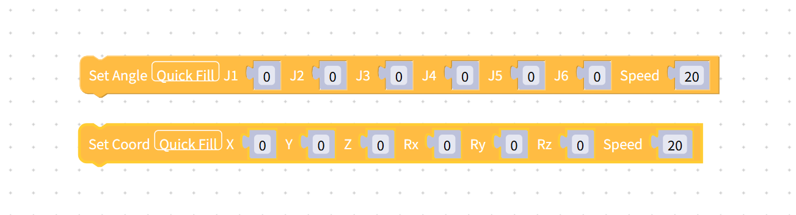
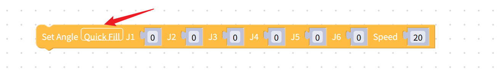

# Quickly fill in the data

This chapter introduces the `quick filling` function of building blocks.

When a building block has too many data items, filling them in one by one is rather troublesome. So for building blocks with too many data items to fill in, we can use the quick fill function.

Currently, the following building blocks are supported for quick filling:

### How to use Quick Fill

Take `setting the full-angle block` as an example. First, you need to select the block, and then click the quick Fill button in the block.

When the prompt box shown in the following picture appears on the page, it indicates that the filling is successful.

[← Previous page](./6.5.5.3-littleCase.md) | [Next page →](./6.5.5.5-quickMove.md)