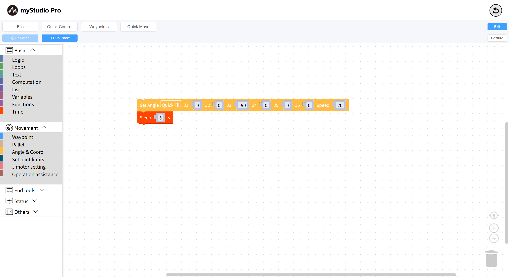

# Learn to use coordinate control

Before starting

> 1. Make sure the robotic arm is powered on
> 2. Ensure that the server side of the robotic arm is enabled
> 3. Ensure that the robotic arm is in zero position

### The main apis involved:

**Set Coord**

- **Prototype**：`send_coords(values,speed)`

- **Interface description:** Set all coords of the robotic arm

- Parameter:
  - values：[X,Y,Z,RX,RY,RZ]
  - speed：speed 1-100

### Little Case

#### Some operations that need to be performed before the first use of coordinate movement:

- When the robotic arm returns to zero, please refer to [Controlling the Robotic Arm to Return to Zero](./6.5.5.3-littleCase.md)
- Set the initial posture of the mechanical arm's coordinate movement (Machine J3 needs to be parallel to the ground)
  - As shown in the following code figure:
  
    

    Open the `Run Panel` and run the code.

#### Coords movement

Drag a `Set Coord` block to the workspace, click the' Quick Fill 'button in the block to fill in the data, and modify the `Z` axis data to `400`

The complete code is as follows:

During the execution of the code, it was observed that the robotic arm was moving up and down throughout the process

[← Previous page](./6.5.5.5-quickMove.md) | [Next page →](./6.5.5.7-singleStep.md)