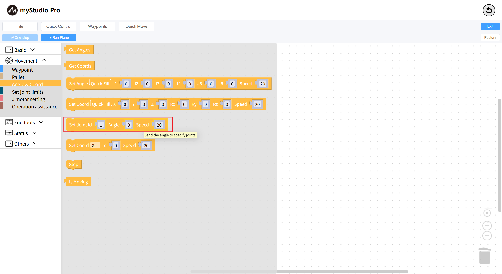
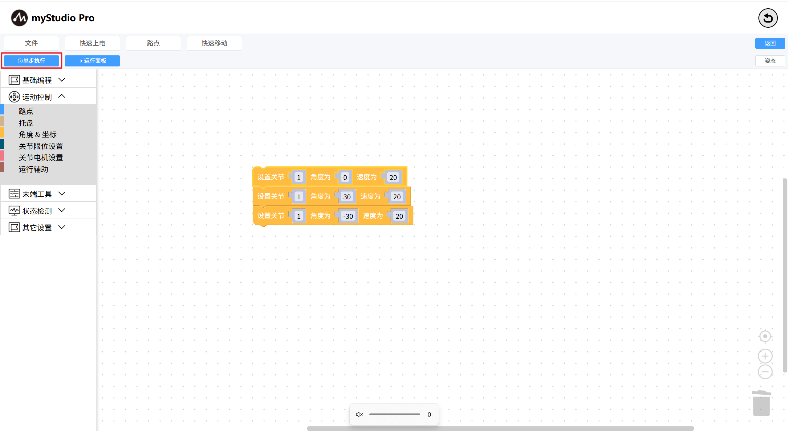

# One-step execution

The so-called single-step execution refers to: single-block execution. When there are a large number of building blocks in the workspace, I only want to execute one of them to see what effect it will have. At this point, single-step execution can be used

**One-step** button is disabled by default and cannot be clicked.

**Step 1:** Drag several setting joint blocks into the workspace.

**Step 2:** Select the joint setting block and observe that the single-step execution button has been unlocked (the color has changed to dark).

**Step 3:** Clicking the One-step execution button will open the Run panel. Clicking the Run button in the panel will start executing the code. Meanwhile, observe the changes in the movement of the robotic arm.

[← Previous page](./6.5.5.6-useCoords.md) | [Next page →](./6.5.5.8-program.md)