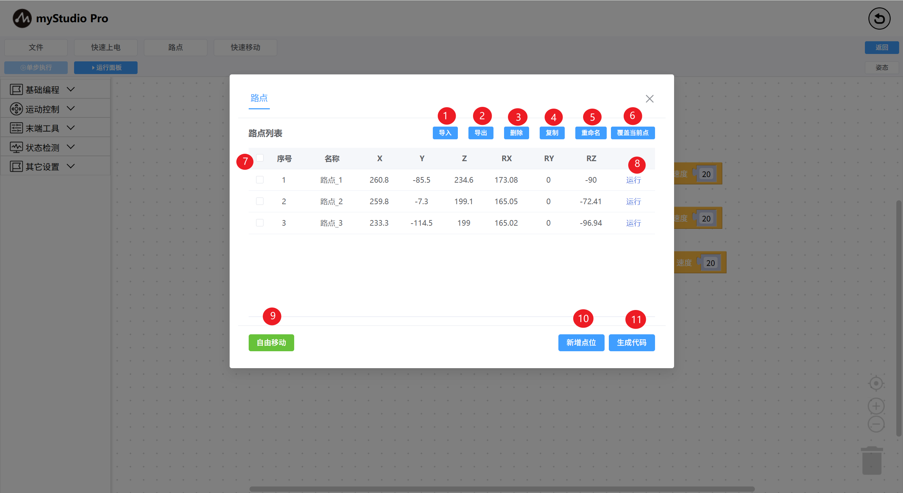
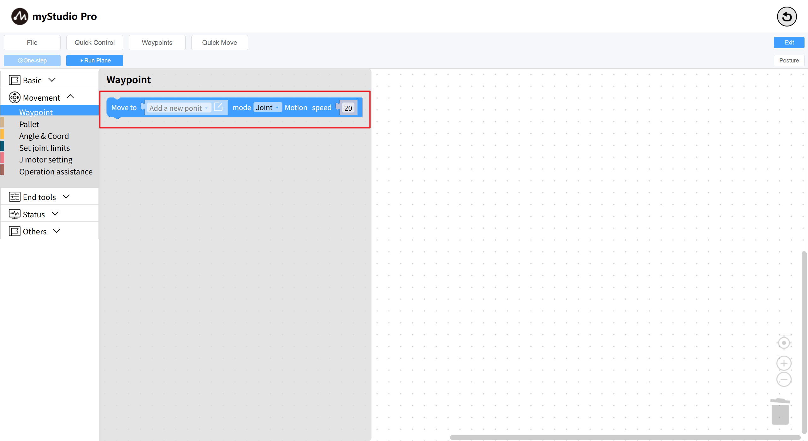
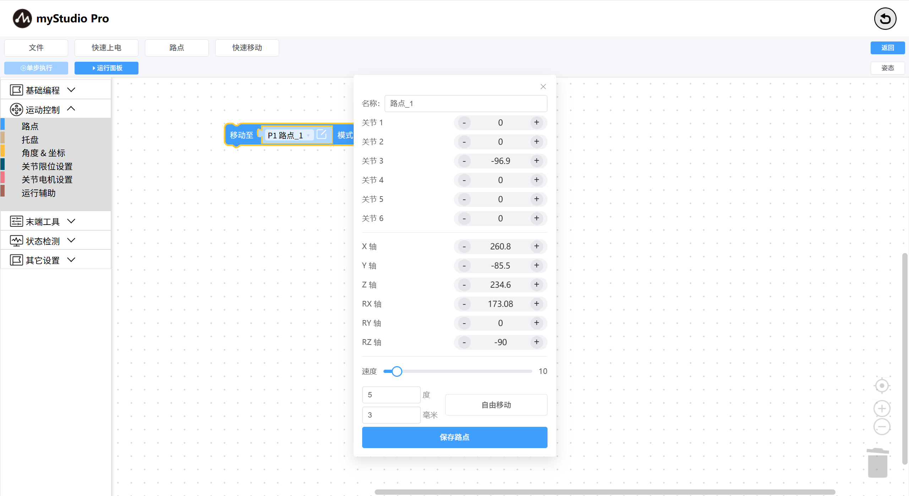
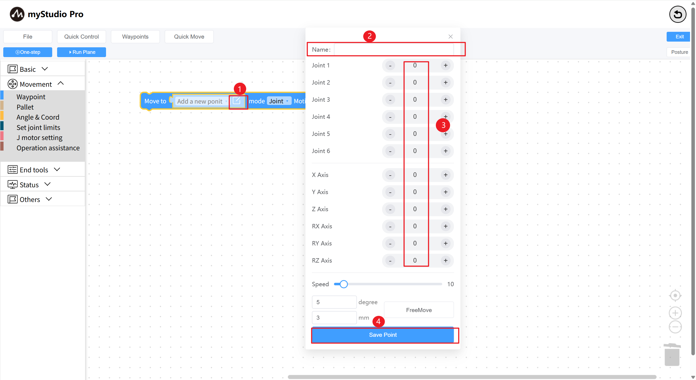

# Waypoint

*Before starting*

> *1. Make sure the robotic arm is powered on.*
> 
> *2. Ensure that the robotic arm is properly connected.*
> 
> *3. The server is enabled.*

This chapter introduces how to use the waypoint function to control the robotic arm.

Function description: By `inputting multiple waypoint data (joints and coordinates of the robotic arm)` information, quickly control the position of the robotic arm at each waypoint. Open the road point list page, enable Free Movement, relax the robotic arm, manually adjust the robotic arm's posture, click `New Point`, and you can add a road point data.

| Serial number | Explanation                                                  |
| ------------- | ------------------------------------------------------------ |
| 1             | Click the "Import" button to import the previously saved road point information json file. |
| 2             | Click the "Export" button to export all the road point information into a single json file. |
| 3             | Click the "Delete" button to delete all selected waypoints in the current waypoint list. |
| 4             | Click the "Copy" button to copy the coordinate information of all currently selected road points. |
| 5             | Click the "Rename" button to name and rename all the currently selected road points. |
| 6             | Click the "Overwrite Current Point" button to quickly overwrite the coordinate information of all selected road points with the current robotic arm's coordinate information. |
| 7             | For the list data, select the column. Functions 3 to 6 are based on this function. |
| 8             | Click the "Run" button, and the robotic arm will move to the current recorded road point position. |
| 9             | Click the "FreeMove" button, and a secondary confirmation window will pop up. When you click to confirm, the button will turn yellow. The robotic arm will become relaxed. Adjust the posture of the robotic arm. |
| 10            | Click the "New Point" button, and the coordinate information of the robotic arm at this time will be entered. |
| 11            | Clicking the "Generate Code" button will quickly generate the waypoint block to the blockly program code area. |

In `blockly`, select the waypoint block and add it to the program coding area. Or use the `Generate Code` button in the waypoint list, which will concatenate the generated waypoint blocks on the last block in the workspace.

The waypoint block associates the data in the waypoint list  and selects any waypoint in the road point list for association.

The `waypoint` block adds point information. Select a new point, click the edit icon to open the pop-up box for adding new road points. At this time, the road point name will be customized by default. Adjust the road point information through `+` or ` -`, and click the `Save Point `button to add waypoint data.

| Serial number | Explanation                                                  |
| ------------- | ------------------------------------------------------------ |
| 1             | Select a waypoint. After clicking the edit icon, a pop-up box for waypoint editing will open. |
| 2             | Input the waypoint name.                                     |
| 3             | Display the joint and coordinate data of the robotic arm, and adjust the waypoint data through the left (-) and right (+) buttons. |
| 4             | Click "Save Point" to add or modify waypoint data.           |

[← Previous page](./6.5.5.8-program.md) | [Next page →](./6.5.5.10-gripperUse.md)