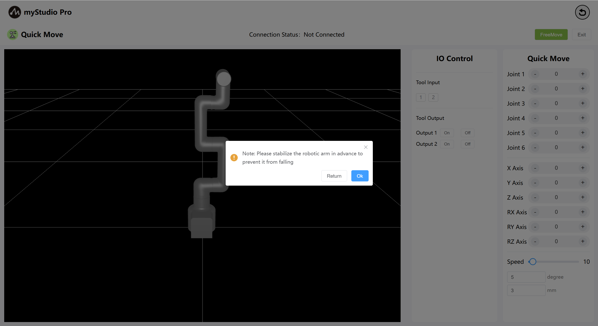

# Quick Move

*Before starting*

> 1. Make sure the machine is powered on
>
> 2. Ensure that the machine is properly connected and communicates normally
>
> 3. Ensure that the machine is in the zero position
>
> 4. The machine server has been enabled

### 1 Interface Introduction 

| Serial number | Explanation                                                  |
| ------------- | ------------------------------------------------------------ |
| 1             | 3D simulation model of MyCobotPro450                         |
| 2             | For the End IO pin numbers 1 and 2, enter                    |
| 3             | The terminal IO pin numbers 1 and 2 are used for output to control the Pro force control gripper |
| 4             | Enable free movement mode                                    |
| 5             | Exit the quick move interface                                |
| 6             | Angle control: By clicking the `+` and `-` button, the joint Angle of the robotic arm can be controlled. The value represents the current joint Angle information of the robotic arm and can also be directly modified for joint control |
| 7             | Coordinate control: By clicking the `+` and `-` buttons, the robotic arm can be controlled in terms of coordinates. The values represent the current coordinate attitude information of the robotic arm, and the values can also be directly modified for coordinate control |
| 8             | Set the movement speed of the robotic arm, with a default of 10 mm/s |
| 9             | Angle step size: The value of the Angle that increases or decreases each time when adjusting the Angle |
| 10            | Coordinate step size, the coordinate value that increases or decreases each time when adjusting the coordinate attitude |

### 2 Angle control

In the Angle control area, the joint Angle of the robotic arm can be controlled by clicking the `+` and `-` buttons. The values represent the current joint Angle information of the robotic arm and can also be directly modified for joint control.

### 3 Coordinate control

Before using coordinate control, joint 3 needs to be moved to an Angle position of approximately -90 degrees.

In the coordinate control area, the coordinate control of the robotic arm can be performed by clicking the `+` and `-` buttons. The values represent the current coordinate attitude information of the robotic arm, and the values can also be directly modified for coordinate control.

### 4 FreeMove

By clicking the Free Move button, the free move mode is activated. The color of the interface button turns orange, indicating that the machine is in the free move mode state and can be dragged and moved.

The button turns yellow

When the free movement button is in the yellow state, clicking it again indicates that the free movement mode is turned off.

### 5 IO control

Set the output of the end IO pin numbers 1-2 to control the Pro force control gripper.

Click the on/off button to open the Pro force control gripper.

Turn off the Pro force control gripper by clicking the off/on button.

[← 上一页](../6.5.5-blockly/6.5.5.10-gripperUse.md) | [下一页 →](../6.5.6-quickmove/6.5.6.1-quickmoveFirstUse.md)