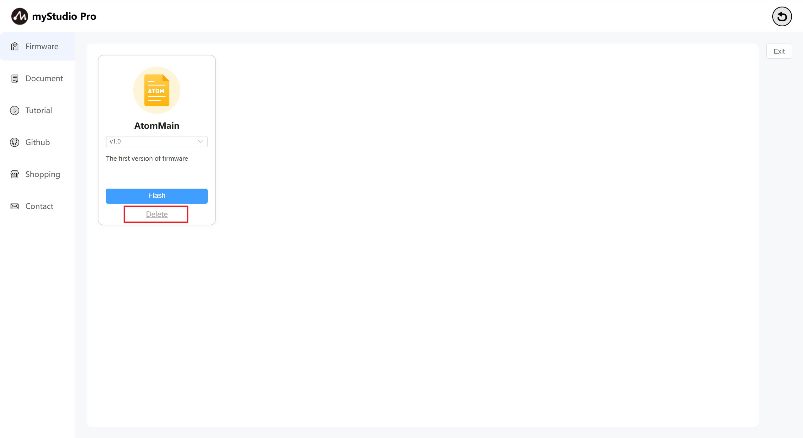
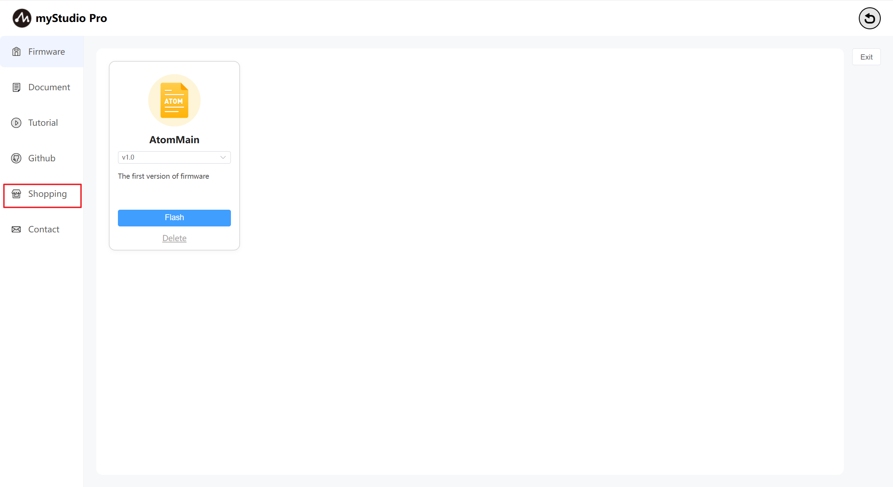
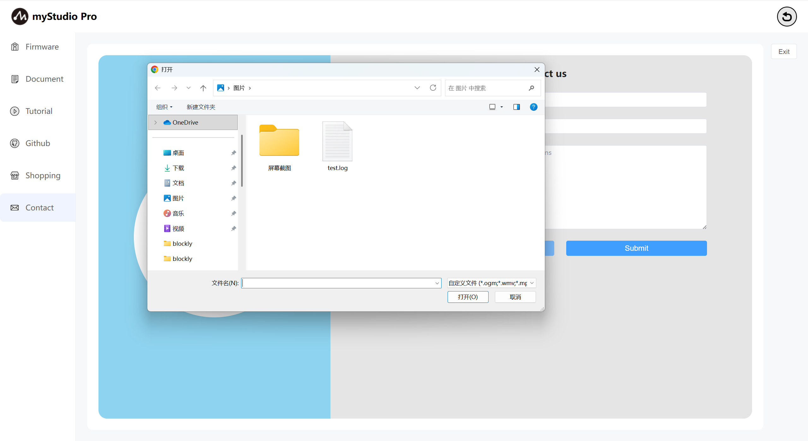
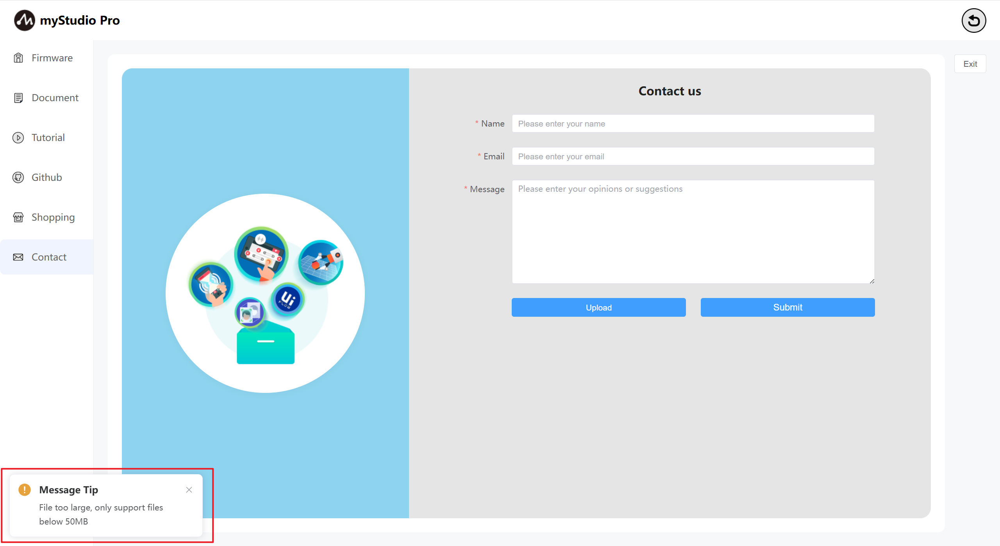

# Firmware and Applications

### 1 Interface Introduction

The myCobotPro450 supports remote upgrades by users and the burning of the latest version of the terminal firmware. The machine is equipped with the latest version of the firmware by default when leaving the factory. New versions of the firmware will be released later. As long as the network connection is kept smooth when using myStudio, myStudio will automatically download the latest version of the firmware.

### 2 Firmware

Function Introduction:

**AtomMain**

End firmware name

**Version number**

The default is the latest firmware version that has been released. You can also choose other versions for burning.

**Description information**

The description information corresponding to the firmware version usually includes the update information of this version of the firmware.

**Delete**

Delete button: The firmware delete button is used to delete the firmware stored locally in a specified version.

Click this button and a prompt message will pop up, asking you to confirm whether you want to delete the firmware. Clicking the `Confirm` button indicates confirmation of deletion. Clicking the `Cancel` button indicates the cancellation of the deletion.

When there is undownloaded firmware or the firmware is deleted, the `Flash` button will change to the `Download` button, and the `Delete` button will disappear. Clicking `Download` will automatically download the firmware.

After the download is complete, the `Flash` and `Delete` buttons will be restored.

### 3 Document

This function is a web page jump link. After clicking it, the gitbook page of the product will open on the current browser in use.

### 4 Tutorial

This function is a web page jump link. After clicking on it, the official video account will open on the current browser in use. The English version will redirect to YouTube, and the Chinese version will redirect to bilibili, and the corresponding links will be accessed in an embedded form.

### 5 Github

This function is a web page jump link. After clicking on it, the official Github will open on the current browser in use.

### 6 Shopping

This function is a web page jump link. After clicking on it, the purchase interface of the corresponding product will open on the current browser in use. The Chinese version will redirect to Taobao, while the English version will redirect and access the corresponding link in an embedded form.

### 7 Contact

If you have any questions or ideas, you can contact us here.

Function Introduction:

**Name**

You can enter your name here

> This is a required field. If you do not fill it in and submit directly, you will be prompted with the corresponding text.

**Email address**

You can enter your email address here

> This is a required field. You can enter your email address here for the official staff to reply to you later. If you do not fill it in and submit directly, you will be prompted with the corresponding text.

**Your opinion**

You can enter your opinion here

> This is a required field. You can enter your questions or ideas here. If you do not fill them in and submit directly, you will be prompted with corresponding text.

### Upload

> Click this button to upload files. A maximum of 3 files can be uploaded, and each file must not exceed 50M.

> After clicking, a pop-up window will appear for file selection.

> If the size of the file you selected exceeds 50M, after clicking "Open", it will fail to open and a pop-up window will prompt you that the file is too large.

> When the number of files you want to upload exceeds three, a pop-up window will prompt you.

### Submit

> Click the `Submit` button to submit all the information. This step may take a relatively long time, so please be patient

[← 上一页](../6.5.6-quickmove/6.5.6.1-quickmoveFirstUse.md) | [下一页 →](../6.5.8-setting/6.5.8.1-settingFirstUse.md)