# Setting
### 1 Interface Introduction

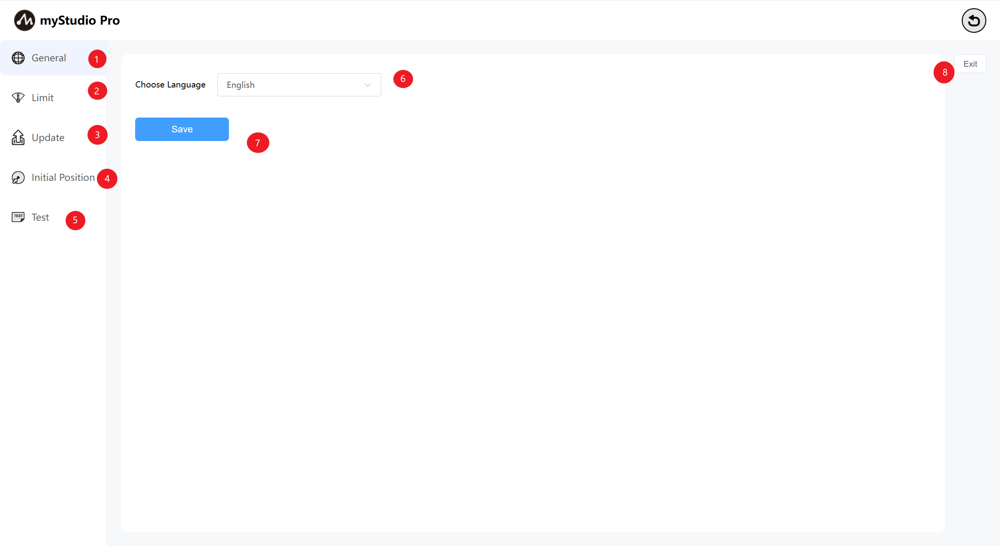

| Serial Number | Function Introduction                   |
| ---- | -------------------------- |
| 1    | General Settings module, main setting languages |
| 2    | Limit setting module               |
| 3    | Check the update module               |
| 4    | Initial Attitude Module               |
| 5    | Test modules                   |
| 6    | Language selection module               |
| 7    | Set the Save button               |
| 8    | Exit Settings                   |

### 2 General

> Click the `General` icon button to enter the language Settings page. The language selection supports both `Chinese` and `English`.

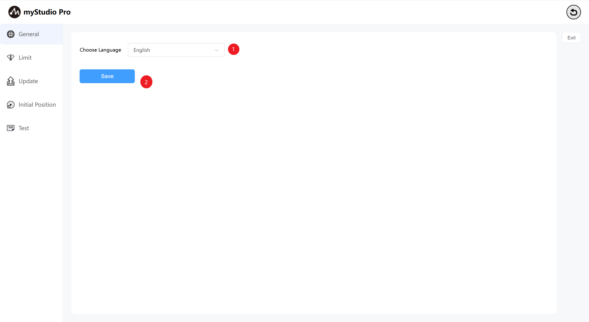

> After choosing the corresponding language, click the `Save` button. A pop-up window with a secondary confirmation prompt will appear. Click Confirm and the language setting will be successful.

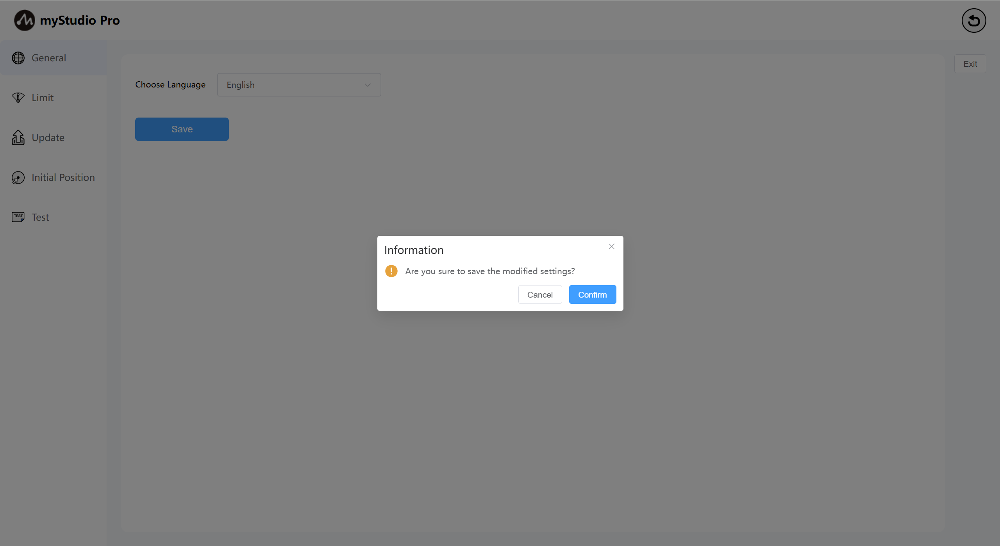

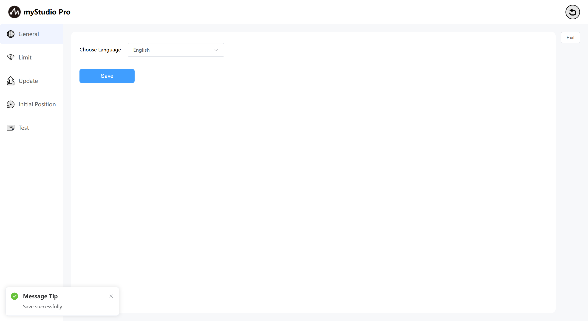

### 3 Limit
> Note: The modification of limit parameters only supports the minimum and maximum angles of the joint. Other parameters are not supported for modification.

Click the limit icon button to enter the joint limit setting page.The limit setting interface displays by default the relevant parameters of the joint limit and coordinate limit of the current robotic arm.

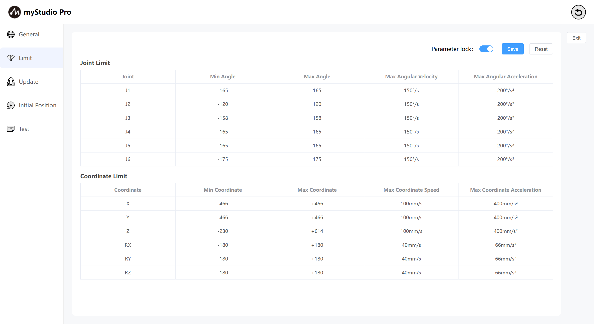

The `parameter lock` button is in the locked state by default. The button color is blue, indicating that the limit parameters cannot be modified.

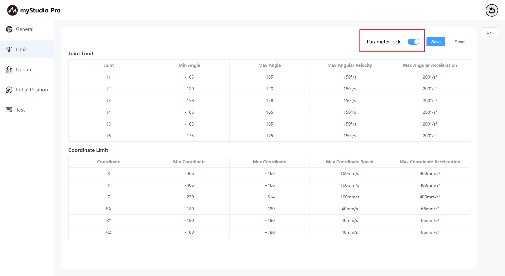

When in the parameter lock state, click the `parameter lock` button. The button color turns gray. At this time, it is in the unlocked state, indicating that the limit parameters can be modified (only the values of the minimum and maximum angles can be modified).

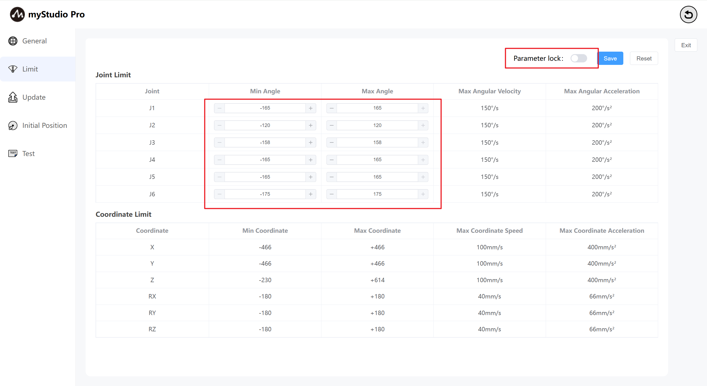

Click the `Save` button to save the parameters of the current limit page to a local file (json file) and set the joint limit of the robotic arm.

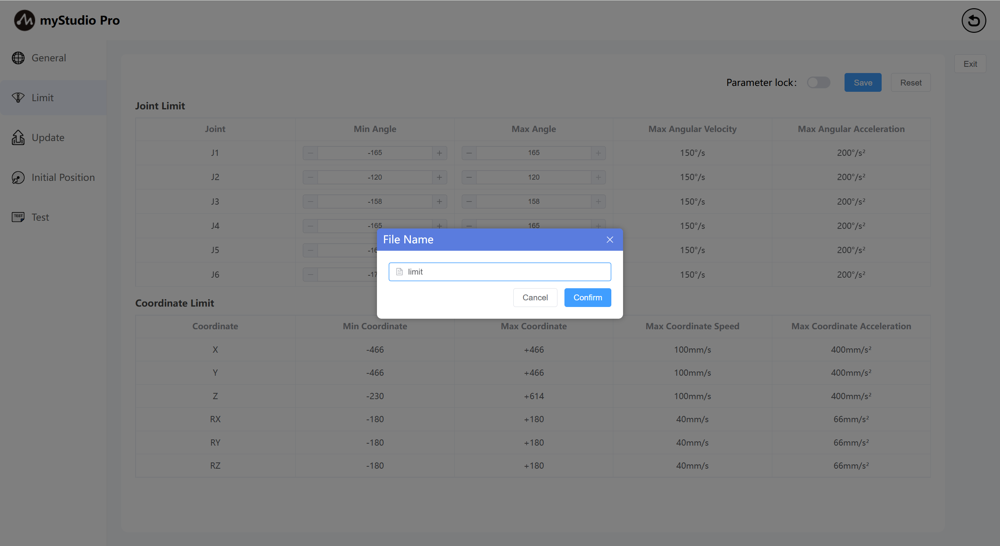

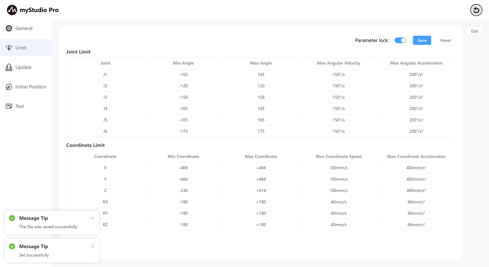

## 4 Update

Click the `Update` icon button, and you will enter the page for checking the update status.

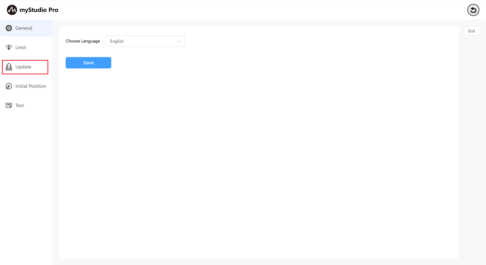

The update page mainly checks the status of the Atom firmware version of the robotic arm.

If it is detected that the Atom firmware of the robotic arm is not the latest version, a prompt will be prompted that the firmware information needs to be updated.

## 5 Initial Position

Click the `Initial Position` icon button to enter the Initial Position page

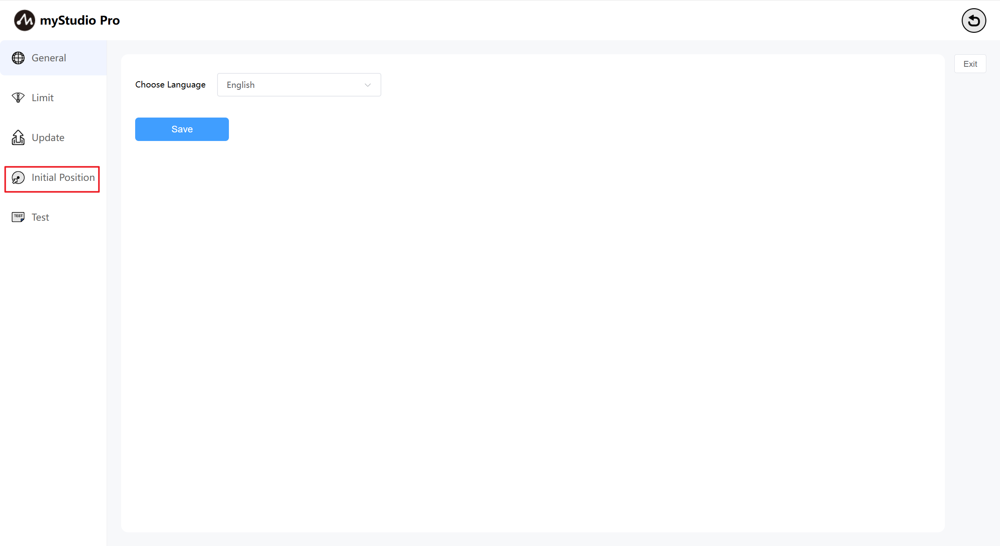

Initial Position page: Displays the initial attitude model diagram of the robotic arm, joint Angle information, and coordinate attitude information.

## Test

Click the `Test` icon button and you will enter the test page.

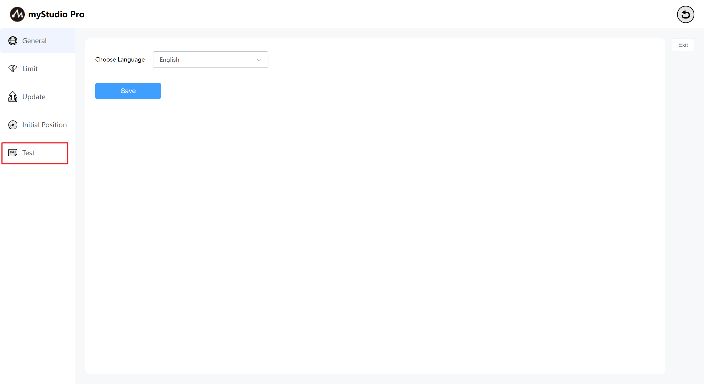

The `Test` page mainly tests the communication connection, firmware, servo and other statuses of the robotic arm.

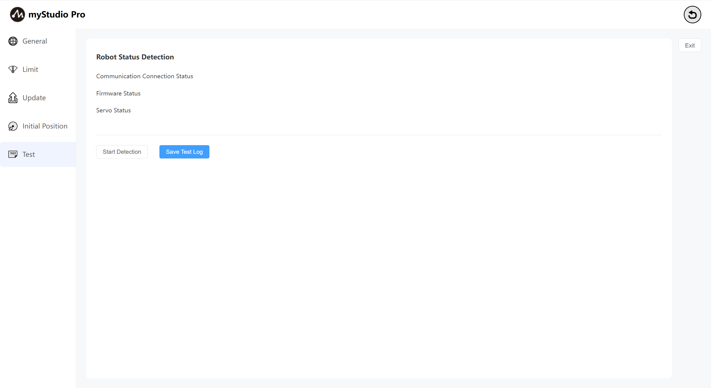

Click the `Start Detection` button to begin the test.

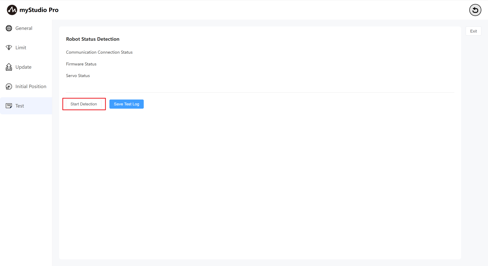

After the test is completed, click the `Save Test Log` button. According to the prompt information in the pop-up window, the test results can be saved to the local log file.

[← 上一页](../6.5.7-firmware/6.5.7.1-firmwareFirstUse.md)