# A case of using exoskeleton manipulation to pick up wooden blocks from MyCobot Pro 450
## 1. Preparatory work
### 1.1 Prepare materials
- MyCobot Pro 450 robotic arm
- 40X40cm wooden block
- USB to type-C data cable
- laptop
- Network cable
- Force-controlled gripper
- MyController S570 Exoskeleton and matching vest

### 1.2 Preparatory steps
1. **Static IP configuration and client startup**
   - Connect the MyCobot Pro 450 to the computer via an Ethernet cable and press the power button on the robot arm.
   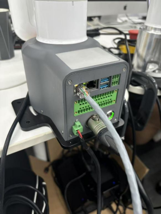
   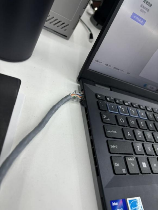
   - Open the computer control panel --> Network and Internet --> Network and Sharing Center --> Change adapter settings --> Ethernet. Right-click Ethernet, click Properties, and double-click as shown by the arrow

   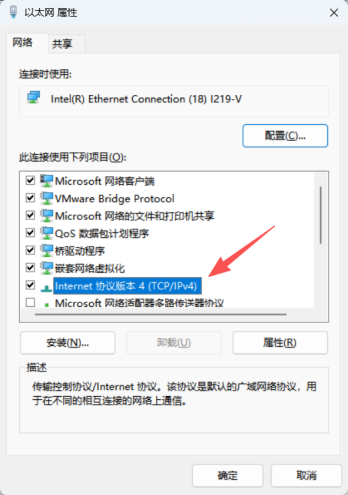

   - Configure the IP as shown below, and click OK after configuration.

   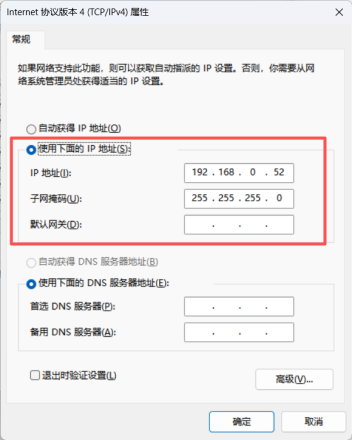

   - Open the software as shown below

   

   - After opening the software
   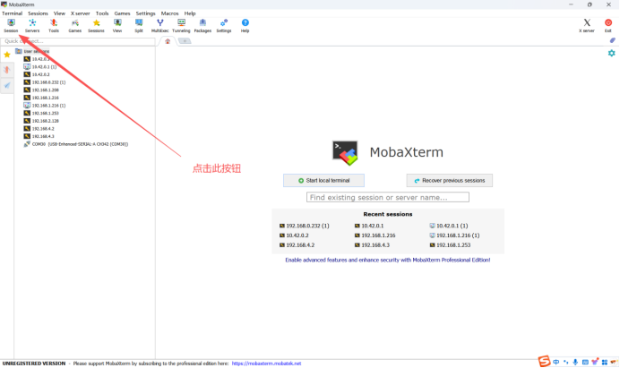
   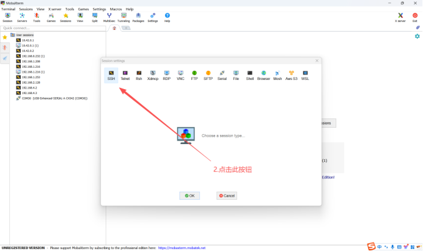
   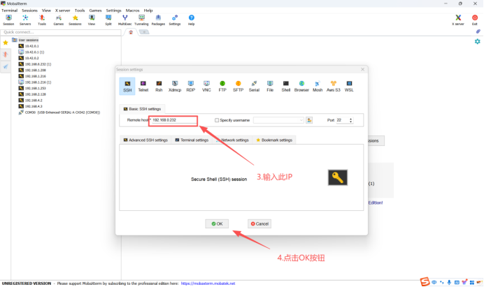
   - Enter the following interface is normal
        - Username: root
        - password: root
   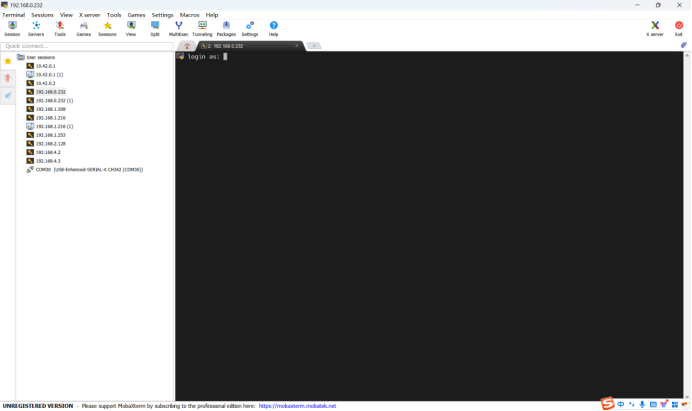

   - Enter the system as shown below
   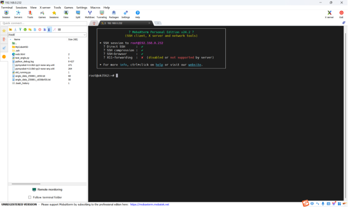
   - Enter the command cd ./MyCobot450/bin/ to switch the path to the bin directory
   
   - Enter ./MyCobotPro and press Enter. You will hear the braking sound, which proves that the machine has started normally.
     - （Note: If the prompt "Permission denied" appears, enter chmod +x ./MyCobotPro and press Enter, and then execute the ./MyCobotPro operation again）
    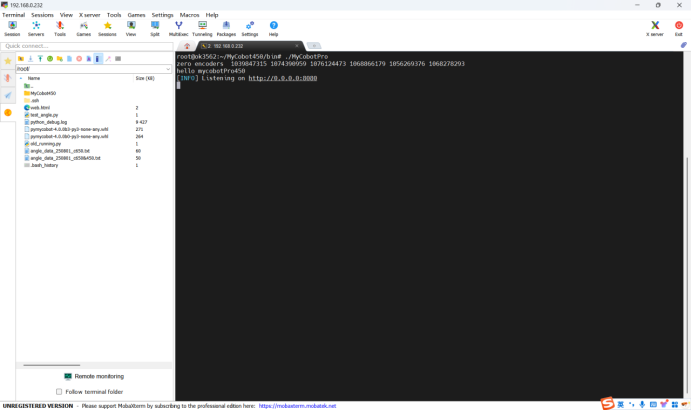


2. **exoskeleton connection**
    - After putting on the vest, connect the exoskeleton to the matching vest, press the exoskeleton power switch button, and connect the USB to type-C data cable to the exoskeleton and the computer.
    
    - Open the computer's device manager and determine the serial port number of the exoskeleton, for example, COM5 here
    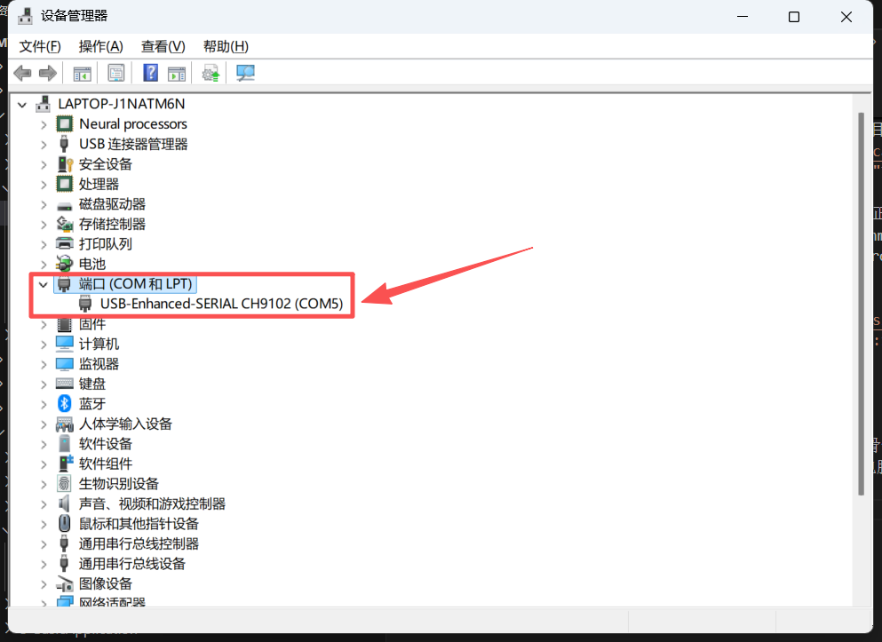

## 2. Source code
**Create a Python file and copy the following source code into the file. Use pymycobot library version 4.0.1 or above.**
```python
import os
import threading
import time
import serial
from Pro450.pymycobot import Exoskeleton, Pro450Client
from pymycobot.utils import get_port_list

Pro450 = Pro450Client("192.168.0.232", 4500)
# Modify the corresponding exoskeleton serial port number
obj = Exoskeleton("COM7")
Pro450.set_fresh_mode(1)


# Control gripper function
def open_gripper():
    Pro450.set_pro_gripper_open()
    Pro450.set_pro_gripper_open()


def close_gripper():
    Pro450.set_pro_gripper_close()
    Pro450.set_pro_gripper_close()


def control_arm(arm):
    while True:
        if arm == 2:
            arm_data = obj.get_arm_data(2)
            x, y = arm_data[11], arm_data[12]
            red_btn = arm_data[9]
            blue_btn = arm_data[10]
            mercury_list = [
                -arm_data[1] - 40, arm_data[0], -arm_data[3] - 20, arm_data[5] + 40,
                arm_data[4] + 70, arm_data[6] - 50
            ]

            Pro450.send_angles(mercury_list, 100)

            if red_btn == 0:
                threading.Thread(target=open_gripper, args=()).start()

            elif blue_btn == 0:
                threading.Thread(target=close_gripper, args=()).start()


def main():
    # threading.Thread(target=control_arm, args=(1,)).start()  # left arm
    threading.Thread(target=control_arm, args=(2,)).start()  # right arm
    while True:
        time.sleep(1)


if __name__ == "__main__":
    main()
```

## 3. Effect display
<video src="../../resources/3-FunctionsAndApplications/7.ExamplesRobotsUsing/demo.mp4" controls="controls" width="800" height="500"></video>
