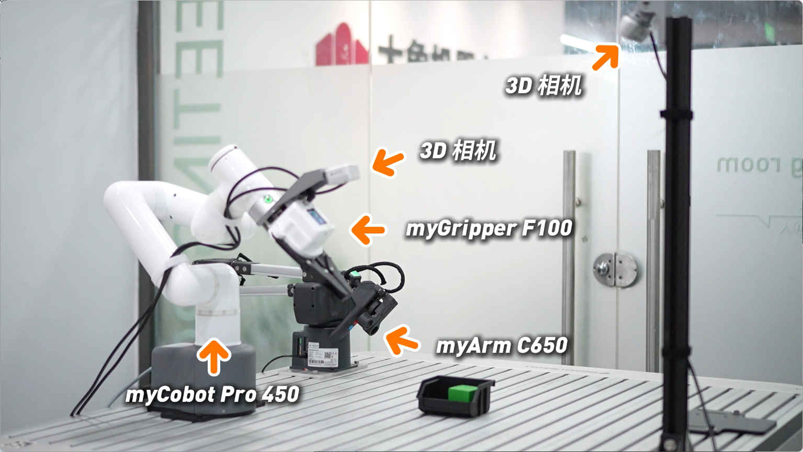
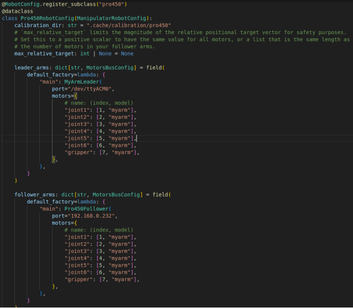
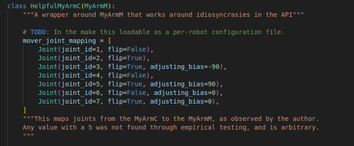
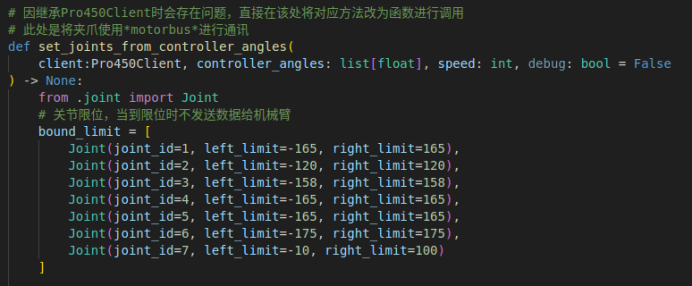
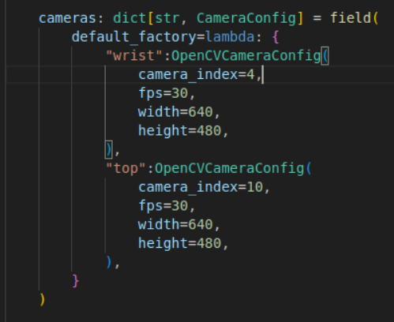

# ACT Imitation Learning Training Case
## 1.Preparation
### 1.1 Prepare materials
- MyCobot Pro 450 Robotic arm
- MyArm C650 Robotic arm
- Computer (GPU 3080 or above, Ubuntu 22.04 or above, ROS2)
- top camera D405
- wrist camera D435
- Force-controlled gripper
- Top camera bracket
- USB to type-C data cable

### 1.2 Hardware connection
- Top camera connected to computer
- Wrist camera connected to computer
- The force-controlled gripper is connected to the end interface of MyCobot Pro 450
- The wrist camera is attached to the end of the MyCobot Pro 450
- After MyArm C650 is powered on, connect it to the computer using a Type-C data cable.
- Start the MyCobot Pro 450 robot arm and start the client in the system (if you don’t know how to start the client, please refer to [Robot Composite Case](7.1.md) )
- Top camera bracket connects to the top camera
    - As shown below
    

### 1.3 Robotic arm firmware version
- Pro450：
    - basic version：1.0 (and above)
- C650：
    - basic version：1.20 (and above)

## 2.Project configuration
### 2.1 Project pull
- Project URL:[https://github.com/elephantrobotics/ER-ALOHA/tree/lerobot_pro450](https://github.com/elephantrobotics/ER-ALOHA/tree/lerobot_pro450)
- Terminal input: git clone https://github.com/elephantrobotics/ER-ALOHA.git
- After pulling the project down, create a new terminal in the folder and enter: git switch lerobot_pro450

### 2.2 Configure the corresponding interface
- Determine the serial port name of the MyArm C650 robotic arm and enter: **ls /dev/ttyACM***  
- To grant serial port permissions, enter the following in the terminal: **sudo chmod a+rw /dev/ttyACM***(Serial port name)
- Determine the serial port names of the two cameras and input the following in the terminal: **ls /dev/video***
- To grant camera permission, enter the following in the terminal: **sudo chmod a+rw /dev/video***(Serial port name)

- Modify the serial port name in the ER-ALOHA/lerobot/common/robot_devices/robots/configs.py file according to the recognized serial port name of the MyArm C650 robot arm, as shown in the figure.



### 2.3 Initialize the environment and path
- Enter in the terminal:
    - **conda activate lerobot_pro450**
    - **cd ~/lerobot_pro450**

### 2.4 Teleoperation performance verification
- In the terminal of the activated virtual environment, enter:
    ```python
    python lerobot/scripts/control_robot.py \
        --robot.type=pro450 \
        --robot.cameras='{}' \
        --control.type=teleoperate
    ```
**When the mapping relationship of telecontrol does not meet expectations, open the global search in the virtual environment, search for mover_joint_mapping, and modify the mapping relationship of the corresponding document (acton_ai/controller_wrapper.py) as shown in the figure below.**


**When the teleoperation limit does not meet expectations, open the global search in the virtual environment, search for bound_limit, and modify the limit relationship of the document (ER-ALOHA/acton_ai/connection_utilities.py) as shown in the figure below.**


### 2.5 Verify that the camera is functioning properly
- In the terminal of the activated virtual environment, enter:
    ```python
    python lerobot/common/robot_devices/cameras/opencv.py
    ```

**Make sure the output camera image matches the configuration file (ER-ALOHA/lerobot/common/robot_devices/robots/configs.py) as shown below.**


## 3.Collect data
- In the terminal of the activated virtual environment, enter:
    ```python
    python lerobot/scripts/control_robot.py \
        --robot.type=pro450 \
        --control.type=record \
        --control.fps 30 \
        --control.single_task="Fold the Clothes." \
        --control.repo_id=$USER/fold_clothes \
        --control.num_episodes=10 \
        --control.warmup_time_s=1 \
        --control.episode_time_s=300 \
        --control.reset_time_s=60
    ```
**While recording an episode, press the right arrow key to exit early and enter the environment reset phase.  
During the environment reset phase, press the right arrow key to exit early and enter the next episode recording.  
Press the left arrow key to exit early and re-record the current episode.
Press the escape key (esc) to stop data recording.  
This example records a dataset 100 times.**

## 4. Visualizing datasets
- In the terminal of the activated virtual environment, enter:
    ```python
    python lerobot/scripts/visualize_dataset.py \
        --repo-id $USER/fold_clothes \
        --episode-index 0
    ```

## 5. Policy network training
- In the terminal of the activated virtual environment, enter:
    ```python
    python lerobot/scripts/train.py \
        --dataset.repo_id=$USER/fold_clothes \
        --policy.type=act \  
        --policy.device=cuda \
        --output_dir=outputs/train/fold_clothes \
        --steps=100000 \
        --save_freq=50000 \
        --job_name=fold_clothes
    ```
**Pay attention to the value of dataset.repo_id, which needs to be consistent with the repo-id when collecting data**

## 6. policy network reasoning
- In the terminal of the activated virtual environment, enter:
    ```python
    python lerobot/scripts/control_robot.py \
        --robot.type=pro450 \
        --control.type=record \
        --control.fps=15 \
        --control.single_task="Fold the Clothes." \
        --control.repo_id=$USER/eval_fold_clothes \
        --control.tags='["tutorial"]' \
        --control.warmup_time_s=3 \
        --control.episode_time_s=120 \
        --control.reset_time_s=120 \
        --control.num_episodes=10 \
        --control.push_to_hub=false \
        --control.policy.path=outputs/train/fold_clothes/checkpoints/010000/pretrained_model
    ```
**Pay attention to the value of dataset.repo_id, which needs to be consistent with the repo-id when collecting data**

## 7. Results display
<video src="../../resources/3-FunctionsAndApplications/7.ExamplesRobotsUsing/demo_ACT.mp4" controls="controls" width="800" height="500"></video>

