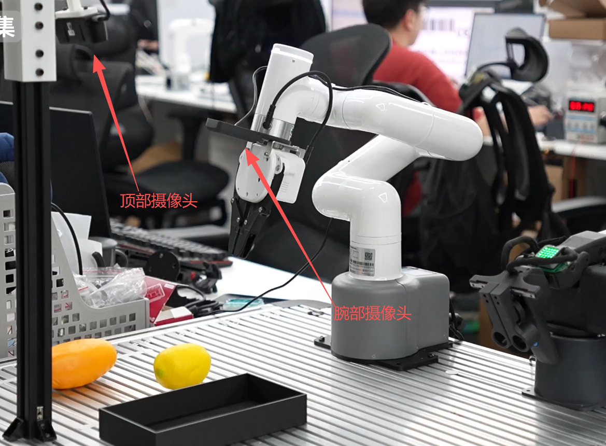
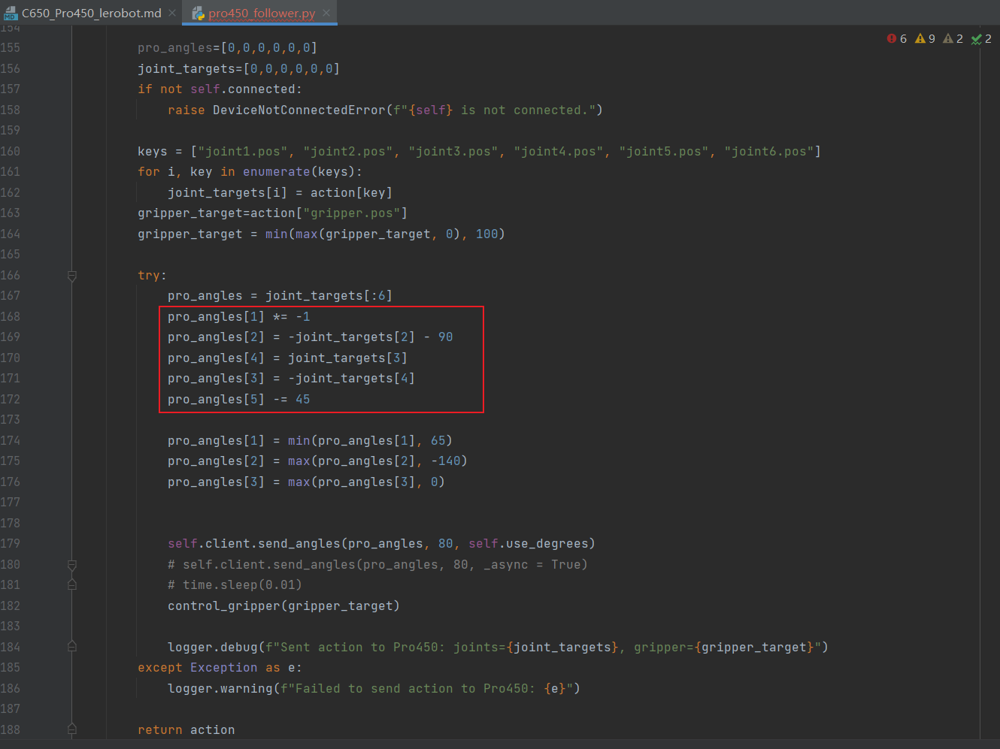

# ACT Imitation Learning Training Case - Picking up Various Fruits
## 1.Preparatory work
### 1.1 Prepare materials
- MyCobot Pro 450 robot arm
- MyArm C650 robot arm
- Computer (graphics card version 3080 or above, Ubuntu 22.04 or above, ROS2)
- Top camera Gemini2
- Hand camera myCobotPro Camera flange
- Force-controlled gripper - MyGripper F100
- Top camera bracket
- USB to type-C data cable

### 1.2 Hardware connection
- The top camera is connected to the computer
- The wrist camera is connected to the computer
- The force-controlled gripper is connected to the end interface of MyCobot Pro 450
- The wrist camera is connected to the end of the MyCobot Pro 450
- After powering on the MyArm C650, connect it to the computer with a type-C data cable
- Start the MyCobot Pro 450 robotic arm and start the client in the system. (If you can't start the client, please refer to [Robot Composite Case](7.1.md).)
- The top camera bracket connects to the top camera
    - As shown in the following figure
    

### 1.3 Firmware version of the robotic arm and model framework version
- MyCobot Pro450：
    - Main control software version: 1.1 (or above)
    - Screen version: 2.0.4 (or above)
    - End version: 1.2.0 (or above)
- MyArm C650：
    - basic version：1.20（or above）
- LeRobot：
    - version: v0.4.2
- pymycobot：
    - version: v4.0.3(or above)


## 2.Project configuration
### 2.1 Project pull
- Project website：[https://github.com/elephantrobotics/ER-ALOHA/tree/lerobot_pro450_v0.4.2](https://github.com/elephantrobotics/ER-ALOHA/tree/lerobot_pro450_v0.4.2)
- Terminal input：git clone https://github.com/elephantrobotics/ER-ALOHA.git
- After pulling down the project, create a new terminal in the folder and enter it： git switch lerobot_pro450_v0.4.2

### 2.2 Configure the corresponding interface
- Determine the serial port name of the MyArm C650 mechanical arm and input it in the terminal：**ls /dev/ttyACM***  
- Grant serial port permission and terminal input：**sudo chmod a+rw /dev/ttyACM***（Serial port name）
- Determine the serial port names of the two cameras, connect them to the cameras one by one and input them into the terminal：**ls /dev/video***
- Grant permission to the camera and input the terminal：**sudo chmod a+rw /dev/video***（Serial port name）

### 2.3 The LeRobot environment is set up and initialized
- Create a virtual environment
    - Input in the terminal：
        - **conda create -y -n lerobot_pro450 python=3.10**
- Enter the virtual environment
    - Input in the terminal：
        - **conda activate lerobot_pro450**
- Install ffmpeg
    - Input in the terminal：
        - **conda install ffmpeg -c conda-forge**
- Install lerobot
    - Input in the terminal：
        - **cd ~/lerobot_pro450**
        - **pip install -e .**
        - **pip install lerobot**


## 3.Remote operation performance verification
- Enter in the terminal in the activated virtual environment：
    ```python
    lerobot-teleoperate \
        --teleop.type=myarmc650_leader \
        --teleop.port=/dev/ttyACM0 \
        --teleop.baudrate=1000000 \
        --robot.type=mycobot_pro450_follower \
        --robot.host=192.168.0.232 \
        --robot.port=4500 \
        --display_data=true \
        --fps=30 \
        --robot.cameras="{top: {type: opencv, index_or_path: 6, width: 640, height: 480, fps: 30},hand: {type: opencv, index_or_path: 0, width: 640, height: 480, fps: 30}}"
    ```
    - ***Note: Here, /dev/ttyACM0 is the serial port number of the C650 robotic arm, and index_or_path: 6 and index_or_path: 0 correspond respectively to /dev/video6 and /dev/video0***  

**When the mapping relationship of the remote operation does not meet expectations, open the global search in the virtual environment and search for send_action. The mapping relationship corresponding to the modified document (lerobot\src\lerobot\robots\pro450_follower\pro450_follower.py) is located as shown in the following figure**


## 4.Data collection
- Enter in the terminal in the activated virtual environment：
    ```python
    lerobot-record \
        --teleop.type=myarmc650_leader \
        --teleop.port=/dev/ttyACM0 \
        --teleop.baudrate=1000000 \
        --robot.type=mycobot_pro450_follower \
        --robot.host=192.168.0.232 \
        --robot.port=4500 \
        --display_data=true \
        --robot.cameras="{top: {type: opencv, index_or_path: 6, width: 640, height: 480, fps: 30},hand: {type: opencv, index_or_path: 0, width: 640, height: 480, fps: 30}}" \
        --dataset.repo_id=your_name/fruit-record-test \
        --dataset.num_episodes=100 \
        --dataset.single_task="Grab the fruit"
    ```
    - ***Note: the number of 100 data sets, and the collection of data set is stored in the ~ /. Cache/huggingface/lerobot/your_name folder***

    - Set the flow of data recording using command-line arguments (Can be added after the above command) :  
        - --dataset.episode_time_s=60 Duration of each data recording episode (default: 60 seconds).  
        - --dataset.reset_time_s=60 Duration for resetting the environment after each episode (default: 60 seconds).  
        - --dataset.num_episodes=50 Total number of episodes to record (default: 50).  

    - When recording an episode:
        - Press the right arrow key -> to exit early and enter the environment reset (resetting the environment) stage.  
        - When resetting the environment, press the right arrow key -> to exit early and enter the recording of the next segment.  
        - Press the left arrow key <- to exit early and re-record the current segment.  
        - Press the exit key esc to stop the data recording. 

## 5.Execute the collected dataset
- Enter in the terminal in the activated virtual environment：
    ```python
    lerobot-replay \
        --robot.type=mycobot_pro450_follower \
        --robot.host=192.168.0.232 \
        --robot.port=4500 \
        --dataset.repo_id=your_name/fruit-record-test \
        --dataset.episode=0
    ```

    - ***Note: that the value of dataset.episode needs to be consistent with the episode at the time of data collection. Here, 0 corresponds to the first collected dataset***

## 6.Visual dataset
- Enter in the terminal in the activated virtual environment：
    ```python
    lerobot-dataset-viz \
        --repo-id=your_name/fruit-record-test \
        --episode-index=30
    ```

    - ***Note: The value of the episode-Index needs to be consistent with the episode at the time of data collection. Here, 30 corresponds to the 31st collected dataset***

## 7.Train the model
- Enter in the terminal in the activated virtual environment：
    ```python
    lerobot-train \
        --dataset.repo_id=your_name/fruit-record-test \
        --policy.type=act \
        --output_dir=outputs/train/act_pro450_fruit_test \
        --job_name=act_pro450_fruit_test \
        --policy.device=cuda \
        --wandb.enable=false \
        --policy.repo_id=act_pro450_fruit_test \
        --steps=200000
    ```

    - ***Note: The value of "steps" refers to 200,000 training steps and can be modified as needed. The more steps you take, the longer you will stand together during training.***

## 8.Evaluate the strategy on the robotic arm
- Enter in the terminal in the activated virtual environment：
    ```python
    lerobot-record  \
        --robot.type=mycobot_pro450_follower \
        --robot.host=192.168.0.232 \
        --robot.port=4500 \
        --robot.cameras="{top: {type: opencv, index_or_path: 6, width: 640, height: 480, fps: 30},hand: {type: opencv, index_or_path: 0, width: 640, height: 480, fps: 30}}" \
        --robot.id=my_awesome_follower_arm \
        --display_data=true \
        --dataset.repo_id=your_name/eval_fruit-record-test \
        --dataset.single_task="Grab the fruit into the box" \
        --policy.path=outputs/train/act_pro450_fruit_test/checkpoints/last/pretrained_model \
        --dataset.push_to_hub=false
    ```

    - ***Note :policy.path is the path where the training model is stored, and during the decision-making process, its behavior is also recorded in the form of a dataset. Therefore, the ← key, the → key, and the Esc key on the keyboard can also be used***

## 9. Results display
<video src="../../resources/3-FunctionsAndApplications/7.ExamplesRobotsUsing/fruit_ACT.mp4" controls="controls" width="800" height="500"></video>