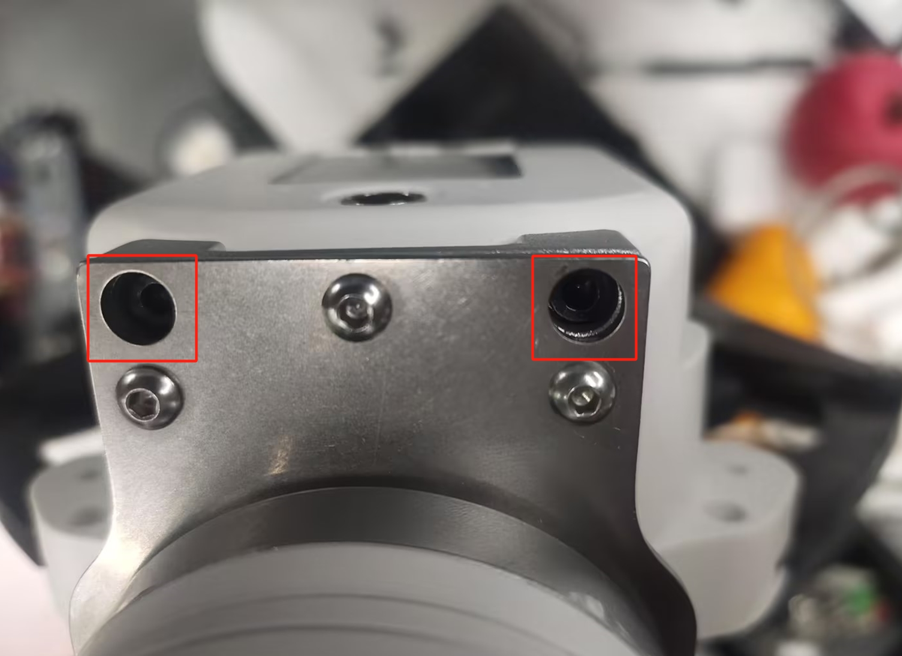

# myGripper F100 Force-controlled Gripper

## 1 Product Image


## 2 Specifications

| **Name** | **myGripper F100 force-controlled gripper** |
| :----------- | :-------------------------------------- |
| Material | PC, PBT |
| Dimensions | 156X106X61mm |
| Process technology | Injection molding |
| Gripping range | 0-100 mm (default fingertip) |
| Repeatability | 0.5 mm |
| Service life | 300,000 openings and closings |
| Drive mode | Electric drive |
| Transmission mode | Gear + connecting rod |
| Dimensions | 158x105x55mm |
| Weight | 340 g |
| Rated load | 500g |
| Working voltage | 24V |
| Fixing method | Screw fixing |
| Environment requirements | Normal temperature and pressure |
| Control interface | RS485/IO control/button control |
| Applicable equipment | ER myCobot 320 series, ER Mercury series, ER myCobot Pro 600, ERmyCobot Pro 630, other general robots, ER myCobot Pro 450 |

## 3 Working Principle
Driven by the motor, the finger surface of the manipulator makes linear reciprocating motion to achieve opening or closing. By setting the clamping torque, the impact of the workpiece is minimized, the positioning point is controllable, and the clamping is controllable.

## 4 Usage Scenario
Experimental operation: In scientific research experiments, complete the grasping and moving of test tubes, utensils, etc. to ensure the safety and accuracy of the experiment.
Educational demonstration: As a teaching tool, it helps students understand the principle of robot grasping and cultivate practical ability.
Material handling: In simulated production lines or warehouses, materials of various specifications are handled to improve work efficiency.

## 5 Installation Method

Use screws and washers to install the gripper connector to the end flange of the robot arm


Then use screws to install the gripper on the connector




Finally, use M8 aviation wire to connect the gripper and the robot arm


## 6 Python Control Method

### Based On 450 Terminal IO Control
The IO control method can only control the gripper to fully open and close

```python
from pymycobot import ElephantRobot
import time
mc=ElephantRobot("192.168.1.159",5001)
mc.start_client()

def gripper_open():
    mc.set_digital_out(16,0)
    mc.set_digital_out(17,1)

def gripper_close():
    mc.set_digital_out(16,1)
    mc.set_digital_out(17,0)


if __name__=="__main__":
    gripper_open()
    time.sleep(2)
    gripper_close()
    time.sleep(2)
```

### Control Based On USB tTo 485 Module

**Note**: To control the gripper in this way, you need to connect one end of the M8 aviation cable connected to the gripper to the USB to 485 module. That is, one end of the M8 aviation cable with a plug is connected to the gripper, and the other end is connected to the USB to 485 module and the 24V power supply.

**Wiring instructions:**


Connect the 24V, GND, 485_A (T/R+, 485+), 485_B (T/R-, 485-) wires at the end of the gripper, a total of 4 wires, the power supply is a 24V DC regulated power supply or the 24V of the IO at the bottom of the 450, insert the USB port of the module into the USB port of the computer


485A connects to the 485 to USB module A+;

485B connects to the 485 to USB module B-;

24V connects to 24V DC regulated power supply positive pole/24V of IO at the bottom of 450;

GND connected to 24V DC regulated power supply negative pole/GND of IO at the bottom of 450

**Driver library installation**
[Click to download the driver library](https://github.com/elephantrobotics/elegripper)


### Serial Port Dependency Library Installation
Execute the following command in the computer terminal to install the dependency library
```bash
pip install pyserial
```
### API Description

### get_firmware_version()

- **Function:** Get the main version number of the gripper firmware

- **Parameter:** None
- **Return:** `(int)` Firmware main version number

### get_modified_version()

- **Function:** Get the sub-version number of the gripper firmware

- **Parameter:** None
- **Return:** `(int)` Firmware sub-version number

### get_gripper_Id()

- **Function:** Get the gripper ID

- **Parameter:** None
- **Return:** `(int)` Gripper ID

### get_gripper_baud()

- **Function:** Get the baud rate of the gripper

- **Parameter:** None
- **Return:**`(int)` 0-5
  - `0`: 115200
  - `1`: 1000000
  - `2`: 57600
  - `3`: 19200
  - `4`: 9600
  - `5`: 4800

### get_gripper_value()

- **Function:** Get the current position data of the gripper
- **Parameter:** None
- **Return:** `(int)` The current position data of the gripper

### get_gripper_status()

- **Function:** Get the current status of the gripper
- **Parameter:** None
- **Return:**`(int)` 0-3
  - `0`: Moving
  - `1`: Stopped moving, no object was detected
  - `2`: Stopped moving, object was detected
  - `3`: After detecting that the object is clamped, the object falls

### get_gripper_speed()

- **Function:** Get the current speed of the gripper

- **Parameter:** None

- **Return:** `(int)` The current speed of the gripper

### get_gripper_P()

- **Function:** Get the P value of the gripper PID

- **Parameter:** None

- **Return:** `(int)` The P value of the gripper PID

### get_gripper_I()

- **Function:** Get the I value of the gripper PID

- **Parameter:** None

- **Return:** `(int)` The I value of the gripper PID

### get_gripper_D()

- **Function:** Get the D value of the gripper PID

- **Parameter:** None

- **Return:** `(int)` The D value of the gripper PID

### get_gripper_cw()

- **Function:** Get the clockwise runnable error of the gripper
- **Parameter:** None
- **Return:** `(int)` Clockwise runnable error of the gripper

### get_gripper_cww()

- **Function:** Get the counterclockwise runnable error of the gripper
- **Parameter:** None
- **Return:** `(int)` Counterclockwise runnable error of the gripper

### get_gripper_mini_pressure()

- **Function:** Get the minimum starting force of the gripper
- **Parameter:** None
- **Return:** `(int)` Minimum starting force of the gripper

### get_gripper_io_open_value()

- **Function:** Get the opening angle of the gripper Io
- **Parameter:** None
- **Return:** `(int)` Opening angle of the gripper Io

### get_gripper_io_close_value()

- **Function:** Get the closing angle of the gripper Io
- **Parameter:** None
- **Return:** `(int)` Get the closing angle of the gripper Io

### get_gripper_queue_count()

- **Function:** Get the amount of data in the current queue of the gripper

- **Parameter:** None
- **Return:** `(int)` The amount of data in the current queue of the gripper

### get_gripper_vir_pos()

- **Function:** Get the virtual position value of the gripper servo

- **Parameter:** None
- **Return:** `(int)` The virtual position value of the gripper servo

### get_gripper_protection_current()

- **Function:** Get the gripper clamping current

- **Parameter:** None
- **Return:** `(int)` The gripper clamping current


### set_gripper_Id(value)

- **Function:** Set the gripper ID
- **Parameters:**
  - `value`: `(int)` Gripper ID, value range `1-254`
- **Return:** `(int)` 0-1
  - `0`: Failed
  - `1`: Success

### set_gripper_baud(value)

- **Function:** Set the gripper baud rate
- **Parameter:**
  - `value`: `(int)` Gripper baud rate, value range `0-5`
    - `0`: 115200
    - `1`: 1000000
    - `2`: 57600
    - `3`: 19200
    - `4`: 9600
    - `5`: 4800
- **Return:** `(int)` 0-1
  - `0`: Failed
  - `1`: Successful

### set_gripper_enable(value)

- **Function:** Set the gripper enable state
- **Parameter:**
- `value`: `(int)` Enable state, value range `0-1`
  - `0`: Disabled
  - `1`: Enabled
- **Return:**`(int)` 0-1
  - `0`: Failed
  - `1`: Success

### set_gripper_value(value,speed)

- **Function:** Set the gripper to rotate to the specified position at the specified speed
- **Parameter:**
  - `value`: `(int)` Position, value range `0-100`
  - `speed`: `(int)` Speed, value range `1-100`
- **Return:**`(int)` 0-1
  - `0`: Failed
  - `1`: Success

### set_gripper_calibration()

- **Function:** Set the gripper Zero Calibration
- **Parameter:** None
- **Return:**`(int)` 0-1
  - `0`: Failed
  - `1`: Success

### set_gripper_P(value)

- **Function:** Set the P value of the gripper PID
- **Parameters:**
  - `value`: `(int)` P value, value range `0-254`
- **Return:** `(int)` 0-1
  - `0`: Failed
  - `1`: Success

### set_gripper_I(value)

- **Function:** Set the I value of the gripper PID
- **Parameters:**
  - `value`: `(int)` I value, value range `0-254`
- **Return:** `(int)` 0-1
  - `0`: Failed
  - `1`: Success

### set_gripper_D(value)

- **Function:** Set the D value of the gripper PID
- **Parameters:**
  - `value`: `(int)` D value, value range `0-254`
- **Return:** `(int)` 0-1
  - `0`: Failed
  - `1`: Success

### set_gripper_cw(value)

- **Function:** Set the clockwise running error of the gripper

- **Parameter:**
  - `value`: `(int)` Error, value range `0-16`
- **Return:** `(int)` 0-1
  - `0`: Failure
  - `1`: Success

### set_gripper_cww(value)

- **Function:** Set the counterclockwise running error of the gripper

- **Parameter:**
  - `value`: `(int)` Error, value range `0-16`
- **Return:** `(int)` 0-1
  - `0`: Failure
  - `1`: Success

### set_gripper_mini_pressure(value)

- **Function:** Set the minimum starting force of the gripper
- **Parameter:**
  - `value`: `(int)` Minimum starting force, value range `0-254`
- **Return:**`(int)` 0-1
  - `0`: Failed
  - `1`: Success

### set_gripper_torque(value)

- **Function:** Set gripper torque
- **Parameter:**
  - `value`: `(int)` Torque, value range `0-300`
- **Return:**`(int)` 0-1
  - `0`: Failed
  - `1`: Success

### set_gripper_output(value)

- **Function:** Set gripper IO
- **Parameter:**
  - `value`: `(int)` Gripper IO, value range `0-3`
    - `0`: out1 off,out2 off
    - `1`: out1 on,out2 off
    - `2`: out1 off,out2 on
    - `3`: out1 on,out2 on

- **Return:**`(int)` 0-1
  - `0`: Failed
  - `1`: Success

### set_gripper_io_open_value(value)

- **Function:** Set the gripper Io open position
- **Parameter:**
  - `value`: `(int)` position, value range `0-100`
- **Return:**`(int)` 0-1
  - `0`: Failed
  - `1`: Success

### set_gripper_io_close_value(value)

- **Function:** Set the gripper Io closed position
- **Parameter:**
  - `value`: `(int)` position, value range `0-100`
- **Return:**`(int)` 0-1
  - `0`: Failed
  - `1`: Success

### set_gripper_speed(speed)

- **Function:** Set the gripper speed
- **Parameters:**
  - `speed`: `(int)` speed, value range `1-100`
- **Return:** `(int)` 0-1
  - `0`: failed
  - `1`: successful

### set_abs_gripper_value(value,speed)

- **Function:** Set the gripper to rotate to the specified absolute position at the specified speed
- **Parameters:**
- `value`: `(int)` position, value range `1-100`
- `speed`: `(int)` speed, value range `1-100`
- **Return:** `(int)` 0-1
  - `0`: failed
  - `1`: successful

### set_gripper_vir_pos(value)

- **Function:** Set the virtual position value of the gripper servo
- **Parameters:**
  - `value`: `(int)` virtual position, value range `0-100`
- **Return:**`(int)` 0-1
  - `0`: Failed
  - `1`: Success

### set_gripper_protection_current(value)

- **Function:** Set the gripper gripping current
- **Parameter:**
  - `value`: `(int)` Virtual position, value range `1-254`
- **Return:**`(int)` 0-1
  - `0`: Failed
  - `1`: Success

### set_gripper_pause()

- **Function:** Set the gripper to pause motion
- **Remarks:** Only valid for set_abs_gripper_value()
- **Parameter:** None
- **Return:**`(int)` 0-1
  - `0`: Failed
  - `1`: Success

### set_gripper_resume()

- **Function:** Set the gripper to resume motion
- **Remarks:** Only valid for set_abs_gripper_value()
- **Parameters:** None
- **Return:** `(int)` 0-1
  - `0`: Failure
  - `1`: Success

### set_gripper_stop()

- **Function:** Set the gripper to stop moving and clear the message queue
- **Remarks:** Only valid for set_abs_gripper_value()
- **Parameters:** None
- **Return:** `(int)` 0-1
  - `0`: Failure
  - `1`: Success


#### Case Procedure
```python
from elegripper import Gripper
import time
if __name__=="__main__":
    g=Gripper("COM27",baudrate=115200,id=14)##Fill in the actual serial port number, baud rate and gripper ID
    print("The actual ID of the gripper is:",g.get_gripper_Id())
    print(g.set_gripper_value(100,100))
    time.sleep(2)
    print(g.set_gripper_value(0,100))
    time.sleep(2)
```
---

[← Previous Chapter](./accessories.md) | [Next Chapter→](./10.2-PneumaticGripper.md)
