# First Use

`myStudio Pro` is already configured on your machine. You can access it via your PC by opening a browser and using `ip:8000`. After the homepage loads, the system will automatically establish a connection with the machine (default static IP: 192.168.0.232:8000).

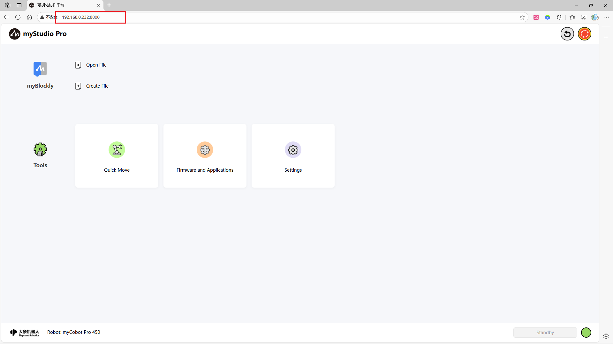

You can click the `blockly` icon or the `New Document` button to enter the `blockly` programming page.

> Alternatively, you can click the `Open File` button to automatically jump to the blockly programming page, loading your saved file content, including the workspace, waypoints, and track file (for information on saving the workspace, [click here](./5.5.3-littleCase.md)). 

> Clicking the `blockly` icon or the `New Document` button to enter the `blockly` programming page is equivalent to creating a new workspace.

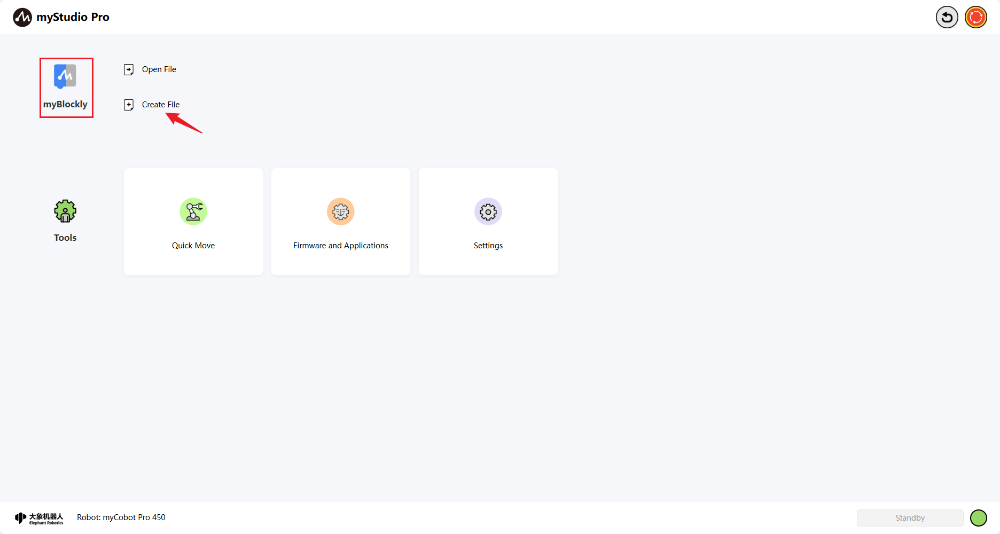

The `blockly` homepage is shown below:

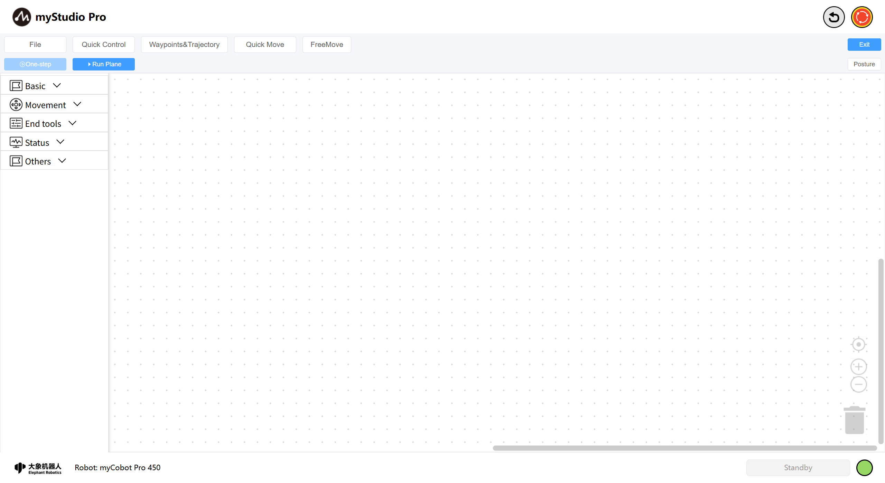

# 1 Introduction to the Blockly Main Interface

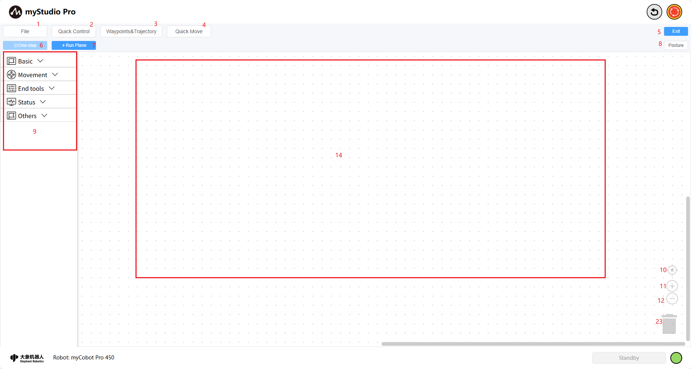

| Number | Function Introduction |
| ------ | ------------------------------------------------------------ |
| 1 | File: Allows loading, saving, and creating new workspaces; |
| 2 | Quick Power On: Powers on/off the robotic arm, releases/tightens joints; |
| 3 | Waypoints & Trajectories: Quickly create and run teaching points, and record and reproduce trajectories; |
| 4 | Rapid Movement: Used for rapid control of the robotic arm's movement; |
| 5 | Return: Exit the `myBlockly` main interface; |
| 6 | Single Step Execution: Select a block, click the button to execute only the currently selected block; |
| 7 | Run Panel: Open the run panel, where you can run and debug workspace code; |
| 8 | Attitude: Open the attitude page to see the real-time simulated motion attitude of the 3D model; |
| 9 | Toolbox: Provides pre-built blocks for users to use; |
| 10 | Workspace Calibration: Clicking this will return the workspace to its origin; |
| 11 | Zoom In: Zoom in on the workspace; |
| 12 | Zoom Out: Zoom out on the workspace; |
| 13 | Trash Can: Blocks in the workspace can be dragged here to delete them, and deleted blocks can also be retrieved from here; |
| 14 | Workspace: Blocks in the toolbox can be dragged here for programming; |

# 2 Basic Function Usage

Let's write a small case study to introduce the basic usage of `myBlockly`

**Case Description:** Control the robotic arm to return to zero, then control one joint to move to a 20-degree position, and then return to zero.

**Step 1:** First, click the `Attitude` button to open the attitude view, where you can see the current attitude of the simulated robotic arm.

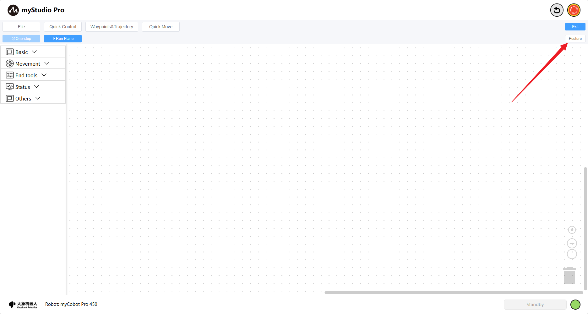

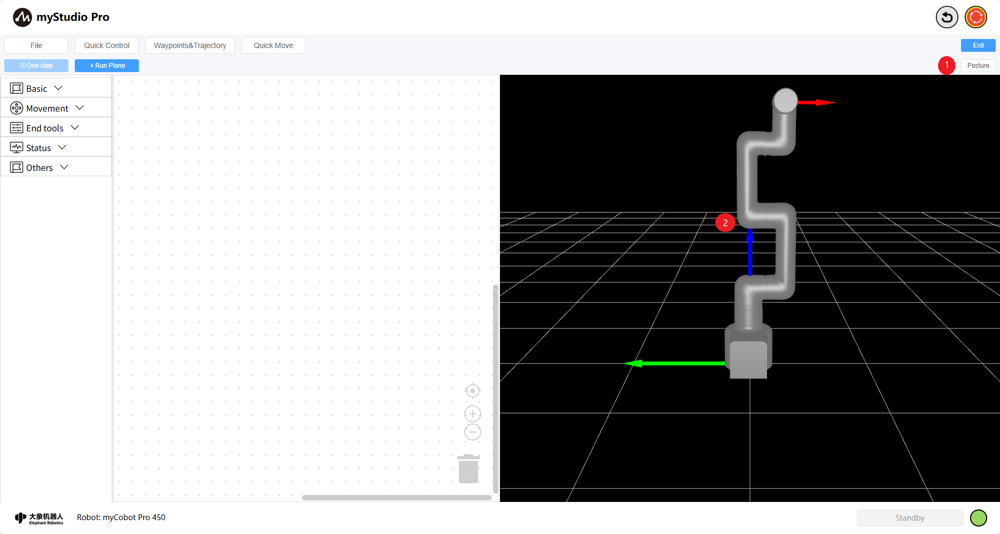

- 1: Switch the posture panel: Click to show when the posture panel is hidden, and click to collapse when it is hidden.

- 2: Robotic arm simulation model, which can simulate motion in real time based on the current actual angle.

**Step Two:** Start Programming

Open the toolbox, first-level category `Motion Control`, select the second-level category `Angle & Coordinates`, and drag the `Set Full Angle` block to the workspace.

This block is used to control the movement of each joint of the robotic arm to a given angle. The default movement speed is 20.

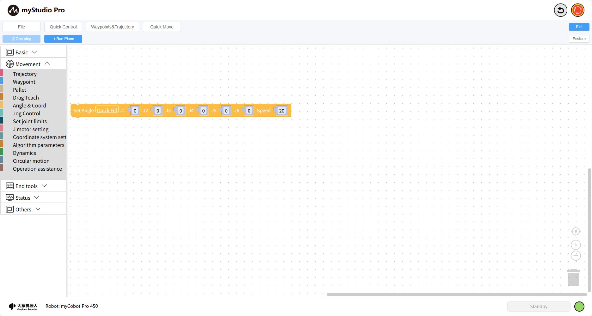

Open the toolbox's primary category `Basic Programming`, select the secondary category `Time`, drag the `Sleep` block to the workspace, and set the sleep time to 3 seconds.

A 3-second sleep time means: the program will wait 3 seconds before continuing execution. Why wait 3 seconds? Because the system needs to ensure the robotic arm completes the first instruction before executing subsequent actions.

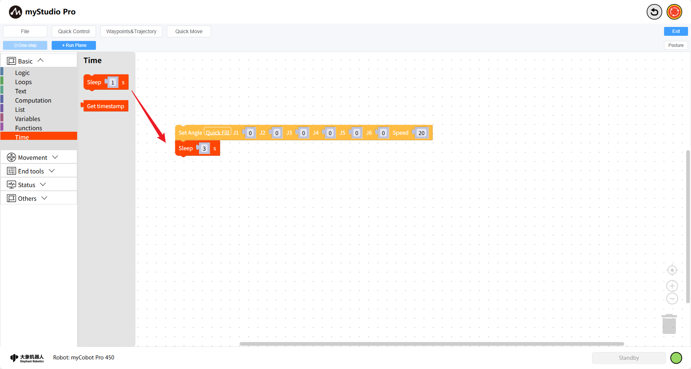

Copy the `Set Full Angle` block and modify the `Joint 1` angle to 20:

- Click to select the `Set Full Angle` block in the workspace;

- Press Ctrl + C to copy the `Set Full Angle` block;

- Press Ctrl + V to paste the `Set Full Angle` block;

- Modify the `Joint 1` angle of the new block to 20;

- Drag the block to connect it to the `Sleep` block;

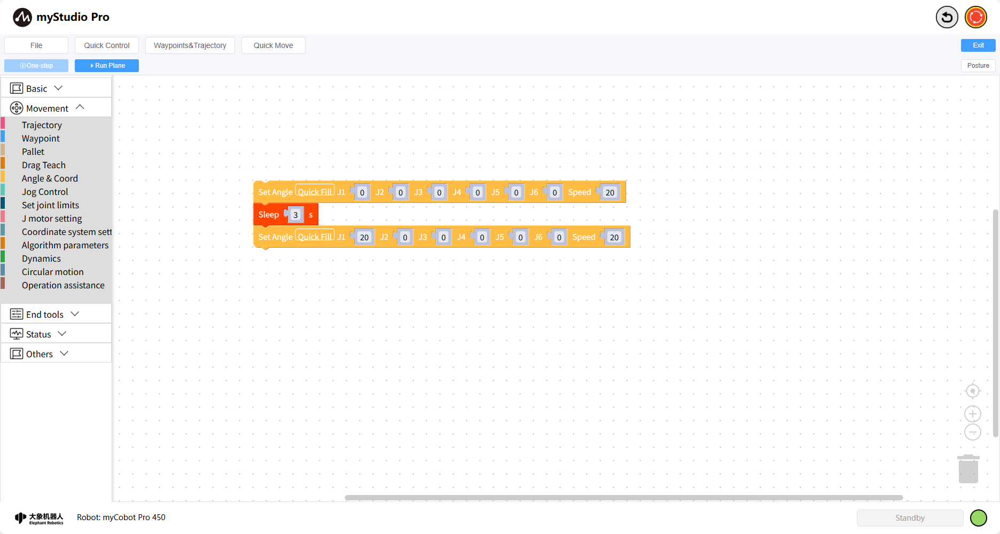

Similarly, copy the `Sleep` block and set the sleep time to `3`. Seconds;

Copy the first `Set Full Angle` block in the workspace again;

The complete code is as follows:

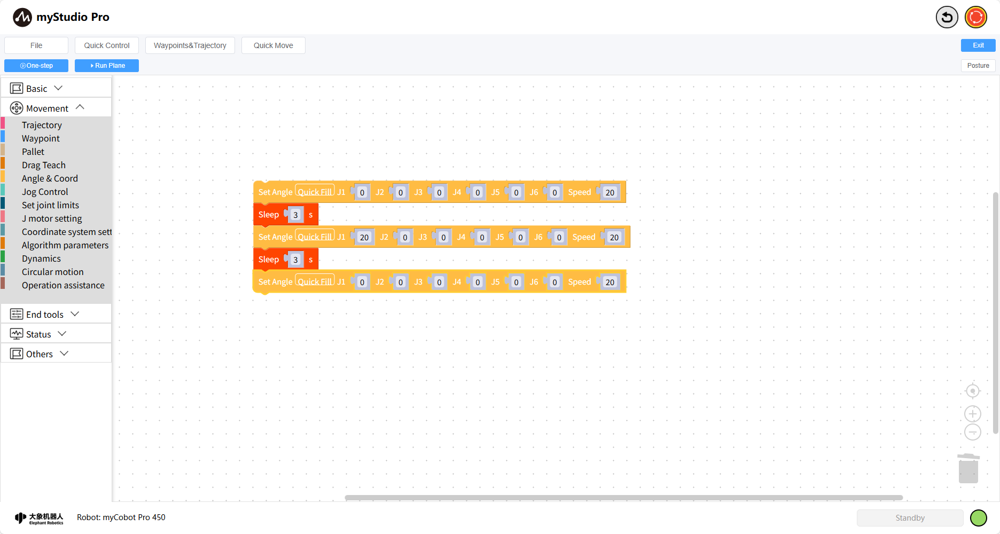

> This code means:

>
- Control the robotic arm to return to the zero point 

> - Wait 3 seconds (wait for the machine to return to the zero point) 

> - Move one joint (J1) to a 20-degree position 

> - Wait 3 seconds 

> - Control the robotic arm to return to the zero point 

Finally, click the `Run Panel` button. After opening the panel, click the `Run` button to start executing the code. The right side of the Run Panel will display the joint and angle coordinates in real time, and the 3D model will also simulate motion.

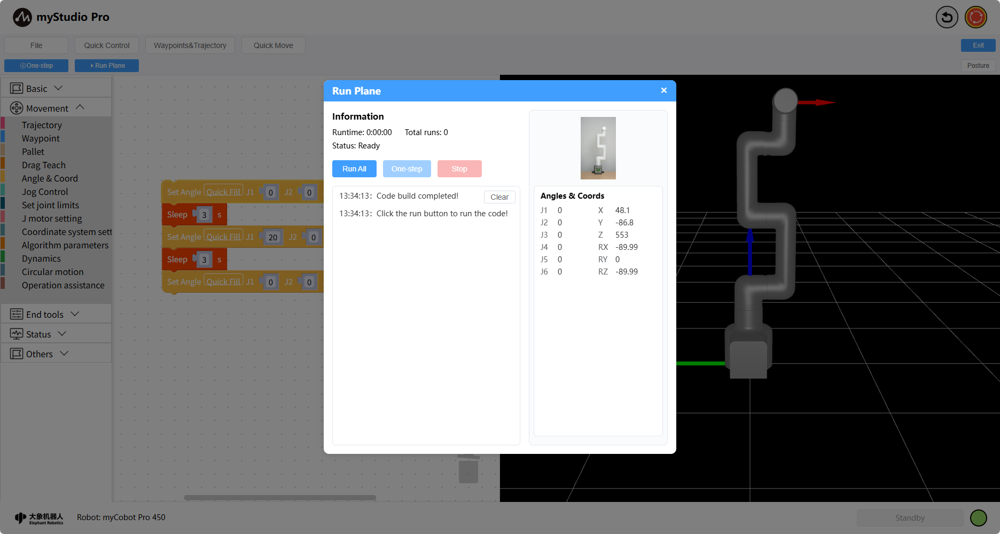

The code has finished running. Click the `X` on the panel to close it.

**Step 3:** Saving and Loading Files (or Saving and Loading the Workspace)

`blockly` supports saving and loading the workspace.

Click the "File" button, and a drop-down menu will appear. Click the "Save" button, and a file naming modal will appear. Enter your desired name and click "OK" to save (by default, it will be saved to the test space). The saved result will be displayed as a message in the lower left corner.

**Step 4:** Creating a New Workspace (This operation will clear all code in the workspace)

Click the `File` button. A drop-down menu will appear. Click the `New Workspace` button. A prompt will appear. Click the `OK` button.

Workspace creation complete.

**Step 5:** Load the previously saved workspace file.

Click the `File` button. A drop-down menu will appear. Click the `Open File` button in the menu. A list of saved files will be displayed. Select the file you want to load, and use the edit button in the operation column to load the file into the workspace.

Loading complete

# 3 Quick Data Fill

This chapter introduces the Quick Data Fill function in the block.

When a block has too many data items, filling them one by one is too tedious. Therefore, for blocks with too many data items, we can use the Quick Data Fill function.

Quick Data Fill Source: Angle or coordinate data of the current robotic arm posture.

Currently, the following blocks support quick fill:

## How to Use Quick Fill

Taking the `Set Full Angle` block as an example, first select the block, then click the `Quick Fill` button within it.

When the following prompt box appears on the page, the fill was successful.

# 4 Quick Move

What is **Quick Move**? Simply put, it means controlling the robot's movement quickly using only mouse clicks, without any programming.

> Note: myStudio Pro has two **Quick Move** control panels; their functions are largely the same.

**Step 1:** Click the Quick Move button to open the **Quick Move** panel and wait for the robot data to return.

<im