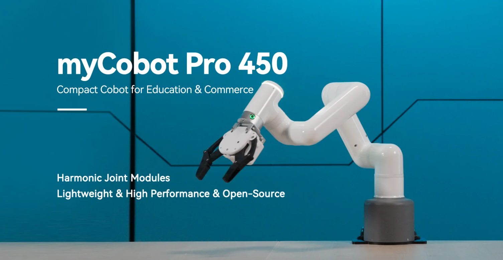

# myCobot Pro 450

The first choice for getting started with the full harmonic collaborative robot arm

Core Document
---

This document contains comprehensive information from product introduction, detailed technical parameters to user instructions and product development guidance. The document will introduce the basic functions of the myCobot Pro 450 robot arm in depth, provide software development guidelines, and show successful application cases to help you understand how to effectively integrate myCobot Pro 450 into various applications. In addition, we also provide a wealth of support and service information to ensure that you can get the necessary help when you encounter any technical challenges.

Document Description
---

Depending on your needs and your level of expertise in myCobot Pro 450 application development, you can choose to follow this order from beginning to end or use it as a standalone reference. You can always use the sidebar navigation on the left to jump to any part of this document. The full text is divided into the following five sections:

#### Product Information
The product information section will provide you with a basic overview of the robot arm, including detailed technical specifications such as main functions, product parameters and electrical characteristics, to help you quickly understand the basic characteristics and usage environment of the product. In addition, this section will detail the application examples and supported extended development of the product, providing you with the necessary development guides and resources. At the end of the article, relevant purchase links and channels will be provided for your convenience.

#### Basic Settings
This section is an important section that every user of this product must read carefully. It covers key information about the use, transportation, storage and maintenance of the product, aiming to ensure the safety and efficiency of users when operating the product. In addition, this section also details the division of responsibilities for product failure or damage that may occur due to failure to follow these guidelines.

#### Functions and Applications
The Functions and Applications section details the basic functions of the robotic arm and how to use the software, including instructions for using myBlockly and system and firmware updates. The Software Development Guide provides guidance based on different development environments, such as Python and ROS2, to support technical developers in expanding their applications. By showcasing successful application cases and providing supporting resources, we provide practical references and essential support materials for a deeper understanding and use of the product.

#### Support and Services
The Support and Services section will provide you with comprehensive troubleshooting guides and post-purchase service information, such as warranty and service terms, to help you quickly resolve problems when you encounter them, and ensure that you understand your rights and obligations after purchase. In addition, the 'About Us' section reinforces the user's understanding of the myCobot series product design and manufacturer, aiming to build trust and brand loyalty.

#### Acknowledgements
We appreciate your taking the time to read the myCobot Pro 450 User Manual. We hope that this document will help you better understand and effectively use this robot, thereby inspiring your creativity. If you have any questions or need further assistance, please feel free to contact our customer support team. We look forward to seeing the innovative projects you complete with myCobot Pro 450 and welcome you to join our fast-growing developer community.

Document Directory

---

