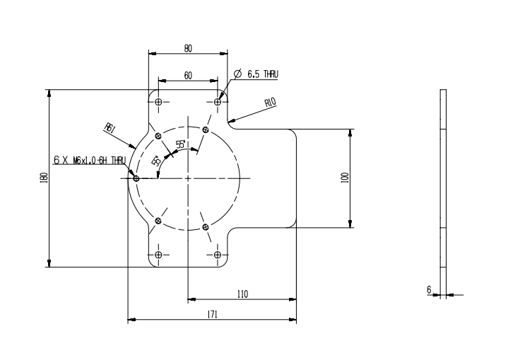
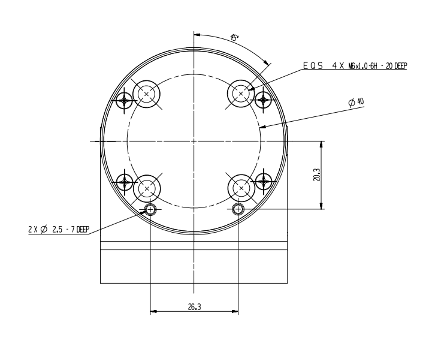
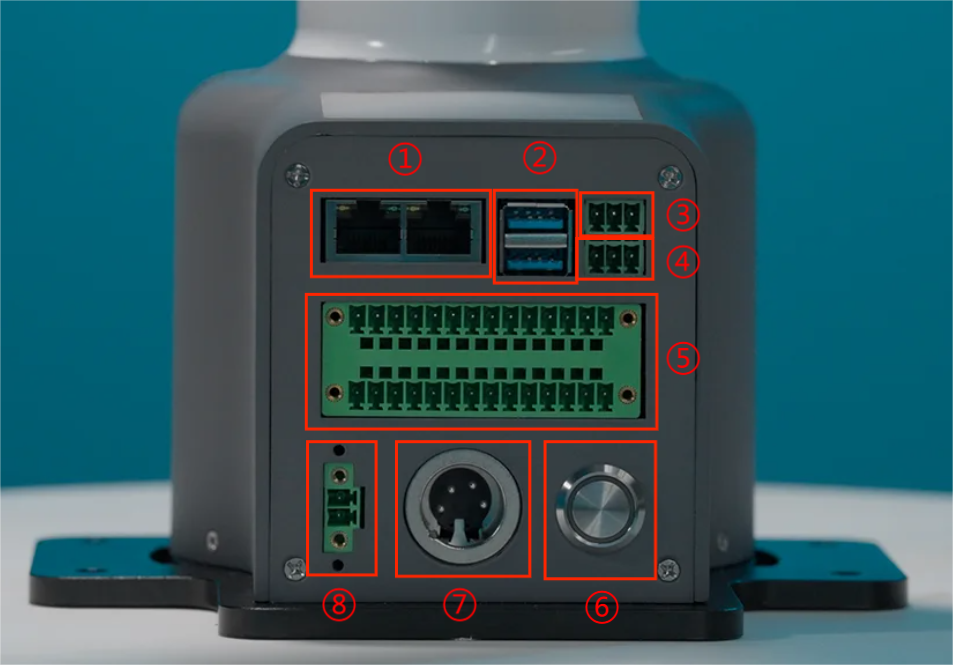
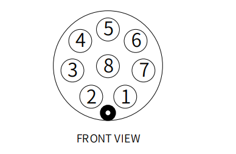
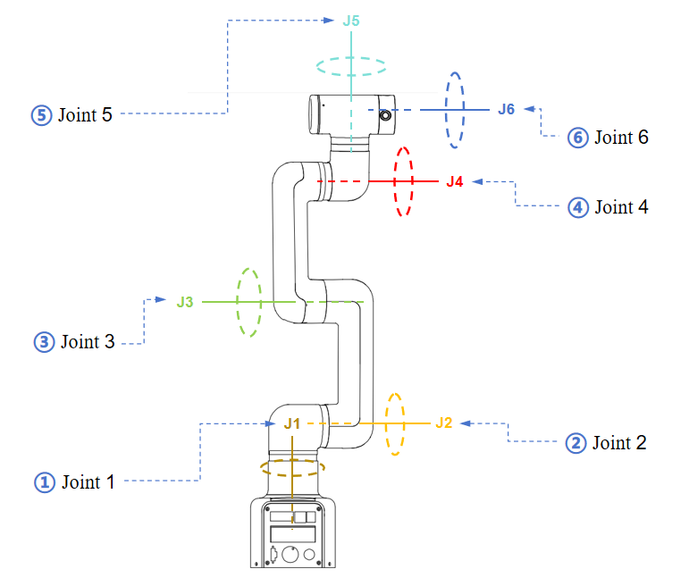

# Robot Parameters

> In the first chapter, we discussed the selling points of the product and its design concept, providing you with a panoramic perspective of the high-level understanding of the product. Now, let's move on to the second chapter - Robot Parameters. This chapter will be the key to your understanding of the product's technical details. A detailed understanding of these technical parameters will not only help you fully realize the advancement and practicality of our products, but also ensure that you can use these technologies more effectively to meet your specific needs.

## 1. Robot Specifications

| Index | Parameters |
| :-----------: | :---------: |
| Name | Full harmonic collaborative robotic arm |
| Model | myCobot Pro 450 |
| Degrees of Freedom | 6 |
| Payload | 1 Kg |
| Working Radius | 450mm |
| Repeatability | ±0.1mm |
| Weight | <5Kg |
| Power Input | 24V，9.2A |
| Operating Temperature | 0-45℃ |
| Communication | TCP/IP-Socket MODBUS Ethernet IP |

---

## 2. Structural Dimension Parameters
> ！This chapter uses millimeters as distance units and degrees as angle units.

### 2.1 Product Dimensions And Working Space
<!--  -->

### 2.2 Joint Range Of Motion
**Hardware joint range of motion**

| Joints | Range |
| :--------: | :----------:|
| J1        | -165 ~ +165     |
| J2        | -117 ~ +117      |
| J3  | -157 ~ +157                   |
| J4        | -165 ~ +165 |
| J5   | -165 ~ +165                   |
| J6   | -168 ~ +168         |

**Software joint range of motion**

| Joints | Range |
| :--------: | :----------:|
| J1        | -165 ~ +165     |
| J2        | -120 ~ +120      |
| J3  | -158 ~ +158                   |
| J4        | -165 ~ +165 |
| J5   | -165 ~ +165                   |
| J6   | -175 ~ +175         |
### 2.3 Hole Installation
- The robot base is mounted with flanges. The base is compatible with both LEGO technology and M4 screw installation.

- The robot end is equipped with a flange, and the end of the robotic arm is compatible with both LEGO technology holes and screw thread holes.

## 3. Electrical Characteristic Parameters
### 3.1 Electrical Interface Of The Robotic Arm Base
#### 3.1.1 Base Introduction

* Base front view：
 

  - ① RJ45：Dual network ports, used for connecting the device to the Internet or other network devices.
  - ② USB3：High-speed USB interface for connecting to computers or peripheral devices.
  - ③ RS485：Industrial serial communication, connecting PLC, sensors, etc.
  - ④ CAN：CAN bus communication, connecting drives, I/O modules, etc.
  - ⑤  Function IO: digital signal input/output.
  - ⑥ Power switch: Press and hold to turn on the power, press and hold again to turn off the power.
  - ⑦ 24V power supply: Connect the power adapter.  
  - ⑧ Emergency stop interface: Connect an external emergency stop button to cut off the power supply in an emergency to ensure safety.

#### 3.1.2 Base Interface Description

* The definition of each interface is shown in the following table:

| Label | Signal Name | Type | Function |
| :---: | :----: | :--: | :------: |
| 2     | 1-12 | I/O |  24V |   |    

### 3.2 Electrical Interface At The End Of The Robotic Arm
#### 3.2.1 Introduction To The End Of The Robotic Arm

* Side View Of The End Of The Robotic Arm:

 

| Number | Interface | Definition | Function |
|:------:|:----------------:|:-----------:|:-------------------:|
| 12 | M8 aviation socket | End-of-line tool IO interface | 24V/2A output, supports short-circuit, reverse polarity, lightning strike, overcurrent, and overvoltage protection |
| | M8 aviation socket | RS485 interface | Supports configurable baud rates of 9600 and 115200 |

#### 3.2.2 Robotic Arm End Interface Description

* The definition of each interface is shown in the following table:

The definitions of the various tool I/O ports are shown in the table below. Note that the tool I/O output is PNP type and the input is NPN type. The wiring method is the same as the bottom output interface.

| Number | Signal | Explanation | Matching M8 line color |
| :------: | :------: | :-----------------------: | :--------------------------: |
| 1 | GND | DC24V negative pole | white |
| 2 | OUT1 | Tool output interface 1 | brown |
| 3 | OUT2 | Tool output interface 2 | green |
| 4 | 485A | 485 standard interface A | yellow |
| 5 | 24V | DC24V positive pole | gray |
| 6 | IN1 | Tool input interface 1 | pink |
| 7 | IN2 | Tool input interface 2 | blue |
| 8 | 485B | 485 standard interface B | purple |

## 4. Cartesian Coordinate Parameters

---

[← Previous Chapter](../1.ProductIntroduction/1-ProductIntroduction.md) | [Next Chapter→](../../2-BasicSettings/3.UserNotice/README.md)
