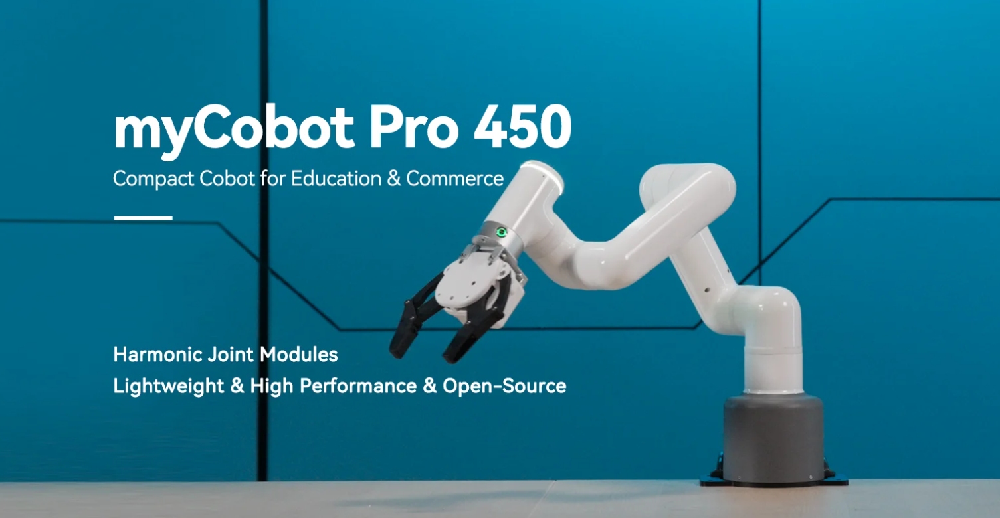

# Robot Parameters

> In the first chapter, we discussed the selling points of the product and its design concept, providing you with a panoramic perspective of the high-level understanding of the product. Now, let's move on to the second chapter - Robot Parameters. This chapter will be the key to your understanding of the product's technical details. A detailed understanding of these technical parameters will not only help you fully realize the advancement and practicality of our products, but also ensure that you can use these technologies more effectively to meet your specific needs.

## 1. Robot Specifications

| Index | Parameters |
| :-----------: | :---------: |
| Name | Full harmonic collaborative robotic arm |
| Model | myCobot Pro 450 |
| Degrees of Freedom | 6 |
| Payload | 1 Kg |
| Working Radius | 450mm |
| Repeatability | ±0.1mm |
| Weight | <5Kg |
| Power Input | 24V，9.2A |
| Operating Temperature | 0-45℃ |
| Communication | TCP/IP-Socket MODBUS Ethernet IP |

---

## 2. Structural Dimension Parameters
> ！This chapter uses millimeters as distance units and degrees as angle units.

### 2.1 Product Dimensions And Working Space
<!--  -->

### 2.2 Joint Range Of Motion
**Hardware joint range of motion**

| Joints | Range |
| :--------: | :----------:|
| J1        | -165 ~ +165     |
| J2        | -117 ~ +117      |
| J3  | -157 ~ +157                   |
| J4        | -165 ~ +165 |
| J5   | -165 ~ +165                   |
| J6   | -168 ~ +168         |

**Software joint range of motion**

| Joints | Range |
| :--------: | :----------:|
| J1        | -165 ~ +165     |
| J2        | -120 ~ +120      |
| J3  | -158 ~ +158                   |
| J4        | -165 ~ +165 |
| J5   | -165 ~ +165                   |
| J6   | -175 ~ +175         |
### 2.3 Hole Installation
- The robot base is mounted with flanges. The base is compatible with both LEGO technology and M4 screw installation.

- The robot end is equipped with a flange, and the end of the robotic arm is compatible with both LEGO technology holes and screw thread holes.

## 3. Electrical Characteristic Parameters

## 4. Cartesian Coordinate Parameters

---

[← Previous Chapter](../1.ProductIntroduction/1-ProductIntroduction.md) | [Next Chapter→](../../2-BasicSettings/3.UserNotice/README.md)
