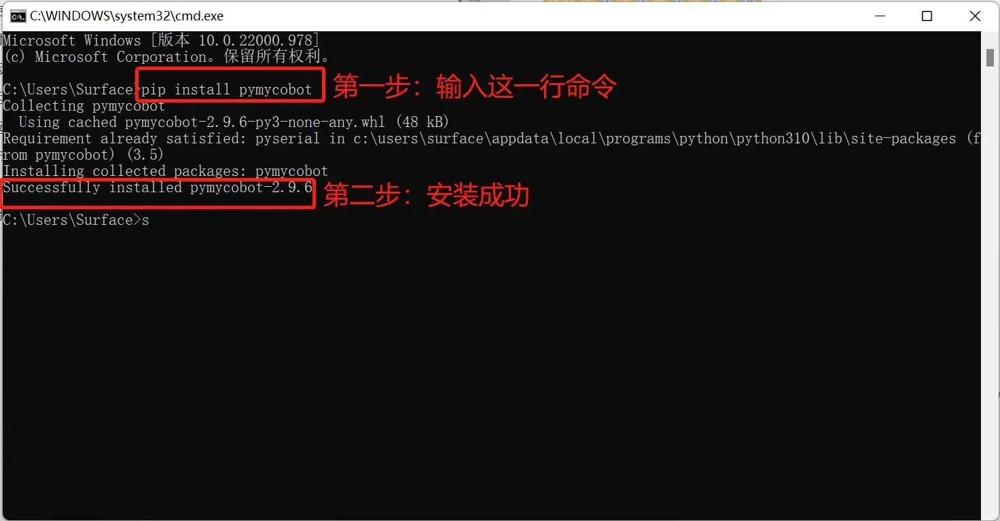

# Software Issues

## 1. myBlockly Related

- **Issue 1**: ​​When running myBlockly, I get the error message `ModuleNotFoundError: No module named 'pymycobot'`
   - **Solution**: This is because the pymycobot library was not installed when setting up the Python environment. To install the pymycobot library, open Terminal (Win + R), enter `pip install pymycobot --upgrade --user`, and press Enter. You should see "Successfully installed pymycobot."



- **Issue 2**: The robot arm is unresponsive because the `sleep` method module is not added
   - **Solution**: The program that operates the robot arm takes a certain amount of time to complete. Therefore, after completing each movement, you need to connect a `sleep` module to allow the robot arm sufficient time before performing the next movement. (The required time depends on the specific situation and machine. The default setting for the robot arm is to sleep for at least 0.5 seconds when running myBlockly.) Otherwise, the robot arm will not be able to perform the desired movement.

- **Issue 3**: SSH cannot connect
   - **Solution**: This situation is usually caused by a poor network cable connection. You can first unplug the network cable on the PC and then reconnect it. When the control panel detects a connection (usually `Ethernet`)，then open the `Windows Command Prompt` and use the `ping` command to check. When the output information is normal, try the `SSH` connection. If the above steps fail to solve the problem, try restarting the machine and then operate again.

- **Issue 4**: Can't open after entering the IP address?
   - **Solution**: Make sure the PC and the robot arm are on the same local area network. Try changing the browser (Chrome or Edge is recommended). Refresh the cache (Ctrl+F5).


## 2. ROS1 Related

### 2.1 Environment-Related Issues

- **Issue 1**: Running `roslaunch` results in the error `package 'mycobot_pro_450' not found`
  - **Cause**: The ROS workspace was not compiled correctly or the environment variables were not loaded
  - **Solution**:
    ```bash
    cd ~/catkin_ws
    catkin_make
    source devel/setup.bash
    ```

### 2.2 Network Communication Issues

- **Issue 1**: Error: "Trying to connect to real MyCobot Pro450... Timeout"

  - **Cause**: The PC and robot are not on the same network segment, or the IP address is incorrectly set

  - **Solution**:

    - Confirm that the robot's default IP address is 192.168.0.232

    - Set the PC network card to the same network segment, for example, 192.168.0.100

    - Test connectivity:

      ```bash
      ping 192.168.0.232
      ```

### 2.3 Python API/Library Issues

- **Issue 1**: **Runtime Error** ModuleNotFoundError: No module named 'pymycobot'

  - **Cause**: pymycobot is not installed in the Python environment

  - **Solution**:

    ```bash
    pip3 install pymycobot
    ```

  - **Issue 2**: **Runtime Error** ImportError: cannot import name 'Pro450Client' from 'pymycobot'

    - **Cause**: pymycobot version is too low

    - **Solution**:

      ```bash
      pip install -U pymycobot
      ```

  - **Issue 3**: **Runtime Error** RuntimeError: The version of the pymycobot library must be greater than 3.9.9 or higher. The current version is 3.9.7. Please upgrade the library version.

    - **Cause**: Pymycobot version is too low

    - **Solution**:

      ```bash
      pip install -U pymycobot
      ```

      **Note**: Version must be greater than **4.0.0**

### 2.4 ROS Node Operation Issues

- **Problem 1**: Model not displayed after opening in rviz

  - **Cause 1**: `robot_description` not loaded correctly

  - **Solution**:
    - Check that the `roslaunch` command is complete
    - In the terminal, enter:

      ```bash
      rosparam list | grep robot_description
      ```
      If you see the `/robot_description` parameter, the model has been loaded.

    - Please check that the joint_state_publisher and robot_state_publisher are running properly.
    - Use the `rostopic list` command to confirm the existence of `/joint_states`, `/tf`, and `/tf_static`. These are necessary topics for model display and motion.

- **Problem 2**: After opening rviz, the model is incomplete, and the terminal continuously outputs a warning message similar to: `Warning [Invalid frame ID "base" passed to canTransform argument target frame frame does not exist rviz] rviz at line 133 in /tmp/binarydeb/ros-foxy-tf2-0.13.13/src/buffer core.cpp`

  - **Cause 1**: Robot communication is abnormal and angle coordinates cannot be read normally.

  - **Solution**:
    - Is `joint_states` being published (a message will be printed)?
    - In the terminal, enter:

    ```bash
    rostopic echo -n 5 /joint_states
    ```
    If `/joint_states` does not output anything, it is likely that the robot communication or the mycobot service is not receiving data.

  - Please check that `joint_state_publisher` and `robot_state_publisher` are running properly. - Use the `rostopic list` command to confirm the existence of `/joint_states`, `/tf`, and `/tf_static`. These are necessary topics for model display and motion.

  - Check the robot's communication status. For details, see [Python Exception Handling](../6.1-python/7_exception_description.md)
  - Check whether the robot can read angles and coordinates normally.

    ```python
    from pymycobot import Pro450Client
    mc = Pro450Client('192.168.0.232', 4500)

    if mc.is_power_on() != 1:
    mc.power_on()

    print(mc.get_angles(), mc.get_coords())
    ```

- **Problem 3**: Error message: `[WARN]: Coordinate control disabled. Please press '2' first.`

  - **Solution**: First enter `2` on the keyboard control interface to return the robot to its starting point, then resume coordinate control

## 3. ROS2 Related

### 3.1 Environment-Related Issues

- **Issue 1**: Running `ros2 launch` results in the error `package 'mycobot_pro_450' not found`
  - **Cause**: The ROS workspace was not compiled correctly or the environment variables were not loaded
  - **Solution**:
    ```bash
    cd ~/colcon_ws
    colcon build
    source install/setup.bash
    ```

### 3.2 Network Communication Issues

- **Issue 1**: Error: "Trying to connect to real MyCobot Pro450... Timeout"

  - **Cause**: The PC and robot are not on the same network segment, or the IP address is incorrectly set

  - **Solution**:

    - Confirm that the robot's default IP address is 192.168.0.232

    - Set the PC network card to the same network segment, for example, 192.168.0.100

    - Test connectivity:

      ```bash
      ping 192.168.0.232
      ```

### 3.3 Python API/Library Issues

- **Issue 1**: **Runtime Error** ModuleNotFoundError: No module named 'pymycobot'

  - **Cause**: pymycobot is not installed in the Python environment

  - **Solution**:

    ```bash
    pip3 install pymycobot
    ```

  - **Issue 2**: **Runtime Error** ImportError: cannot import name 'Pro450Client' from 'pymycobot'

    - **Cause**: pymycobot version is too low

    - **Solution**:

      ```bash
      pip install -U pymycobot
      ```

  - **Issue 3**: **Runtime Error** RuntimeError: The version of the pymycobot library must be greater than 3.9.9 or higher. The current version is 3.9.7. Please upgrade the library version.

    - **Cause**: Pymycobot version is too low

    - **Solution**:

      ```bash
      pip install -U pymycobot
      ```

      **Note**: Version must be greater than **4.0.0**

### 3.4 ROS Node Operation Issues

- **Problem 1**: Model not displayed after opening in rviz

  - **Cause 1**: `robot_description` not loaded correctly

  - **Solution**:
    - Check that the `ros2 launch` command is complete
    - In the terminal, enter:

      ```bash
      ros2 param list | grep robot_description
      ```
      If you see the `/robot_description` parameter, the model has been loaded.

    - Please check that the joint_state_publisher and robot_state_publisher are running properly.
    - Use the `ros2 topic list` command to confirm the existence of `/joint_states`, `/tf`, and `/tf_static`. These are necessary topics for model display and motion.

- **Problem 2**: After opening rviz, the model is incomplete, and the terminal continuously outputs a warning message similar to: `Warning [Invalid frame ID "base" passed to canTransform argument target frame frame does not exist rviz2-2] rviz2-2 at line 133 in /tmp/binarydeb/ros-foxy-tf2-0.13.13/src/buffer core.cpp`

  - **Cause 1**: Robot communication is abnormal and angle coordinates cannot be read normally.

  - **Solution**:
    - Is `joint_states` being published (a message will be printed)?
    - In the terminal, enter:

    ```bash
    rostopic echo -n 5 /joint_states
    ```
    If `/joint_states` does not output anything, it is likely that the robot communication or the mycobot service is not receiving data.

  - Please check that `joint_state_publisher` and `robot_state_publisher` are running properly. - Use the `ros2 topic list` command to confirm the existence of `/joint_states`, `/tf`, and `/tf_static`. These are necessary topics for model display and motion.

  - Check the robot's communication status. For details, see [Python Exception Handling](../6.1-python/7_exception_description.md)
  - Check whether the robot can read angles and coordinates normally.

    ```python
    from pymycobot import Pro450Client
    mc = Pro450Client('192.168.0.232', 4500)

    if mc.is_power_on() != 1:
    mc.power_on()

    print(mc.get_angles(), mc.get_coords())
    ```

- **Problem 3**: Error message: `[WARN]: Coordinate control disabled. Please press '2' first.`

  - **Solution**: First enter `2` on the keyboard control interface to return the robot to its starting point, then resume coordinate control


---

[← Previous Chapter](./3.4-FAQs.md) | [Next Chapter→](./3.4.2-hardware.md)