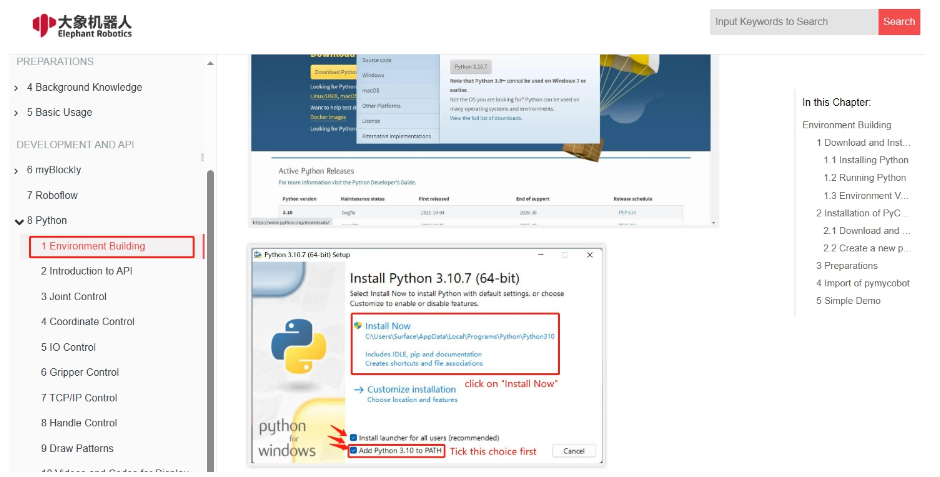

# Software issues

## 1. mystudio related

**Q: Details about downloading firmware for mystudio**

1. Generally, the firmware is already built-in when leaving the factory. Unless the machine is abnormal, there is no need to re-flash the firmware

2. You need to connect to the network during the firmware download process

3. Select the firmware for the corresponding model, and do not choose the wrong model


## 2. python related

**Q: The running prompt is missing library filesQ: The error message: ModuleNotFoundError: No module named "pymycobot", how to deal with it?**

- A1: Pymycobot is not installed. The corresponding solution is to reinstall pymycobot. The command is `pip3 install pymycobot --upgrade --user`

- A2: During the installation of Python, the "Add Pythonxx to PATH" in the figure below was not checked. You need to uninstall Python and reinstall Python, and check this option.

- 

- A3: It is recommended to use version 3.9 of pyhton, as pyhton12 will be incompatible.

**Q: Is there a more popular explanation for the mode in send_coords(coords, speed, mode)?**

- A: Linear 1 means that the end of the robot reaches the target position in a straight line. If it cannot go in a straight line due to limitations, structure, etc., the command will not be fully executed;
Linear 0 means that the end reaches the target position in an arbitrary posture. Since there is no straight line restriction, it is not easy for the command to not be executed.

**Q: What is the difference between the interpolation and refresh modes of set_fresh_mode(mode)?**

- A: Interpolation 0 means that many dense points are planned between the starting point and the end point, so as to achieve the effect of controlling the trajectory of the middle segment.
How to achieve the effect of program parallelism: Non-interpolation 1 means that there is no planning of the middle segment, and the trajectory cannot be controlled, but the movement will be relatively smooth.

**Q：Is it normal for the trajectory not to be straight up and down when only the Z-axis is changed, but the final landing point is adjusted only in the Z-axis? How can the middle trajectory be ensured to be straight？**


- Turn on interpolation and walk in a straight line to ensure the trajectory

```python
set_fresh_mode(0) # Turn on interpolation
send_coords(coords, speed, mode=1) # Walk in a straight line
```

Note that the intelligent planning route set in send_coords will only be useful after turning on interpolation.
Interpolation means that many dense points are planned between the starting point and the end point, so as to achieve the effect of controlling the trajectory of the middle section.
Non-interpolation means that there is no planning of the middle section, and the trajectory cannot be controlled.

**Q: The target position is identified, but the end cannot reach it. How to determine whether this coordinate can be reached and then process it?**

- A: Use solve inv kinematics(target coords, current_angles) to see if there is a solution.
solve_inv_kinematics(target_coords, current_angles)
- Function: Convert coordinates to angles.
- Parameters:
- target_coords: list A floating point list of all coordinates.
- current_angles: list A floating point list of all angles, the current angle of the robot
- Return value: list A floating point list of all angles.

## 3. ROS related

**Q: Is there a virtual machine image with a configured environment?**

- A:We have provided a virtual machine environment with a configured ROS2 environment and built-in ROS source code. Users can download it through the link below and import the virtual machine file into VirtualBox, saving the trouble of configuring the environment themselves. When testing ROS cases, it is recommended to use our configured virtual machine environment for verification to avoid some case operation errors caused by environmental configuration issues.
Please refer to the operation steps video of importing virtual machine files into virtual machine software: https://drive.google.com/file/d/1KeYk_CUgDE46rVn7zbd0EhraIbgt3qZt/view?usp=sharing

[Download ROS2 virtual machine file](https://download-elephantrobotics.oss-cn-shenzhen.aliyuncs.com/system_images/ubuntu20.04_ROS2_V20240228.zip)

[Download virtual machine software VirtualBox](https://www.virtualbox.org/wiki/Downloads)

**Q: How to deal with errors when importing ROS2 virtual machine files?**


- A: This is because the version of the virtual machine software Oracle VM VirtualBox is too low, and the virtual machine software version needs to be updated.

**Q: How to re-download the ROS source code package?**

- A: Use the command to pull:

```bash
git clone https://github.com/elephantrobotics/mycobot_ros.git
```

Or download manually. The download method is to enter the ROS source code package address and follow the steps below. The source code package address is: https://github.com/elephantrobotics/mycobot_ros

 

**Q: What should I do if I run the ROS moveit case and get an error ImprotError: No module named yaml?**


- A: In the first line of this script, change the Python interpreter to python3

**Q: What should I do if the serial port cannot be found when running the virtual machine?**

- A: Use a USB cable to connect the M5 robot to the PC, open the virtual machine settings → USB device → Add USB device → Select the serial port number QinHeng xxxxx, which is the serial port device of the machine.
If there is no such device number, you can get the corresponding USB device number by re-plugging the device. The serial port number corresponding to the machine serial port device number is the one that changes when plugging and unplugging.

   

**Q: When the terminal switches to ~/catkin_ws/src and uses git to install and update mycobot_ros, the target path "mycobot_ros" already exists. What is the reason?**
- A: This means that there is already a `mycobot_ros` package in `~/catkin_ws/src`. You need to delete it in advance and then re-execute the git operation.

**Q: When rosrun is running, the terminal reports an error message `counld not open port /dev/ttyUSB0: Permission: '/dev/ttyUSB0'`, why?**

- A: The serial port permissions are insufficient. Enter `sudo chmod 777 /dev/ttyUSB0` in the terminal to grant permissions.

**Q: When rosrun is running, the terminal prompts `Unable to register with master node [http://localhost:11311]: master may not be running yet. Will keep trying`. Why?**

- A: Before running the ros program, you need to open the ros node. Enter `roscore` in the terminal.

**Q: When rosrun is running, the terminal reports an error message `counld not open port /dev/ttyUSB0: No such file or directory: '/dev/ttyUSB1'`, why?**

- A: The serial port is incorrect. You need to confirm the actual serial port of the current robot. You can check it through `ls /dev/tty*`.

**Q: I just cloned the mycobot_ros2 package, and then ran the rosrun program directly. The error `package 'mycobot_pro_450' not found` or the file could not be found appeared?**

- A: The mycobot_ros2 that I just cloned needs to build the code for ros environment compilation. Terminal input

```bash
cd ~/catkin_ws/
catkin_make
source devel/setup.bash
```

**Q: After the compilation is completed, why does the following error appear when the launch command is run in a new terminal?**

   

- A1: The system does not add ros environment variables, so you need to source each time you open a new terminal:

```bash
cd ~/catkin_ws/
source devel/setup.bash
```

- A2: The system adds ros environment variables, and you do not need to execute source each time you open a new terminal:

```bash
# noetic is Ubuntu20.04 system
echo "source /opt/ros/noetic/setup.bash" >> ~/.bashrc
source ~/.bashrc
```

- A3: The file name in the command may be inconsistent with the actual file name in the mycobot_ros package. Please check the command carefully for errors.

## 4 C++ related

**Q: What should I do if I can't find various dll files?**

- A1: If myCobotCpp.dll is missing, put myCobotCpp.dl in the lib directory to the directory where mycobotcppexample.exe is located.

- A2: If QT5Core.dll is missing, open qt command (search QT in the menu bar), select msvc2017 64-bit, and execute windeployqt--release to the directory where myCobotCppExample.exe is located (such as: windeployqt --release D:lvs2019myCobotCpploutlbuildlx64-Releaselbin). If the vs installation path cannot be found after executing the command here, please check the settings of the vs environment variables.

After executing the above steps, if the qt5serialport.dll file is missing, move this file in the gt installation directory (path such as: D:lgt5.12.1015.12.10msvc2017 64bin), copy it to the directory where myCobotCppExample.exe is located

**Q: Generate the myCobotCppExample.exe executable file, what could be the problem?**
Select the start


---

[← Previous Chapter](./3.4-FAQs.md) | [Next Chapter→](./3.4.2-hardware.md)