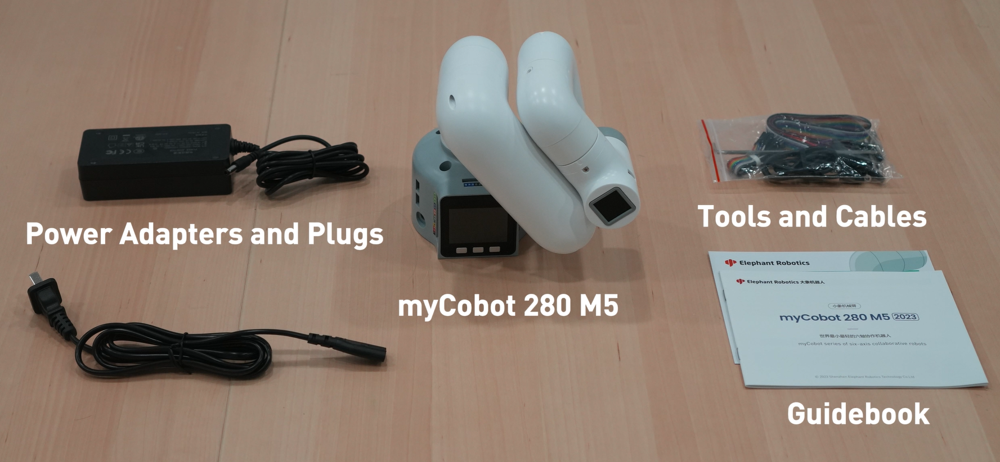

# Product Standard List

## 1. Product List Image
> Thank you for choosing the Elephant Robot myCobot 280 M5 robot arm. This chapter is designed to help you easily get started with Elephant Robot products and enjoy every wonderful moment brought by the product.

## 2. Product Standard List Comparison Table

| Serial Number | Product |
| :----: | :------------------------------------ |
|   1    | myCobot Pro 450 Robotic Arm   |
|   2    | 24V Power Adapter                |
|   3    | Mounting Base Plate                |
|   4    | Emergency Stop Switch                            |
|   5    | Fixed base plate G-clamp                                  |
|   6    | M8 Air Plug Cable                                |
|   7    | Back head M6 screws                            |
|   8    | M5 Wrench                            |
|   9   | M2 Wrench                            |
|   10 | 14-pin pluggable terminal blocks                           |
|   11  | 3Pin pluggable terminal blocks                           |
|   12 | myGripper F100                            |
|   13  | Gigabit network cable 2m                           |

**Note:** After the packing box arrives, please confirm that the robot packaging is intact. If there is any damage, please contact the logistics company and the supplier in your area in time. After unpacking, please check the actual items in the box according to the item list.

---

[← Previous Chapter](./README.md) | [Next Chapter→](./4.2-ProductUnboxingGuide.md)