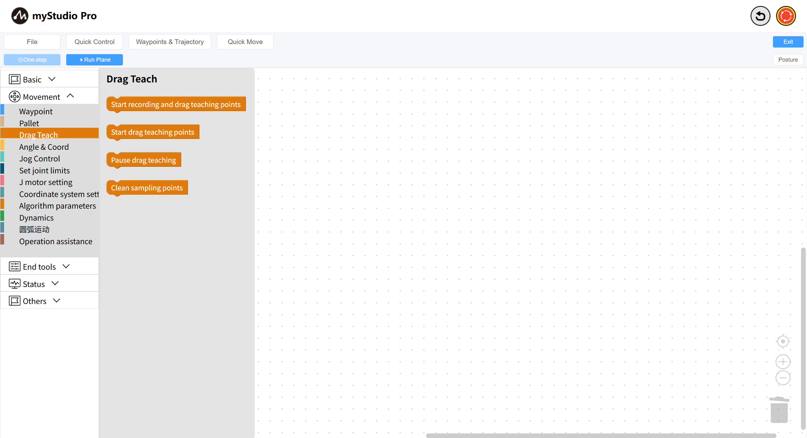
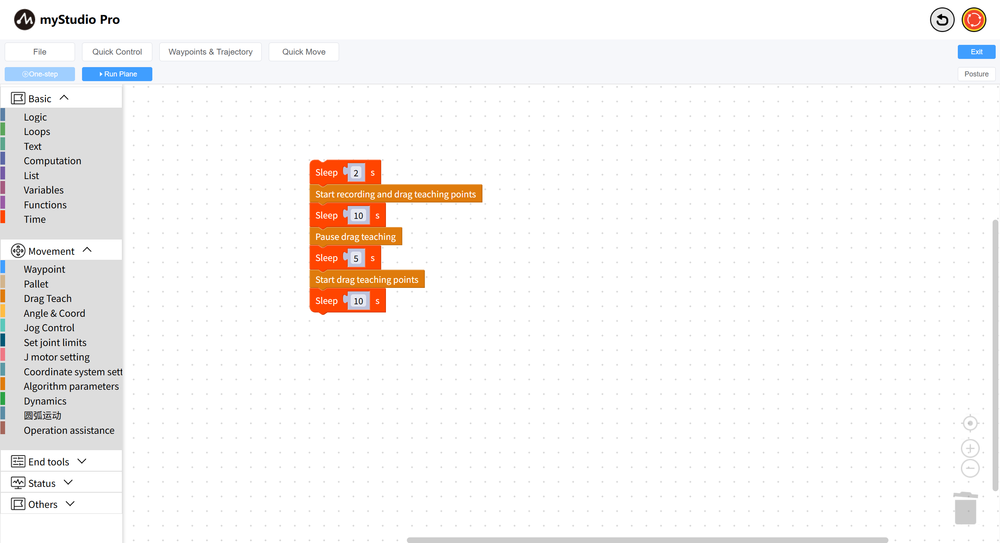
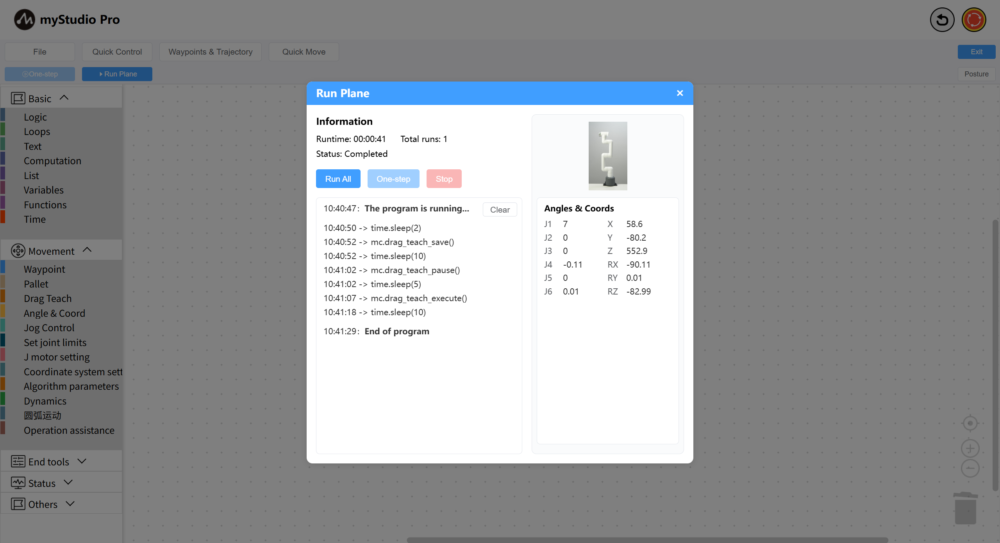

# The Use Of Drag-and-drop Teaching

*Before You Begin*

> *1. Ensure the robot is powered on*
>
> *2. Ensure the robot is properly connected*
>
> *3. The server is enabled*
>
This chapter introduces how to use the drag-and-drop teaching function in `blockly`.

It refers to the movement of the operating arm along the direction of the human force under the traction of the operator (the traction end or a certain operating arm).

### API Display

### Case

We will achieve such an effect: randomly drag the mechanical arm to perform some actions. After the dragging is completed, the mechanical arm will execute the actions just performed. It is equivalent to the recording and playback of trajectories.

The complete code is as follows:

Code explanation:

- Wait for 2 seconds
- Start recording and drag teaching points: After executing this block, the brake of the robotic arm joint is released, and the robotic arm can now be dragged
- Wait for 10 seconds (equivalent to recording for 10 seconds)
- Pause drag teaching: The joint brake of the mechanical arm is locked and it must not be pulled by hand
- Wait for 5 seconds
- Start drag teaching points: The robotic arm began to execute the trajectory just recorded
- Wait for 10 seconds (equivalent to playing the 10-second trajectory just recorded)
  

[← Previous Chapter](./5.5.10-gripperUse.md) | [Next Chapter→](../5.6-quickmove/5.6.1-quickmovefirstuse.md)