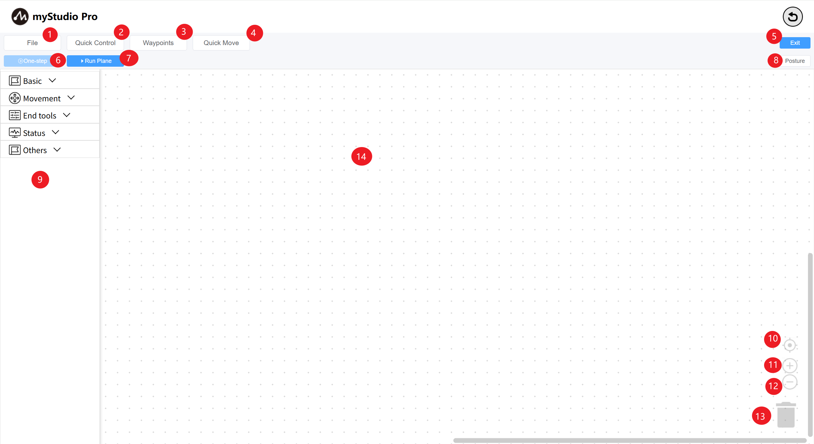

# Introduction to the blockly main interface

| Serial Number | Function Introduction                                                 |
| ---- | ------------------------------------------------------------ |
| 1 | File: Load, save, and create new workspaces; |
| 2 | Quick Power On: Release/clamp the robot's joints; |
| 3 | Waypoint: Quickly create teach points and run; |
| 4 | Quick Move: Used to quickly control the robot's movement; |
| 5 | Return: Exit the Blockly main interface.  |
| 6 | Single-Step Execution: Select a block and click this button to execute only the currently selected block. |
| 7 | Run Panel: Opens the Run panel, where you can run and debug your workspace code. |
| 8 | Pose: Opens the Pose page to view the real-time simulated motion of the 3D model. |
| 9 | Toolbox: Provides pre-built blocks for user use. |
| 10 | Workspace Calibration: Click this button to return the workspace to its original position. |
| 11 | Zoom in: Enlarges the workspace. |
| 12 | Zoom out: Reduces the workspace. |
| 13 | Trashcan: You can drag blocks from the workspace here to delete them, and you can also remove deleted blocks from here. |
| 14 | Workspace: You can drag blocks from the toolbox here to start programming. |

---

[← Previous Chapter](./5.5.1-blocklyFirstUse.md) | [Next Chapter→](./5.5.3-littleCase.md)